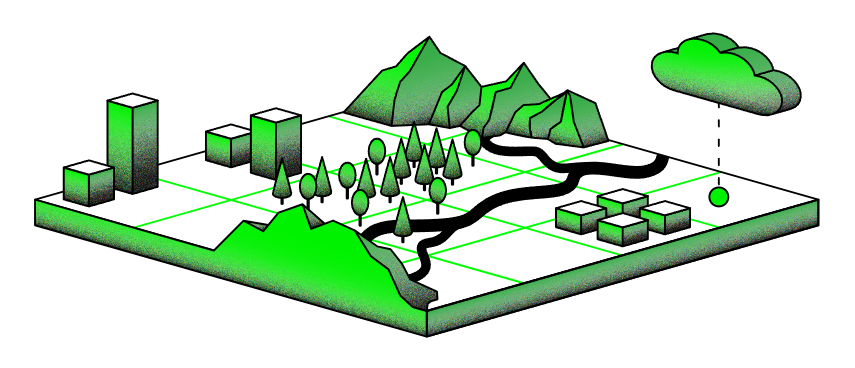

# Official documentation of **InformationGrid.eu**



InGrid is a modular software programme that can be used in a variety of ways: The core components are a web portal, a search engine, a metadata catalogue with profiles for recording INSPIRE-compliant metadata, open data and EIA projects, a visualisation component for OGC Web Map Services, a client for visualising time series and various access and query interfaces that are responsible for researching the connected components, but also for forwarding the results to external systems.

Website: https://ingrid-oss.eu


## Edit documentation
The documentation is organized in versions. Each version has its branch.

* Branches starting with `version/` contain version specific documentation. 
* The default branch `draft` contains unreleased changes and is long lived.
* See [.docs-version](.docs-version) to check which version the branch represents.

Once you found the correct branch, you can start to edit the documentation.
* Go to folder [docs](docs) and edit the markdowns.
* Commit and push your changes.
* Deployment is automated with GitHub workflows.

> **HINT:** If you wish to add new markdown files you need to include them in [mkdocs.yml](mkdocs.yml) at field `nav`.


## Local Preview & Development

If you wish to add more complex changes (e.g. add new markdowns, edit navigation), you might want to preview your changes.

If you wish to edit the **layout** go to folder [theme](theme).

Here are 2 options how you can develop and preview this documentation locally: 

### Option A - VS Code devcontainer

* Open repo in VS Code
* Install VS Code extension `Dev Containers`
* Press `F1` and run the command `Dev Containers: Reopen in container`
* Open new terminal and run `mkdocs serve`

> **Edit Theme:** Run `mkdocs serve --watch-theme` to edit files in theme folder.

### Option B - Python Environment 

Install python and pip. It is recommended to use a python environment. Recommended Python version is `3.13`.
``` sh
# Create a virtual env
python3 -m venv ./.venv
# Activate virtual env
source ./.venv/bin/activate
# Install requirements
pip install -r requirements.txt
# Start MkDocs
mkdocs serve
# If you wish to edit the theme run
mkdocs serve --watch-theme
```


## Release new version

A new version is released based on the `draft` version/branch. 

1. Checkout branch `draft`
2. Make sure everything is checked in and pushed.
3. Get the version of the draft from file `.docs-version`
4. Create new tag (e.g. `git tag v8.1.0`)
5. Push tag (e.g. `git push origin v8.1.0`)
6. Update file `.docs-version` with the upcoming version


This triggers the following workflows: 
1. Workflow `.github/workflows/docs-release.yml`
   * This workflow creates a new branch e.g. `version/8.1.0`
   * Docs version `8.1.0` is marked as `latest`
2. Workflow `.github/workflows/docs-version.yml`
   * This workflow deploys MkDocs & updates files on branch `gh-pages`


## Delete a version
If you wish to delete a version from branch `gh-pages` you can delete the version tag. 

* Delete tag with command `git push --delete origin v8.0.0`
* By removing the tag it triggers the workflow `.github/workflows/docs-delete.yml`.
* This removes the version from branch `gh-pages`. 
* The branch `version/8.0.0` will NOT be deleted.

## Helpful commands and examples
### Add alias `latest` to version `8.0.0`:
* `git fetch` 
* `mike alias 8.0.0 latest --push`

### Add alias `draft` to version `8.0.0`:
* `git fetch` 
* `mike alias 8.0.0 draft --push`

### Remove version published files on server
* `git fetch` 
* `mike delete --push 8.0.0`