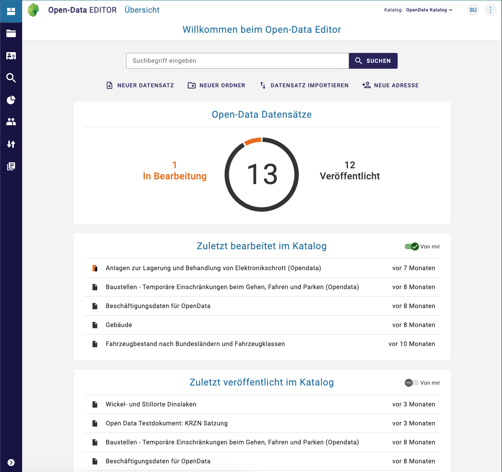

## Allgemeines

Der [**InGrid Editor**](https://github.com/informationgrid/ingrid-editor) ermöglicht die Erfassung von Metadaten über
vielseitige
Formulare und bietet einen umfangreichen Workflow, der den Import sowie den Export verschiedener Formate erlaubt.

Insbesondere wird die Erfassung und Publizierung von **ISO 19115/19119**, **OGC**, **INSPIRE** und **DCAT-AP.DE**
konformen Metadaten unterstützt.


<hr>

## Leitfaden

Sie haben die Installation bereits abgeschlossen? Dieser Leitfaden könnte Sie interessieren.

<div class="grid cards" markdown>

-   :material-book-open-variant-outline: __Benutzeroberfläche__

    ---

    { class="grid-image" }

    Interesse an der **Benutzeroberfläche**?

    Dieser Leitfaden bietet Einblicke in die Bedienung vom **InGrid Editor**.

    [Benutzeroberfläche]({{ fix_url('guides/editor-user-guide.md') }}){ .md-button }

</div>

<hr>

## Systemvoraussetzungen

|              | **Systembestandteil** | **Anforderung**         |
|--------------|-----------------------|-------------------------|
| **Hardware** | Arbeitsspeicher       | 2 GB RAM                |
|              | Festplattenspeicher   | 10 GB frei              |
|              | Prozessor             | Dual Core CPU           |
| **Software** | Java                  | Java 25                 |
|              | Keycloak              | Version 26.x oder höher |
|              | Elasticsearch         | Version 9.x             |
|              | PostgreSQL            | Version 13 oder höher   |

<hr>

## Installation

### :material-docker: Docker

!!! example inline end "Info"
    Neben dem InGrid Editor wird zusätzlich eine **Postgres-Datenbank**, **Elasticsearch** und **Keycloak** eingerichtet werden. Hierfür müssen auch die Datenbanken für den Editor sowie auch für Keycloak erstellt werden. Diese haben standardmäßig die Namen `ige` und `keycloak`


<div class="grid cards" markdown>

-   :material-file-edit-outline:{ .lg .middle } __Docker-Image__

    ---

    Zur Installation kann das folgende Docker-Image verwendet werden:

    [:octicons-arrow-right-24: registry.opencode.de/informationgrid/ingrid-editor](https://gitlab.opencode.de/informationgrid/ingrid-editor/container_registry)

</div>

  <div style="clear: both;"></div>

``` yaml title="Beispiel docker-compose.yml"
services:

  editor:
    image: registry.opencode.de/informationgrid/ingrid-editor
    restart: unless-stopped
    depends_on:
      - postgres-db
    environment:
      - _JAVA_OPTIONS=-Xmx2g -Dstorage.diskCache.bufferSize=256 -Dspring.profiles.active=ingrid
      - DATABASE_HOST=postgres-db
      - DATABASE_USERNAME=${POSTGRES_DB_ADMIN}
      - DATABASE_PASSWORD=${POSTGRES_DB_PASSWORD}
      - KEYCLOAK_URL=http://keycloak:8080/keycloak
      - KEYCLOAK_URL_FRONTEND=http://${HOST}/keycloak
      - KEYCLOAK_BACKEND_USER=${KEYCLOAK_ADMIN}
      - KEYCLOAK_BACKEND_USER_PASSWORD=${KEYCLOAK_PASSWORD}
    ports:
      - "8080:8080"
    networks:
      - informationgrid-network
```

??? example "Beispiel für vollständige docker-compose.yml"

    ``` yaml
    services:

      postgres-db:
        image: postgres:17.4
        restart: unless-stopped
        environment:
          - POSTGRES_USER=${POSTGRES_DB_ADMIN}
          - POSTGRES_PASSWORD=${POSTGRES_DB_PASSWORD}
        volumes:
          - ./_data/postgres-db/:/var/lib/postgresql/data
        networks:
          - informationgrid-network

      elastic:
        image: docker.elastic.co/elasticsearch/elasticsearch:8.18.0
        restart: unless-stopped
        environment:
          - cluster.name=ingrid
          - discovery.type=single-node
          - cluster.routing.allocation.disk.threshold_enabled=false
          - http.host=0.0.0.0
          - transport.host=0.0.0.0
          - http.cors.enabled=true
          - "ES_JAVA_OPTS=-Xmx2g"
          - xpack.security.enabled=false
        volumes:
          - ./_data/elasticsearch_data:/usr/share/elasticsearch/data
        networks:
          - informationgrid-network

      keycloak:
        image: docker-registry.wemove.com/keycloak
        restart: unless-stopped
        environment:
          - KC_BOOTSTRAP_ADMIN_USERNAME=admin
          - KC_BOOTSTRAP_ADMIN_PASSWORD=admin
          - KC_HTTP_RELATIVE_PATH=/keycloak
          - KC_HOSTNAME=http://${HOST}/keycloak
          - KC_HTTP_ENABLED=true
          - KC_PROXY_HEADERS=xforwarded
          - KC_DB=postgres
          - KC_DB_URL_HOST=postgres-db
          - KC_DB_USERNAME=${POSTGRES_DB_ADMIN}
          - KC_DB_PASSWORD=${POSTGRES_DB_PASSWORD}
          - MAIL_SMTP=mailrelay
          - IGE_SUPER_USER_LOGIN=ige
          - IGE_SUPER_USER_PASSWORD=admin
          - IGE_SUPER_USER_FIRSTNAME=Super
          - IGE_SUPER_USER_LASTNAME=User
          - IGE_SUPER_USER_EMAIL=Super.User@test.com
        networks:
          - informationgrid-network

      editor:
        image: registry.opencode.de/informationgrid/ingrid-editor
        restart: unless-stopped
        depends_on:
          - postgres-db
        environment:
          - _JAVA_OPTIONS=-Xmx2g -Dstorage.diskCache.bufferSize=256 -Dspring.profiles.active=ingrid
          - DATABASE_HOST=postgres-db
          - DATABASE_USERNAME=${POSTGRES_DB_ADMIN}
          - DATABASE_PASSWORD=${POSTGRES_DB_PASSWORD}
          - KEYCLOAK_URL=http://keycloak:8080/keycloak
          - KEYCLOAK_URL_FRONTEND=http://${HOST}/keycloak
          - KEYCLOAK_BACKEND_USER=${KEYCLOAK_ADMIN}
          - KEYCLOAK_BACKEND_USER_PASSWORD=${KEYCLOAK_PASSWORD}
        ports:
          - "8080:8080"
        networks:
          - informationgrid-network
    ```

In einer weiteren Datei `.env` werden die Variablen für die `docker-compose.yml` Datei gesetzt.

### :material-redhat: RPM

!!! info
    Schauen Sie sich auch die allgemeinen Informationen für das Installieren von RPMs hier an: [Link]({{ fix_url('components/installation.md/#lokale-installation') }})

Installieren Sie das RPM über den folgenden Befehl:
```shell
sudo dnf install ingrid-editor
```

Der InGrid-Editor verwendet eine PostgreSQL-Datenbank, die vor dem Start vorhanden sein muss. Erstellen Sie die bereits vorkonfigurierte Datenbank mit dem folgenden Befehl:


```shell
sudo -u postgres psql -c "CREATE DATABASE ige;"
```

Stellen Sie sicher, dass dem Datenbankbenutzer die Rechte für die neu erstellte Datenbank korrekt gesetzt sind. Passen Sie die Umgebungsvariablen für den Editor in der Datei `/etc/sysconfig/ingrid-editor` an. Dabei sind vor allem die Einstellungen für die Datenbank und Keycloak wichtig. Für die weitere Konfiguration schauen Sie bitte die verfügbaren [Umgebungsvariablen](#umgebungsvariablen) an. Außerdem können Sie alle Einstellungen auch in der Datei `/opt/ingrid/ingrid-editor/config/application.properties` vornehmen, allerdings empfehlen wir die Konfiguration über Umgebungsvariablen.

Starten Sie danach den InGrid Editor über den folgenden Befehl:

```shell
sudo systemctl start ingrid-editor

# wenn automatisch gestartet werden soll beim Neustart des Systems
sudo systemctl enable ingrid-editor
```

### :material-github: From Source

Um den InGrid-Editor direkt auf einem System zu installieren, müssen folgende zusätzliche Vorbedingungen erfüllt sein:

* NodeJS (>= v22)

Die Installation des InGrid-Editors (z.B. nach `/opt/ingrid/ingrid-editor`) erfolgt dann mit diesen Schritten:

#### Editor klonen und bauen

``` shell
git clone https://github.com/informationgrid/ingrid-editor
cd ingrid-editor/frontend
yarn
cd ..
./gradlew -PbuildProfile=prod build -x test -x check
```

#### Editor installieren

``` shell
unzip -qq "build/distributions/ingrid-editor-[0-9]*.zip" -d /tmp/editor
mkdir -p /opt/ingrid/ingrid-editor
mv /tmp/editor/ingrid-editor-*/* /opt/ingrid/ingrid-editor
cp -r frontend/build/dist/browser/* /opt/ingrid/ingrid-editor/webapp/static
```

#### Editor starten

Bevor Sie den InGrid-Editor starten, müssen sie die Konfiguration vervollständigen. Dazu setzen Sie entweder die
Umgebungsvariablen oder erstellen eine Datei `application-default.properties`. Stellen Sie sicher, dass in der
PostgreSQL-Datenbank, die Datenbanken mit den Namen "ige" und "keycloak" angelegt worden sind. Für die weitere
Konfiguration, siehe [Umgebungsvariablen](#umgebungsvariablen). Danach:

Damit das Frontend verfügbar ist, muss dieses noch auf den Klassenpfad der Anwendung gesetzt werden. Dazu muss das Startskript unter "bin/ingrid-editor" angepasst werden:

```shell
# replace
eval set -- $DEFAULT_JVM_OPTS $JAVA_OPTS $INGRID_EDITOR_OPTS -jar "\"$JARPATH\"" "$APP_ARGS"
# with
JAVA_OPTS="-Dloader.path=/opt/ingrid/ingrid-editor/webapp/"
eval set -- $DEFAULT_JVM_OPTS $JAVA_OPTS $INGRID_EDITOR_OPTS -cp "\"$JARPATH\"" org.springframework.boot.loader.launch.PropertiesLauncher "$APP_ARGS"
```

Danach können Sie den Editor im Verzeichnis `/opt/ingrid/ingrid-editor` wie folgt starten:

``` shell
bin/ingrid-editor
```

<hr>

## Konfiguration

### Umgebungsvariablen

Die folgenden Umgebungsvariablen können direkt über die docker-compose.yml gesetzt werden, um den InGrid Editor zu
konfigurieren.

??? example "Alle Umgebungsvariablen im Überblick"

    | **Variable**                        | **Hinweis**                                                                                                                                                                        | **Defaultwert**                                                                            |
         |-------------------------------------|------------------------------------------------------------------------------------------------------------------------------------------------------------------------------------|--------------------------------------------------------------------------------------------|
    | ALLOW_OVERWRITE_ON_VERSION_CONFLICT | Wenn „true“, wird eine zusätzliche Option angezeigt, um ein Dokument bei einem Versionskonflikt zu überschreiben.                                                                  | true                                                                                       |
    | APP_HELP_LINK                       | Die URL zu einer externen Dokumentationsseite                                                                                                                                      | https://metaver-bedienungsanleitung.readthedocs.io                                         |
    | APP_HOST_URL                        | Diese URL sollte die von außen erreichbare URL des Frontends darstellen                                                                                                            | https://ige-ng.informationgrid.eu                                                          |
    | APP_INSTANCE_ID                     | Wenn mehrere IGE‑Anwendungen mit einem iBus verbunden sind, müssen sie durch eine unterschiedliche Instanz‑ID unterschieden werden.                                                | ige-ng                                                                                     |
    | APP_PROXY_URL                       | Proxy für die Kommunikation mit Keycloak setzen. Häufig läuft Keycloak auf demselben Host, sodass die Kommunikation lokal erfolgen kann. Siehe KEYCLOAK_URL und KEYCLOAK_URL_FRONTEND. |                                                                                            |
    | BROKER_URL                          | Die URL zum WebSocket, z. B. `wss://<DOMAIN>/ige-ng/ws`                                                                                                                            |                                                                                            |
    | CODELIST_REPO_PASSWORD              | Passwort für den Zugriff auf die API des Codelisten‑Repositorys                                                                                                                    |                                                                                            |
    | CODELIST_REPO_URL                   | URL des Codelisten‑Repositorys                                                                                                                                                     | https://dev.informationgrid.eu/codelist-repo                                               |
    | CODELIST_REPO_USER                  | Benutzername für den Zugriff auf die API des Codelisten‑Repositorys                                                                                                                |                                                                                            |
    | CONTEXT_PATH                        | Wenn der InGrid Editor unter einem Kontextpfad erreichbar ist, muss er hier definiert werden.                                                                                      | /                                                                                          |
    | DATABASE_HOST                       | Die IP‑Adresse, unter der sich die Datenbank befindet                                                                                                                              | localhost                                                                                  |
    | DATABASE_NAME                       | Der Name der Datenbank                                                                                                                                                              | ige                                                                                        |
    | DATABASE_PASSWORD                   | Das Passwort des Benutzers für den Zugriff auf die Datenbank                                                                                                                       | admin                                                                                      |
    | DATABASE_PORT                       | Der Port der Datenbank                                                                                                                                                              | 5432                                                                                       |
    | DATABASE_USERNAME                   | Der Benutzername für den Zugriff auf die Datenbank                                                                                                                                  | admin                                                                                      |
    | ENABLE_AI                           | Option zum Aktivieren der KI‑Funktion, die derzeit die Generierung von SQL‑Abfragen umfasst                                                                                        | false                                                                                      |
    | KEYCLOAK_CLIENT_ID                  | Die Client‑ID in Keycloak                                                                                                                                                           | ige-ng-backend                                                                             |
    | KEYCLOAK_CLIENT_SECRET              | Das konfigurierte Secret für den Client in Keycloak                                                                                                                                                           | ige-ng-backend                                                                             |
    | KEYCLOAK_REALM                      | Der Realm in Keycloak                                                                                                                                                               | InGrid                                                                                     |
    | KEYCLOAK_RESOURCE                   | Der Client für das Frontend in Keycloak                                                                                                                                             | ige-ng-frontend                                                                            |
    | KEYCLOAK_URL                        | Die extern erreichbare URL zu Keycloak. Diese wird für die Authentifizierung über den Browser verwendet. | https://keycloak.informationgrid.eu                                                        |
    | KEYCLOAK_URL_INTERNAL                        | Die interne URL zu Keycloak. Diese Einstellung ist optional, verbessert aber die Kommunikation zwischen dem Backend und Keycloak, da diese direkt erfolgt. Im Docker-Setup sieht die URL bspw. folgendermaßen aus: `http://keycloak:8080/keycloak` ||
    | OPEN_AI_TOKEN                       | Token zur Authentifizierung bei OpenAI, um KI‑Funktionen zu nutzen.                                                                                                                |                                                                                            |
    | MAIL_FROM                           | Absenderadresse für ausgehende E‑Mails                                                                                                                                              | noreply@wemove.com                                                                         |
    | MAIL_HOST                           | Hostname des zu verwendenden Mailservers                                                                                                                                            | mailrelay                                                                                  |
    | MAP_TILE_URL                        | URL für die Kartenkacheln mit den Platzhaltern {x}, {y} und {z}. Wird zum Hinzufügen räumlicher Bezüge verwendet.                                                                  | https://gdi-niederrhein-geodienste.de/openstreetmap/\{z\}/\{x\}/\{y\}.png                  |
    | MAP_ATTRIBUTION                     | Anzuzeigender Quellenvermerk für die Karte                                                                                                                                          | `&copy; <a href="https://openstreetmap.de" target="_blank">OpenStreetMap</a> contributors` |
    | MAP_WMS_URL                         | Bei Verwendung eines WMS‑Dienstes muss diese Variable gesetzt werden; sie überschreibt MAP_TILE_URL.                                                                               |                                                                                            |
    | MAP_WMS_LAYERS                      | Anzuzeigende Layer des WMS‑Dienstes festlegen                                                                                                                                       |                                                                                            |
    | MATOMO_URL                          | Die URL zum Matomo‑Tracking‑Dienst                                                                                                                                                  |                                                                                            |
    | MATOMO_SITE_ID                      | Die Seitenkennung (Site ID) für den Matomo‑Tracking‑Dienst                                                                                                                          |                                                                                            |
    | NOMINATIM_URL                       | Die URL des Nominatim‑Dienstes, der im Dialog für räumliche Bezüge verwendet wird.                                                                                                  | https://nominatim.openstreetmap.org/search?q={query}&format=json&countrycodes={countries} |
    | SWAGGER_SERVERS                     | Liste der Server, die in der Swagger UI verwendet werden (Trennzeichen: „::“ und „,“). Beispiel: http://localhost:8550::Local Server,https://ige-ng.informationgrid.eu/::Test Server |                                                                                            |
    | SERVER_PORT                         | Port, unter dem die Anwendung läuft                                                                                                                                                  | 80                                                                                         |
    | SHOW_ACCESSIBILITY_LINK             | Link zur Barrierefreiheitsseite anzeigen                                                                                                                                            | false                                                                                      |
    | SHOW_SWAGGER_UI                     | Swagger UI anzeigen                                                                                                                                                                  | false                                                                                      |
    | SHOW_TEST_BADGE                     | Test‑Badge anzeigen (nützlich auf Testservern)                                                                                                                                       | false                                                                                      |
    | VIRUSSCAN_MAIL_RECEIVER             | E‑Mail‑Adresse für Viruswarnungen                                                                                                                                                    |                                                                                            |
    | UPLOAD_EXTERNAL_URL                 | URL, die beim Export verwendet wird, um hochgeladene Dateien aus dem Internet zu erreichen                                                                                           | /documents/                                                                                |
    | VIRUSSCAN_SCHEDULE                  | Crontab‑Zeitplan für den Virenscan‑Job                                                                                                                                                | 0 0 2 * * *                                                                                |
    | WAIT_FOR_PARAM                      | Auf einen erreichbaren Dienst warten (z. B. eine Datenbank)                                                                                                                          |                                                                                            |
    | WAIT_FOR_PARAM_TIMEOUT              | Timeout in Sekunden für das Warten auf eine Verbindung                                                                                                                               |                                                                                            |
    | ZABBIX_API_KEY                      | API‑Schlüssel für den Zugriff auf die Zabbix‑Instanz                                                                                                                                 |                                                                                            |
    | ZABBIX_API_URL                      | URL der Zabbix‑Instanz                                                                                                                                                               |                                                                                            |
    | ZABBIX_CATALOGS                     | Katalogkennungen, für die die Zabbix‑Integration aktiviert werden soll                                                                                                               |                                                                                            |
    | ZABBIX_CHECK_COUNT                  | Anzahl aufeinanderfolgender Fehler, bis eine E‑Mail von der Zabbix‑Instanz gesendet wird                                                                                             | 3                                                                                          |
    | ZABBIX_CHECK_DELAY                  | Zeitspanne zwischen zwei Prüfungen                                                                                                                                                   | 8h                                                                                         |
    | ZABBIX_DETAIL_URL_TEMPLATE          | URL der Detailseite des Datensatzes im Portal                                                                                                                                        |                                                                                            |

## FAQ

??? question "Die Indizierung/Der Import zeigt keinen Fortschritt an?"

    Dies kann an einer falsch konfigurierten WebSocket-Verbindung liegen. Bitte überprüfen Sie die Konfiguration des InGrid-Editors und die Konfiguration des Webservers. Dieser muss Websockets unterstützen und diese korrekt weiterleiten.

    ``` title="Beispiel einer Apache-Konfiguration"
    RewriteCond %{HTTP:Connection} Upgrade [NC]
    RewriteCond %{HTTP:Upgrade} websocket [NC]
    RewriteRule /(.*) ws://localhost:18101/$1 [P,L]
    ```
