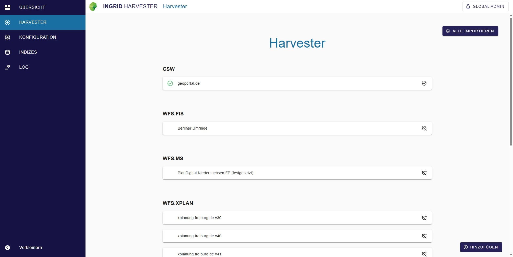

<!-- md:version 7.5.0 -->

## Allgemeines

Der [**InGrid Harvester**](https://github.com/informationgrid/ingrid-harvester) ist eine eigenständige
Softwarekomponente, die Daten aus diversen Quellen „erntet“ und in einem Speicher, den Elasticsearch-Indizes, zur
weiteren Verarbeitung bereitstellt. Dadurch wird sichergestellt, dass die Daten jederzeit in einem einheitlichen Format
verfügbar sind.


<hr>

## Leitfaden

Sie haben die Installation bereits abgeschlossen? Diese Leitfaden könnten Sie interessieren.

<div class="grid cards" markdown>

-   :material-book-open-variant-outline: __Harvester einrichten__

    ---

    Sie haben die Installation vom **Harvester** abgeschlossen?

    Dieser Leitfaden begleitet Sie beim finalen Einrichtungsprozess.

    [Harvester einrichten]({{ fix_url('guides/harvester-setup.md') }}){ .md-button }

-   :material-book-open-variant-outline: __CSW Harvester Beispiel__

    ---

    Sie wollen einen **Harvester-Prozess aufsetzen**?

    Dieser Leitfaden begleitet Sie bei dem Aufsetzen eines **CSW** Harvesters.

    [CSW Harvester aufsetzen]({{ fix_url('guides/harvester-csw.md') }}){ .md-button }

</div>

<div class="grid cards" markdown>

-   :material-book-open-variant-outline: __Benutzeroberfläche__

    ---

    { class="grid-image" }

    Interesse an der **Benutzeroberfläche**?

    Dieser Leitfaden bietet Einblicke in Bediehnung und Überwachung von Harvester-Prozessen.

    [Benutzeroberfläche]({{ fix_url('guides/harvester-user-guide.md') }}){ .md-button }

</div>

<hr>

## Systemvoraussetzungen

|              | **Systembestandteil** | **Anforderung**       |
|--------------|-----------------------|-----------------------|
| **Hardware** | Arbeitsspeicher       | 2 GB RAM              |
|              | Festplattenspeicher   | 10 GB frei            |
|              | Prozessor             | Dual Core CPU         |
| **Software** | Java                  | Java 17               |
|              | Node.js               | Version 20            |
|              | Elasticsearch         | Version 8.x           |
|              | PostgreSQL            | Version 13 oder höher |

<hr>

## Installation

!!! example inline end "Info"
    Neben dem Harvester muss zusätzlich eine **Datenbank** und **Elasticsearch** eingerichtet werden.

Die Installation des Harvester kann mit Docker, per RPM (in Arbeit) oder direkt aus dem github-Repository erfolgen. Im Folgenden sind Beispiele und Anleitungen dazu aufgelistet.

### :material-docker: Docker

<div class="grid cards" markdown>

-   :material-docker:{ .lg .middle } __Docker-Image__

    ---

    Zur Installation kann das folgende Docker-Image verwendet werden:

    [:octicons-arrow-right-24: docker-registry.wemove.com/ingrid-harvester](https://docker-registry.wemove.com/ingrid-harvester)

</div>

``` yaml title="Beispiel docker-compose.yml"
services:

  harvester:
    image: docker-registry.wemove.com/ingrid-harvester:latest
    restart: unless-stopped
    environment:
     - NODE_ENV=production
     #- BASE_URL=/harvester/
     - IMPORTER_PROFILE=ingrid
     - ADMIN_PASSWORD=admin
     - ELASTIC_URL=http://elastic:9200
     - ELASTIC_VERSION=8
     - ELASTIC_USER=elastic
     - ELASTIC_PASSWORD=
     - ELASTIC_ALIAS=harvester-alias
     - ELASTIC_PREFIX=harvester_
     - DB_URL=postgres
     - DB_PORT=5432
     - DB_NAME=harvester
     - DB_USER=admin
     - DB_PASSWORD=admin
    volumes:
       - /etc/localtime:/etc/localtime:ro
       - ./harvester/config/config.json:/opt/ingrid/harvester/config.json
       - ./harvester/config/client_config.json:/opt/ingrid/harvester/app/webapp/assets/config.json
       - ./harvester/logs:/opt/ingrid/harvester/logs
    ports:
      - 8090:8090
    working_dir: /opt/ingrid/harvester
    command: node app/index.js
    networks:
      - ingrid-network

  postgres:
    image: postgres:15.7
    restart: unless-stopped
    environment:
      - POSTGRES_USER=admin
      - POSTGRES_PASSWORD=admin
      - POSTGRES_DB=harvester
      - PGDATA=/pgdata
    volumes:
      - ./postgres/_data/pgdata:/pgdata
      - ./postgres/init-db:/docker-entrypoint-initdb.d
    networks:
      - ingrid-network

  elastic:
    image: docker.elastic.co/elasticsearch/elasticsearch:8.14.1
    restart: unless-stopped
    environment:
      - cluster.name=ingrid
      - discovery.type=single-node
      - cluster.routing.allocation.disk.threshold_enabled=false
      - http.host=0.0.0.0
      - transport.host=0.0.0.0
      - http.cors.enabled=true
      - xpack.security.enabled=false
      - "ES_JAVA_OPTS=-Xms2g -Xmx2g -Dlog4j2.formatMsgNoLookups=true"
      # Hotfix #3292
      - "LOG4J_FORMAT_MSG_NO_LOOKUPS=true"
    deploy:
      resources:
        limits:
          memory: 3072M
    networks:
      - ingrid-network

networks:
  ingrid-network:
    driver: "bridge"
```

### :material-redhat: RPM

TODO

### :material-github: From Source

Um den Harvester direkt auf einem System zu installieren, müssen folgende Vorbedingungen erfüllt sein:

* Elasticsearch (>= v6)
* PostgreSQL (>= v14)
* NodeJS (>= v20)

Die Installation des Harvesters (z.B. nach `/opt/ingrid/harvester`) erfolgt dann mit diesen Schritten:

#### Harvester clonen und bauen

```
git clone https://github.com/informationgrid/ingrid-harvester
cd ingrid-harvester/server
npm ci
npm run build
cd ../client
npm ci
npm run prod
```

#### Harvester installieren

```
mkdir -p /opt/ingrid/harvester
cp server/package*.json /opt/ingrid/harvester/
cp -r server/build/* /opt/ingrid/harvester/
cp -r client/dist/webapp /opt/ingrid/harvester/app/webapp
cd /opt/ingrid/harvester
npm run install-production
```

#### Harvester starten

Zuerst eine Datenbank erstellen und die nötigen Umgebungsvariablen für Elasticsearch und PostgreSQL einrichten,
siehe [Umgebungsvariablen](#umgebungsvariablen). Danach:

```
export IMPORTER_PROFILE=ingrid
node app/index.js
```

<hr>

## Konfiguration

Wenn der **InGrid Harvester** unter einem Unterpfad (z. B. nicht direkt unter dem Root) erreichbar sein soll, müssen *
*beide** der folgenden Einstellungen vorgenommen werden:

* `BASE_URL` auf den gewünschten Pfad setzen (Umgebungsvariable)
* `contextPath` in der Client-Konfigurationsdatei auf denselben Wert setzen

Zusätzlich müssen entsprechende Einstellungen in nginx vorgenommen werden.

### Authentifizierung

Benutzer und Passwort wird über die Konfigurationsdatei `users.json` gesetzt.
Das Admin-Password kann mit der Umgebungsvariable `ADMIN_PASSWORD` überschieben werden.

???+ example "Beispiel für `users.json`"

    ```
    [
        {
            "firstName": "Global",
            "lastName": "Admin",
            "password": "**********************",
            "username": "admin"
        }
    ]
    ```

### Konfigurationsdateien

In einem Docker-Setup sollten diese Dateien vom Hostsystem in den Container gemappt werden.

??? example "Mapping relevanter Dateien"

    | Speicherort der Konfigurationsdatei (Projekt) | Speicherort der Konfigurationsdatei (Docker-Container)     | Zweck                                                   |
    | --------------------------------------------- | ---------------------------------------------------------- | ------------------------------------------------------- |
    | server/users.json                             | /opt/ingrid/harvester/users.json                    | Konfiguration von Benutzer und Passwort                 |
    | server/config.json                            | /opt/ingrid/harvester/config.json                   | Konfiguration des Harvester                             |
    | server/config-general.json                    | /opt/ingrid/harvester/config-general.json           | Allgemeine Einstellungen (Elasticsearch, Postgres, ...) |
    | server/mappings.json                          | /opt/ingrid/harvester/mappings.json                 | Mapping der Datenformate                                |
    | server/keycloak.json                          | /opt/ingrid/harvester/keycloak.json                 | Zugriffskonfiguration für den Keycloak-Client                                |
    | client/src/assets/config.json                 | /opt/ingrid/harvester/app/webapp/assets/config.json | Einstellungen des Clients                               |

### Umgebungsvariablen

Einige allgemeine Einstellungen können auch über Umgebungsvariablen konfiguriert werden. Diese Einstellungen haben
Vorrang vor den Konfigurationsdateien.

??? example "Alle Umgebungsvariablen im Überblick"

    | Variable                    | Hinweis                                                                      |
    | --------------------------- | ---------------------------------------------------------------------------- |
    | ADMIN_PASSWORD              | Admin Passwort zum Überschreiben der Konfigurationsdatei `users.json`        |
    | DB_CONNECTION_STRING        |                                                                              |
    | DB_URL                      |                                                                              |
    | DB_PORT                     |                                                                              |
    | DB_NAME                     |                                                                              |
    | DB_USER                     |                                                                              |
    | DB_PASSWORD                 |                                                                              |
    | DEFAULT_CATALOG             | Standardkatalog, der verwendet wird, wenn kein spezifischer angegeben ist    |
    | ELASTIC_URL                 |                                                                              |
    | ELASTIC_VERSION             | Hauptversion (6, 7 oder 8)                                                   |
    | ELASTIC_USER                |                                                                              |
    | ELASTIC_PASSWORD            |                                                                              |
    | ELASTIC_REJECT_UNAUTHORIZED | Ob Verbindungen abgelehnt werden sollen, wenn das Zertifikat ungültig ist    |
    | ELASTIC_INDEX               | TODO                                                                         |
    | ELASTIC_ALIAS               | TODO                                                                         |
    | ELASTIC_PREFIX              | TODO                                                                         |
    | ELASTIC_NUM_SHARDS          | TODO                                                                         |
    | ELASTIC_NUM_REPLICAS        | TODO                                                                         |
    | PORTAL_URL                  | Basis-URL zur Anzeige der Portal-Website (ohne abschließenden Slash)         |
    | PROXY_URL                   | URL mit Anmeldedaten und Port, falls erforderlich                            |
    | ALLOW_ALL_UNAUTHORIZED      | Ob alle Verbindungen unabhängig vom SSL-Status erlaubt werden sollen         |
    | IMPORTER_PROFILE            | Profil, das für die Anwendung verwendet wird: ingrid, diplanung, mcloud      |
    | BASE_URL                    | Unterpfad, unter dem der Harvester bereitgestellt wird, wenn nicht unter `/` |
    | PASSPORT_ENABLED            | Aktiviere lokalen Login mit `ADMIN_PASSWORD` |
    | KEYCLOAK_ENABLED            | Aktiviere Login mit Keycloak |
    | KEYCLOAK_AUTH_SERVER_URL    | URL zur Keycloak-Instanz |
    | KEYCLOAK_CREDENTIALS_SECRET | Geheimnis für den Zugriff auf Keycloak-Client `harvester` |

### Keycloak Konfiguration

Damit der Harvester mit Keycloak authentifiziert werden kann, muss ein Client mit dem Namen `harvester` eingerichtet
werden. Wird der bereitgestellte vorkonfigurierte Keycloak von wemove verwenden, dann ist dieser Client schon vorhanden
und kann über Umgebungsvariablen angepasst werden. Für die manuelle Konfiguration muss wie folgt vorgegangen werden:

- neuen Client mit der ID `harvester` anlegen
- Redirect-URIs: <URL zum Harvester>/*
- Client authentication: An
- Authentication flow: Standard flow
- unter `Roles` müssen die folgenden drei Rollen angelegt werden
    - admin
    - editor
    - viewer

Um einem Benutzer Zugang zum Harvester zu geben, muss diesem Benutzer eine der Rollen zugewiesen werden. Der Benutzer
kann dann auf den Harvester zugreifen.

Der Harvester muss außerdem mit dem korrekten Client-Secret konfiguriert werden, so dass der Zugriff auf den Keycloak-Client
erlaubt ist.

<hr>

## FAQ

??? question "Wie richte ich den Harvester final ein, wenn die Installation abgeschlossen ist?"

    Siehe Leitfaden [Harvester einrichten]({{ fix_url('guides/harvester-setup.md') }})

??? question "Wie setze ich einen CSW Harvester auf?"

    Siehe Leitfaden [CSW Harvester]({{ fix_url('guides/harvester-csw.md') }})

??? question "Werde ich benachrichtigt wenn ein Harvester Process fehl schlägt?"

    Diese Verhalten kann eingerichtet werden.

    Im Abschnitt [E-Mail Einstellungen]({{ fix_url('guides/harvester-setup.md/#e-mail-einstellungen') }}) vom Leitfaden "Harvester einrichten" können Benachrichtigungen eingerichtet werden.
