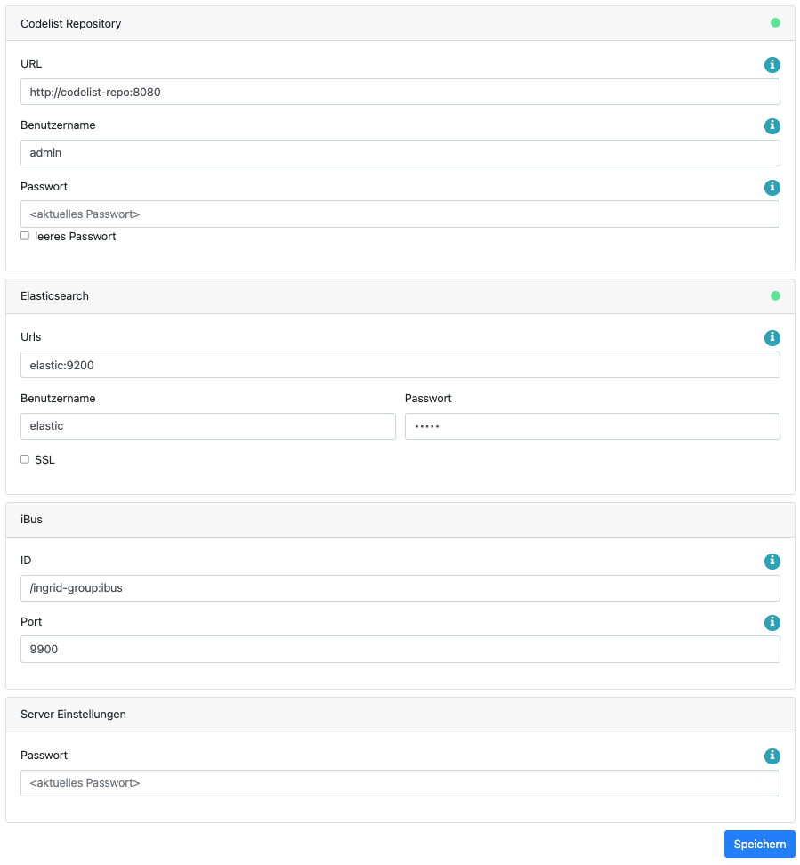

## Allgemeines

Der iBus (information bus) bildet in einem InGrid-System das zentrale Element. Er fungiert als Verteilungsstation
zwischen Datenquellen und Suchanfragen. So nimmt der iBus eine Suchanfrage von der Portaloberfläche oder einer anderen
übergeordneten Schnittstelle entgegen, bereitet die Anfrage auf und sucht in einem zentralen Index, der im Elasticsearch
abgelegt ist. Es kann auch ein iPlug angeschlossen sein, das seine Daten nicht im zentralen Index ablegt und vom iBus
separat angefragt wird. Dabei wird dann die Suchanfrage auf dem iPlug durchgeführt und das Ergebnis über den iBus zum
Aufrufer (z.B. das Portal) weitergeleitet.


## Systemvoraussetzungen

|              | **Systembestandteil** | **Anforderung** |
|--------------|-----------------------|-----------------|
| **Hardware** | Arbeitsspeicher       | 128 MB RAM      |
|              | Festplattenspeicher   | 80 MB frei      |
|              | Prozessor             | Dual Core CPU   |
| **Software** | Java                  | Java 17         |
|              | Elasticsearch         | Version 8.x     |

<hr>

## Installation

!!! example inline end "Info"
    Neben dem iBus muss zusätzlich **Elasticsearch** eingerichtet werden.

Die Installation des iBus kann mit Docker oder direkt aus dem GitHub-Repository erfolgen. Im Folgenden sind Beispiele
und Anleitungen dazu aufgelistet.

### :material-docker: Docker

<div class="grid cards" markdown>

  - :material-docker:{ .lg .middle } __Docker-Image__

    ---

    Zur Installation kann das folgende Docker-Image verwendet werden:

    [:octicons-arrow-right-24: docker-registry.wemove.com/ingrid-ibus](https://docker-registry.wemove.com/ingrid-ibus)

</div>

``` yaml title="Beispiel docker-compose.yml"
  ingrid-ibus:
    image: docker-registry.wemove.com/ingrid-ibus
    restart: unless-stopped
    environment:
      - TZ=Europe/Berlin
      - CODELIST_URL=http://ingrid-codelist-repo:8080
      - CODELIST_USERNAME=admin
      - CODELIST_PASSWORD=${CODELIST_PASSWORD}
      - ELASTIC_HOSTS=elastic:9200
    volumes:
      - ./conf/activatedIplugs.properties:/opt/ingrid/ingrid-ibus/conf/activatedIplugs.properties
    command: ["sh", "wait-for-elasticsearch.sh", "elastic:9200", "/bin/sh start.sh start"]
```

### :material-github: From Source

Um den iBus direkt auf einem System zu installieren, müssen folgende Vorbedingungen erfüllt sein:

* Elasticsearch 8.x
* Maven 3.5.0+
* Java 17

Die Installation des iBus (z.B. nach `/opt/ingrid/ibus`) erfolgt dann mit diesen Schritten:

#### iBus klonen und bauen

```shell
git clone https://github.com/informationgrid/ingrid-ibus
cd ingrid-ibus
mvn clean package assembly:single -DskipTests
```

#### iBus installieren

```shell
unzip distributions/target/ingrid-ibus-8.1.0-SNAPSHOT-installer.jar "ingrid-*"
cd ingrid-ibus-8.1.0-SNAPSHOT
```

#### iBus starten

```shell
export INGRID_USER=$USER
./start.sh start
```

Der iBus besitzt eine Administrationsoberfläche, über die die angeschlossenen iPlugs eingesehen und verwaltet werden
können.

http://localhost:PORT

Anstelle von `localhost` können Sie auch die IP-Adresse des Computers eingeben. Nach einer neuen Installation wird man
automatisch auf die Konfigurationsseite geleitet, wo man das Administrationspasswort eingeben muss. Nachdem dieses
eingegeben worden ist, muss man sich erneut einloggen, um die volle Funktionalität zu nutzen.

## Konfiguration

Die Systemkonfiguration befindet sich in der `application.properties` Datei im conf-Verzeichnis. Änderungen an der
Konfiguration sollten in der Datei `application-default.properties` geschrieben werden. Die wichtigsten Einstellungen
können über die Admin-Gui getätigt werden. Im Folgenden werden die Umgebungsvariablen beschrieben, die für die
Einrichtung häufig benötigt werden.

### Umgebungsvariablen

??? example "Alle Umgebungsvariablen im Überblick"

    | **Variable**          | **Hinweis**                                                                                                                                                                                                                       | **Defaultwert**         |
      |-----------------------|-----------------------------------------------------------------------------------------------------------------------------------------------------------------------------------------------------------------------------------|-------------------------|
    | SERVER_PORT           | Der Port unter der die Anwendung läuft                                                                                                                                                                                            | 80                      |
    | SERVER_CONTEXT_PATH   | Der Pfad auf dem Host                                                                                                                                                                                                             | /                       |
    | SESSION_COOKIE_PATH   | Der Pfad für die Cookies                                                                                                                                                                                                          | /                       |
    | SERVER_ENABLE_CORS    | Aktiviere CORS (Cross-Origin Resource Sharing), um auf die Anwendung zugreifen zu dürfen                                                                                                                                          | true                    |
    | SERVER_ENABLE_CSRF    | Aktiviere CSRF (Cross-Site Request Forgery, um auf die Anwendung zugreifen zu dürfen                                                                                                                                              | true                    |
    | CODELIST_URL          | Die URL zum Codelist-Repository                                                                                                                                                                                                   | http://localhost:8188   |
    | CODELIST_USERNAME     | Der Benutzername für das Codelist-Repository                                                                                                                                                                                      |                         |
    | CODELIST_PASSWORD     | Das Passwort für das Codelist-Repository                                                                                                                                                                                          |                         |
    | ELASTIC_HOSTS         | Die IP/URL zur Elasticsearch Instanz                                                                                                                                                                                              | localhost:9200          |
    | ELASTIC_USERNAME      | Wenn abgesichert, dann kann hier der Benutzername definiert werden                                                                                                                                                                |                         |
    | ELASTIC_PASSWORD      | Wenn abgesichert, dann kann hier das Passwort definiert werden                                                                                                                                                                    |                         |
    | ELASTIC_SSL_TRANSPORT | Verwende SSL-Transport, das mit dem Zertifikat unter `/opt/ingrid/ingrid-ibus/elasticsearch-ca.pem` überprüft wird                                                                                                                | false                   |
    | IBUS_USER             | Der Benutzername für die Administrationsseite                                                                                                                                                                                     | admin                   |
    | IBUS_PASSWORD         | Das Passwort für die Administrationsseite im BCrypt-Format ($-Zeichen müssen mit einem zusätzlichen $-Zeichen maskiert werden). Wenn keins angegeben wird, muss bei der Anmeldung in der Oberfläche ein Passwort vergeben werden. |                         |
    | IBUS_ID               | Die eindeutige Kennung des iBusses, falls mehrere verwendet werden                                                                                                                                                                | /ingrid-group:ibus-test |

### Einstellungen in der Admin-Gui

In den Einstellungen auf der Administrationsseite können folgende Parameter konfiguriert werden:

* URL zum Codelist-Repository
    * ebenfalls der Benutzername und Passwort
* die URL zum Elasticsearch Cluster
    * optional auch Benutzername und Passwort
    * optional auch mit SSL-Zertifikat (/opt/ingrid/ingrid-ibus/elasticsearch-ca.pem)
* ID des iBusses
* Port des iBusses, auf dem sich die iPlugs verbinden können
* das Passwort für die Admin-GUI



Die Einstellungen für das Codelist-Repository und Elasticsearch haben außerdem eine Signalisierung, die anzeigt, ob eine
Verbindung zu der externen Komponente besteht. Falls die Anzeige "Rot" ist, ist die Komponente entweder nicht gestartet
oder der iBus hat eine falsche Konfiguration.

### Konfiguration der aktivierten Indizes

Wird ein Index aktiviert, so wird diese Information in der Datei `activatedIplugs.properties` hinterlegt. Zusätzlich wird diese Information auch im Elasticsearch-Index vermerkt, was die `activatedIplugs.properties` in Zukunft ersetzen soll, so dass auch direkte Anfragen an Elasticsearch auf nur ausgewählte Indizes ermöglicht werden.

## FAQ

??? question "Wie kann ich ein Überschreiben der Datei `env.sh` bei einer Aktualisierung verhindern."

    In der Datei env.sh können Systemvariablen komponenten-spezifisch angepasst werden (z.B. Proxy oder Heap Einstellungen).
    Um die Einstellungen nach einer Aktualisierung nicht zu verlieren, muss die Datei `env.sh` nach `user.env.sh` kopiert
    werden. Die Änderungen in `user.env.sh` werden nicht überschrieben.

??? question "Der iBus soll auf einem Port unterhalb von 1024 betrieben werden."

    Der iBus muss als user root gestartet werden. Dazu muss die Variable `INGRID_USER=root` als Umgebungsvariable gesetzt,
    oder der entsprechende Eintrag in der Datei `start.sh` angepasst werden.

??? question "Warum wird bei der Suche mit einem Suchbegriff nur ein Teil der Beschreibung (summary) eines Treffers zurückgeliefert?"

    Durch die Default-Einstellung "elastic.indexSearchDefaultFields" ([siehe oben](#konfiguration)) wird durch Elasticsearch
    aus dem Indexfeld "summary" die Beschreibung des Suchergebnisses abhängig vom Suchbegriff geliefert, d.h. falls der
    Suchbegriff im "summary" enthalten ist, wird ein Teilabschnitt mit dem Suchbegriff aus der Beschreibung (ansonsten die
    komplette Beschreibung) zurückgegeben.

    Setzt man nun die Einstellung auf "elastic.indexSearchDefaultFields=title,content" so wird bei einem Treffer immer der
    komplette Wertes aus dem Indexfeld "summary" geliefert.

    > Hinweis:
    > Änderung von Konfigurationen erfolgen in der Datei `conf/application-default.properties`.

