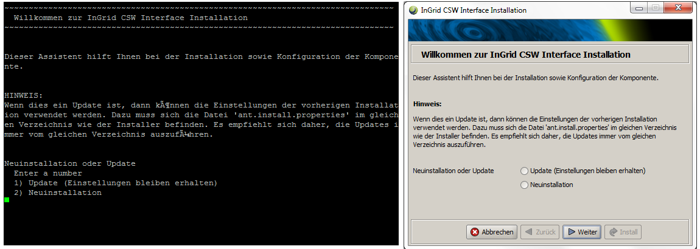

## Setup

Durch die richtige Konfiguration lässt sich InGrid optimal an Ihre Anforderungen anpassen.  
Bevor Sie mit der Installation starten, sollten Sie die folgenden Fragen klären:

### Welche Komponenten sollen installiert werden?

Eine Basis Installation enthält mind. folgende Komponenten:

- Elasticsearch
- [iBus]({{ fix_url('components/ibus.md') }})
- [Portal]({{ fix_url('components/portal.md') }})
- iPlug IGE / InGrid Catalog
- [Codelist Repository]({{ fix_url('components/codelist_repository.md') }})


Genauere Informationen zur Installation der einzelnen Komponenten können bei der Dokumentation der einzelnen Komponenten eingesehen werden.

### Welche Datenbank wird verwendet?

InGrid unterstützt PostgreSQL.

Genauere Informationen können bei der Dokumentation der einzelnen Komponenten eingesehen werden.

### Welches Betriebssystem kommt zum Einsatz?

Die empfohlene Plattform ist Linux.

Das System kann auch unter Windows installiert werden. Dies wird jedoch nur für eien container basierte Installation empfohlen.

<hr>

## Systemvoraussetzungen

|                       | CPU | Arbeitsspeicher | Speicherplatz | 
| --------------------- | ------------- | -------- | ------ |
| Basisinstallation zum Testen | Dual Core CPU | 4 GB RAM | 10 GB  |
| Typische Installation | Quad Core CPU | 8 GB RAM | 100 GB |

Beim Einsatz von der Suchmaschine (iPlug-SE) können durch den Crawl Prozess große Datenmengen anfallen. Die Festplattengröße ist entsprechend zu wählen.

<hr>

## Installation mit Docker

Die einfachste und schnellste Methode, um InGrid zum Laufen zu bringen, ist die Installation über Docker. Die Installation kann sowohl lokal als auch auf einem Server durchgeführt werden.

1. **InGrid-Docker-Container starten**
    ```
    git clone https://github.com/informationgrid/ingrid-docker.git
    cd ingrid-docker
    docker-compose up -d
    ```

2. **Zugriff auf das Web-Portal**

    Öffnen Sie `http://localhost:8080/` im Browser


Details zur Schritt-für-Schritt Installation finden Sie hier:  <https://github.com/informationgrid/ingrid-docker>. 

!!! note "Hinweis"
    Da die default-Installation alle Komponenten beinhaltet, muss ein System mit ≥8GB RAM verwendet werden.


<hr>

## Installation mit Java Installer

### Systemvoraussetzungen

- JAVA 17 JDK (z.B. OpenJDK)
- PostgreSQL

### Allgemeine Hinweise

Für die Installation sollte ein eigener Benutzer (ingrid) angelegt werden. Wird ein abweichender Benutzername verwendet muss dieser in der Systemvariable "INGRID_USER" hinterlegt werden.

Die Installation erfolgt über graphische Installer. Auf GUI-losen Systemen (Linux Server) werden die Installer im Text-Modus ausgeführt. Das folgende Bild zeigt eine Gegenüberstellung von Text-Modus und GUI Modus.



Die Installer bieten die Möglichkeit, Einstellungen aus vorhergehenden Installationen zu übernehmen.
Wenn mehrere Installer aus dem selben Verzeichnis heraus aufgerufen werden, sollte diese Möglichkeit verneint werden, da es ansonsten zu Konflikten zwischen den verschiedenenn Komponenten kommen kann.

Bei der Installation ist auf die nötigen Schreibrechte für die Installationsverzeichnisse zu achten.

Viele Komponenten besitzen eine Administrations GUI, über die die Komponente konfiguriert werden kann. Das InGrid System lässt sich sowohl unter Linux, als auch unter Windows installieren.

<hr>

## Weitere Installationsmöglichkeiten

- Installationsdatei (.rpm) 
- Container basierte Installation (Docker)
- Container basierte Installation (Kubernetes)