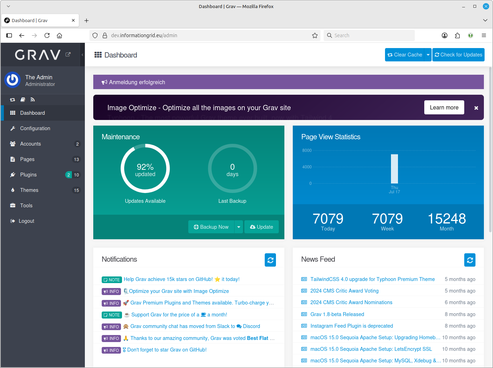
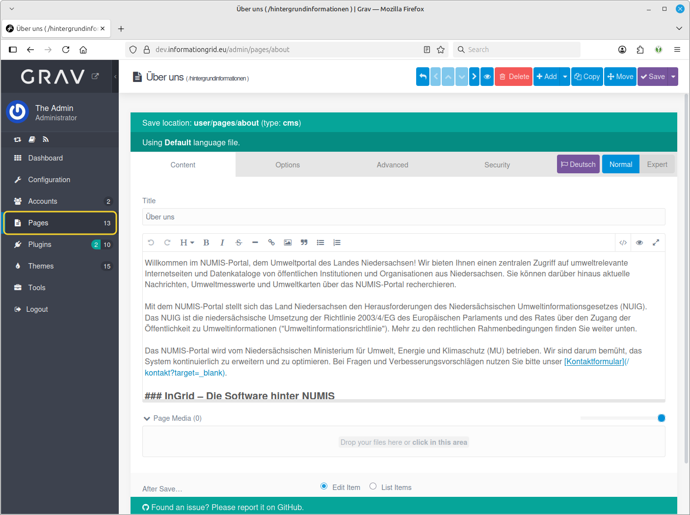

## Allgemeines

Das Portal bietet den Benutzern ein komfortables Interface zur Suche über den InGrid Datenraum und zu weiteren Diensten, wie dem Browsen in Datenkatalogen, dem Karten Client, oder der Darstellung von Zeitreihen.

Funktionsumfang

- Freie Suche in allen angeschlossenen Datenquellen
- Facettierung der Suche, Einschränkung der Suchergebnisse über Kategorien

- News-Feed-Concentrator (Zusammenfassen verschiedener News-Feeds) für den Umweltbereich

- Content Management Funktionen

Die Inhalte der Seiten können angepasst werden.

Das Portal kann über einen Profil-Mechanismus an verschiedene Anforderungen angepasst werden. So kann das Layout kann je nach Anforderung beliebig angepasst werden. Auch die Funktionalität lässt sich weitgehend erweitern und anpassen, so dass flexibel auf kundespezifische Anforderungen eingegangen werden kann.
Beispielsweise wurde für das UVP Portal https://uvp-verbund.de/ Sowohl das Layout verändert und die Funktionaltät angepasst (z.B. Kartendarstellung, Detaildarstellung, Startseite, Suche, etc.)

Das Portal basiert auf dem Content Management System GRAV [https://getgrav.org/](https://getgrav.org/). Es ist flexibel anpassbar und benötigt keinen Datenbank.

**Was sind Portal Profile?**

Portal Profile werden eingesetzt, um die Oberfläche und Funktionalität des Portals an die Anforderungen der unterschiedlichen Anwender anzupassen. Ziel ist es durch die Profile die technische Entwicklung des Portals durch die unterschiedlichen Anforderungen der Anwender nicht auseinanderdriften zu lassen.

Profile bestehen aus einer Sammlung von Dateien (Stylesheets, Templates, Bilder, Backendfunktionen), die die Anpassungen für einen bestimmten Anwender kapseln. Die Profile können in der Administrationsumgebung des Portals umgeschaltet werden.

Profile können während des Deployments oder in der Administrationsoberfläche aktiviert werden.

## Systemvoraussetzungen

|              | **Systembestandteil** | **Anforderung**    |
|--------------|-----------------------|--------------------|
| **Hardware** | Arbeitsspeicher       | 128 MB RAM         |
|              | Festplattenspeicher   | 1 GB frei          |
|              | Prozessor             | Dual Core CPU      |
| **Software** | Webserver             | Apache, Nginx, o.ä. |
|              | PHP                   | > 7.3.6            |


## Installation

### :material-docker: Docker

!!! info inline end
    Zugang zum Docker Repository<br><br>
    login: readonly<br>password: readonly

<div class="grid cards" markdown>

-   :material-file-edit-outline:{ .lg .middle } __Docker-Image__

    ---

    Das Portal benötigt die Komponente ingrid-api um auf den Index zuzugreifen. Zur Installation können folgende Docker-Images verwendet werden:

    [:octicons-arrow-right-24: docker-registry.wemove.com/ingrid-api](https://docker-registry.wemove.com/ingrid-api)

    [:octicons-arrow-right-24: docker-registry.wemove.com/ingrid-portal](https://docker-registry.wemove.com/ingrid-portal)

</div>

Für den Betrieb de InGrid API wird ein Zugriff auf Elasticsearch benötigt.

Für den Betrieb des Portals wird ein Zugriff auf das Codelist Repository benötigt.

``` yaml title="Beispiel docker-compose.yml"
services:

ingrid-api:
    image: docker-registry.wemove.com/ingrid-api
    restart: unless-stopped
    environment:
      - TZ=Europe/Berlin
      - ES_HOST=<Elasticsearch Host>
      - ES_USERNAME=<Login>
      - ES_PASSWORD=<Passwort>
    networks:
      - ingrid-network

  portal:
    image: docker-registry.wemove.com/ingrid-portal
    restart: unless-stopped
    volumes:
      - ./grav:/var/www/portal
      - ./portal/logs:/var/www/portal/logs
      - ./portal/user/:/var/www/portal/user/
    environment:
      - TZ=Europe/Berlin
      - GRAV_FOLDER=portal
      - INGRID_API=http://ingrid-api:8080/
      - CODELIST_API=http://codelist-repo:8080/rest/getCodelists
      - CODELIST_USER=<Login>
      - CODELIST_PASS=<Password>
      - MARKDOWN_AUTO_LINE_BREAKS=true
      #- THEME_COPY_PAGES_INIT=true
      - ENABLE_SCHEDULER_RSS=false
      - ENABLE_MVIS=false
      - ENABLE_FOOTER_BANNER=true
    networks:
      - ingrid-network

```

Außerdem muss der GravCMS Ordner für den Webserver zur Verfügung stehen:

Beispielkonfiguration für Nginx:

``` yaml
  nginx:
    image: nginx
    restart: unless-stopped
    environment:
      - TZ=Europe/Berlin
      - NGINX_HOST=${HOST}
    volumes:
      - ./grav:/var/www/portal
    ports:
      - 80:80
    networks:
      - ingrid-network
```

Beispielkonfiguration für Httpd:

``` yaml
  apache:
    image: httpd:2.4
    restart: unless-stopped
    environment:
      - TZ=Europe/Berlin
    volumes:
      - ./grav:/var/www/portal
```
Ein Beispiel für eine VHOST Konfiguration für NGINX:

??? note "NGINX virtual host Konfiguration"
    ``` nginx
        # Routing zum Portal
        location / {
            #limit_req zone=one burst=5 delay=3;
            auth_basic "Restricted Content";
            auth_basic_user_file /etc/nginx/auth/passwdfile.ingrid;

            root /var/www/portal;

            index index.php index.html index.htm;

            if (!-e $request_filename) { rewrite ^ /index.php last; }
            try_files $uri $uri/ /index.php?$query_string;

            ## Begin - Security
            # deny all direct access for these folders
            location ~* /(\.git|cache|bin|logs|backup|tests)/.*$ { return 403; }
            # deny running scripts inside core system folders
            location ~* /(system|vendor)/.*\.(txt|xml|md|html|yaml|yml|php|pl|py|cgi|twig|sh|bat)$ { return 403; }
            # deny running scripts inside user folder
            location ~* /user/.*\.(txt|md|yaml|yml|php|pl|py|cgi|twig|sh|bat)$ { return 403; }
            # deny access to specific files in the root folder
            location ~ /(LICENSE\.txt|composer\.lock|composer\.json|nginx\.conf|web\.config|htaccess\.txt|\.htaccess) { return 403; }
            ## End - Security

            if ($request_method !~ ^(GET|HEAD|POST)$ ) {
              return 405;
            }

            location ~* \.(jpg|jpeg|png|gif|ico|css|js|svg|webp|woff2)$ {
              expires 2d;
              add_header Cache-Control "public, no-transform, max-age=31536000";
            }

            location ~ \.php$ {
            # Choose either a socket or TCP/IP address
            # fastcgi_pass unix:/run/php/php8.2-fpm.sock;
            # fastcgi_pass unix:/var/run/php5-fpm.sock; #legacy
            fastcgi_pass portal:9000;

            fastcgi_split_path_info ^(.+\.php)(/.+)$;
            fastcgi_index index.php;
            include fastcgi_params;
            fastcgi_param SCRIPT_FILENAME $document_root/$fastcgi_script_name;
            }

        }
    ```

Anpassungen des Virtualhost des Apache

??? note "APACHE virtual host Konfiguration"
    ``` apache
      DocumentRoot /var/www/portal

      ProxyPassMatch ^/(.*\.php(/.*)?)$ fcgi://portal:9000/var/www/portal/$1
      DirectoryIndex /index.php index.php

      <Directory /var/www>
          AllowOverride All
          Options FollowSymlinks
          Satisfy Any
          Require all granted
      </Directory>

      ProxyRequests Off
    ```

    Das fastCGI Modul muss geladen werden (Apache).

    ``` apache
    #LoadModule proxy_ftp_module modules/mod_proxy_ftp.so
    LoadModule proxy_http_module modules/mod_proxy_http.so
    LoadModule proxy_fcgi_module modules/mod_proxy_fcgi.so
    #LoadModule proxy_scgi_module modules/mod_proxy_scgi.so
    #LoadModule proxy_fdpass_module modules/mod_proxy_fdpass.so
    LoadModule proxy_wstunnel_module modules/mod_proxy_wstunnel.so
    ```

**Erstellung eines Admins**

In `user/config/accounts/admin.yaml` kann ein Admin festgelegt werden. Im Feld `hashed_password` ist ein bcrypt gehashtes Passwort zu hinterlegen:

``` yaml
state: enabled
email: webmaster@ingrid-portal.de
fullname: Administrator
title: Administrator
hashed_password: <password bcrypt hashed>
language: en
content_editor: default
twofa_enabled: false
twofa_secret: JXR6OAS6RR4XVCCVTVV4YLEHBHSNZNLH
avatar: {  }
access:
  site:
    login: true
  admin:
    login: true
    super: true
```

## Konfiguration

Die Konfiguration erfolgt über die Administrationsoberfläche des Content-Management-Systems GRAV.



<figcaption>Landing Page des CMS</figcaption>

### Editieren von Seiten



<figcaption>Beispiel für das Editieren einer Seite</figcaption>


### Umgebungsvariablen

Einige allgemeine Einstellungen können auch über Umgebungsvariablen konfiguriert werden.

??? example "Alle Umgebungsvariablen im Überblick"

    | Variable                    | Hinweis                                                                                      |
    | --------------------------- | -------------------------------------------------------------------------------------------- |
    | GRAV_FOLDER                 | Verzeichnis unterhalb von `/var/www/`in dem GRAV installiert ist, z.B. `portal`. Default: `html` |
    | ENABLE_CACHE                | Aktiviert den Cache (`true`/`false`). Default: `true`                                        |
    | THEME_COPY_PAGES_INIT       | Kopiert die initialen Pages aus dem Profil/Theme in das `user/pages`-Verzeichnis (`true`/`false`). Achtung: Bei `true` werden geändert Seiten über die Admin-GUI überschrieben. Default: `false` |
    | MARKDOWN_AUTO_LINE_BREAKS   | Aktiviert automatische Zeilenumbrüche in Markdown (`true`/`false`). Default: `true`          |
    | SITE_DEFAULT_LANG           | Setzt die `default_lang` in der `user/config/site.yaml`. Default: `de`                       |
    | ENABLE_LANG_EN              | Sprachumschalter für Englisch aktivieren  (`true`/`false`). Default: `false`                 |
    | INGRID_API                  | URL zur InGrid API, z.B. `http://ingrid-api:8080/`                                           |
    | CODELIST_API                | URL zur Codelist API                                                                         |
    | CODELIST_USER               | Benutzername für die Authentifizierung an der Codelist API                                   |
    | CODELIST_PASS               | Passwort für die Authentifizierung an der Codelist API                                       |
    | GEO_API_URL                 | URL zur Geo-Api, z.B. `https://geo-api.informationgrid.eu/v1/convert?exportFormat=`          |
    | GEO_API_USER                | Benutzername für die Authentifizierung an der Geo-Api (htaccess)                             |
    | GEO_API_PASS                | Passwort für die Authentifizierung an der Geo-Api (htaccess)                                 |
    | ENABLE_SCHEDULER_RSS        | Aktiviert die regelmäßige Indexierung von den (im Profil/Theme) festgelegten RSS Feeds (`true`/`false`). Default: `true` |
    | ENABLE_SCHEDULER_CODELIST   | Aktiviert die regelmäßige Indexierung vom konfigurierten Codelist-Repo (`true`/`false`). Default: `true` |
    | MVIS_VERSION                | Version des Messwerteclient. Default: `2.0.9` |
    | ENABLE_MVIS                 | Messwerteclient im Portal zur Verfügung stellen (`true`/`false`). Default: `true`            |
    | ENABLE_FOOTER_BANNER        | Roten Banner unten rechts im Portal aktivieren (`true`/`false`). Default: `false`            |
    | TEXT_FOOTER_BANNER          | Text auf dem roten Banner. Default: `Portal-NG`                                              |
    | PHP_MEMORY_LIMIT            | PHP `memory_limit` in `/usr/local/etc/php/php.ini` setzen. Default: `1024M`                    |
    | PHP_MAX_EXECUTION_TIME      | PHP `max_execution_time` in `/usr/local/etc/php/php.ini` setzen. Default: `300`                |
    | PHP_FPM_PM                  | PHP_FPM `pm` in `/usr/local/etc/php-fpm.d/www.conf` setzen. Default: `dynamic`                 |
    | PHP_FPM_PM_MAX_CHILDREN     | PHP_FPM `pm.max_children` in `/usr/local/etc/php-fpm.d/www.conf` setzen. Default: `20`         |
    | PHP_FPM_PM_START_SERVERS    | PHP_FPM `pm.start_servers` in `/usr/local/etc/php-fpm.d/www.conf` setzen. Default: `5`         |
    | PHP_FPM_PM_MIN_SPARE_SERVERS | PHP_FPM `pm.min_spare_servers` in `/usr/local/etc/php-fpm.d/www.conf` setzen. Default: `5`    |
    | PHP_FPM_PM_MAX_SPARE_SERVERS | PHP_FPM `pm.max_spare_servers` in `/usr/local/etc/php-fpm.d/www.conf` setzen. Default: `15`   |

## FAQ

??? question "Wo werden die RSS Feeds festgelegt?"

    RSS Feeds werden in dem jeweilige Profil/Theme unter `RSS feeds` festgelegt.

??? question "Wie oft werden RSS Feeds aktualisiert?"

    RSS Feeds werden alle 15 min aktualisiert. Die Einstellung kann unter Plugin: *InGrid Grav Utils* / *RSS indexing* (admin/plugins/ingrid-grav-utils) eingestellt werden.

??? question "Wie kann die Facettierung im Portal konfiguriert werden?"

    Aktuell können die Einstellungen für die Facettierung nicht über die Administration konfiguriert werden, da dies zu fehleranfällig ist.

??? question "Wie kann man einen Hinweis auf der Startseite hinzufügen?"

    Hinweis-Text auf der Startseite kann unter dem jeweiligen aktivem Profil/Theme aktiviert/deaktiviert werden.

    Hierzu auf das aktive Theme (z.B. InGrid) unter `Themes` navigieren, dann auf den Reiter `Startseite` und unter `Startseite definieren` kann die Startseite angeordnet und Bereiche aktiviert/deaktivert werden.

    Für den Hinweis-Bereich muss ein Eintrag mit der Auswahl `—-▸ Hinweis` vorliegen und für das aktivieren auf der Startseite muss die Checkbox `Ausblenden` bei dieser Auswahl deaktiviert sein.

    Nachdem speichern der Änderungen sollte nun ein Hinweis-Bereich zur Verfügung stehen.

    Um nun den Hinweis-Text zu platzieren, muss nun zum Pages-Bereich navigiert werden und dort `Startseite` > `Hinweis` (admin/pages/home/_warning) ausgewählt werden. Es steht nun ein Textfeld bereit, womit man nun sein Hinweis-Text (in Markdown, HTML) platzieren kann.

    Nachdem speichern der Hinweis-Seite wird die Änderung auf der Startseite angezeigt.