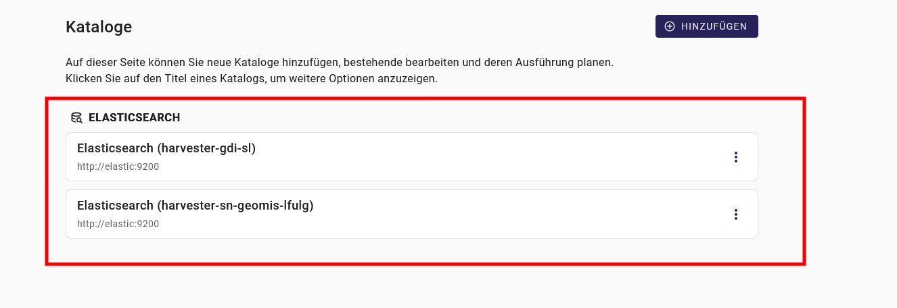
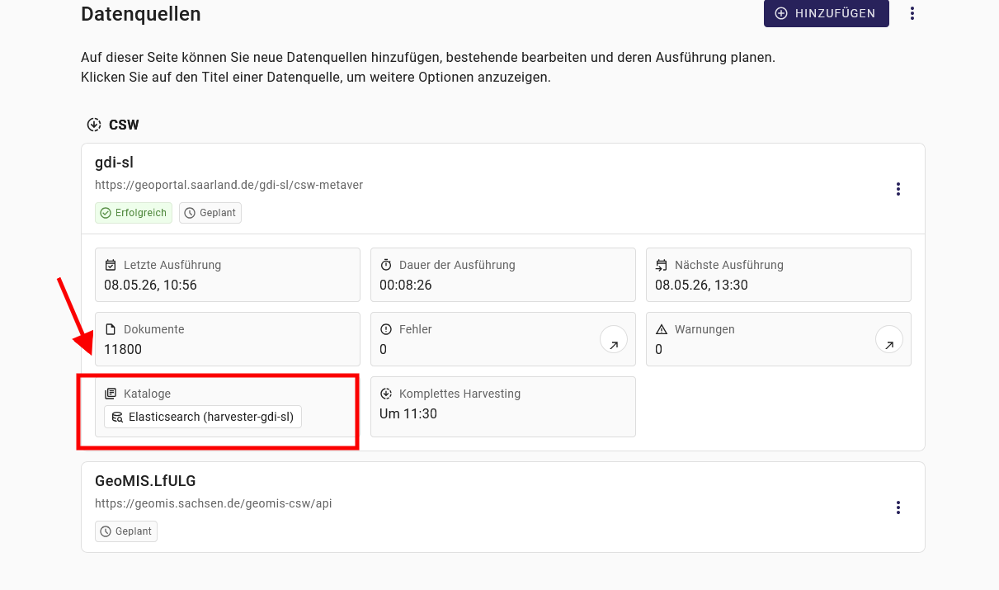
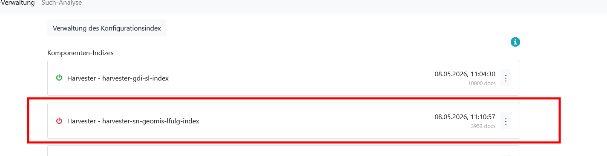
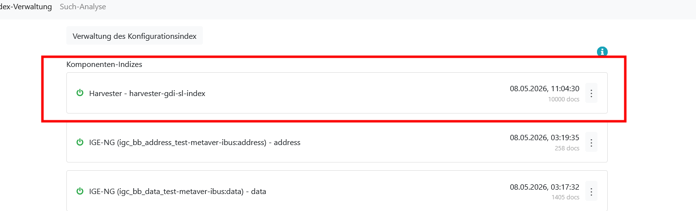

In diesem Leitfaden finden Sie Hilfestellungen, um Kataloge direkt über Konfigurationsdateien anzuschließen (nicht über GUI). Eine abgeschlossene Installation des Harvesters wird vorausgesetzt.

Für die Einrichtung sind folgende Konfigurationsdateien relevant:

- `harvester/config/config-catalogs.json` – definiert die Zielkataloge (z. B. Elasticsearch-Indizes)
- `harvester/config/config.json` – verbindet jede Datenquelle mit einem oder mehreren Katalogen
- `docker-compose.yml` – bindet Konfigurationsdateien als Volume in den Container ein

## Docker Compose

Alle drei Konfigurationsdateien müssen als Volumes in der `docker-compose.yml` in den Container eingebunden werden:

```yaml
harvester:
  image: docker-registry.wemove.com/ingrid-harvester:8.3.0
  # ...
  volumes:
    # ...
    - ./harvester/config/config-catalogs.json:/opt/ingrid/harvester/config-catalogs.json
    - ./harvester/config/config.json:/opt/ingrid/harvester/config.json
```

Der Host-seitige Pfadpräfix (z. B. `./harvester/config/`) richtet sich nach dem jeweiligen Deployment-Aufbau und kann abweichen.

## Kataloge bearbeiten in `config-catalogs.json`

Die Datei `config-catalogs.json` definiert die Zielkataloge des Harvesters z. B. Elasticsearch-Indizes. Jeder Eintrag beschreibt einen Katalog mit einer eindeutigen ID, einem Typ, einem Namen und verbindungsspezifischen Einstellungen.

Erstellen oder bearbeiten Sie die Datei unter `harvester/config/config-catalogs.json`:

```json
[
  {
    "id": 1,
    "type": "elasticsearch",
    "name": "Elasticsearch (harvester-gdi-sl)",
    "url": "http://elastic:9200",
    "settings": {
      "version": "9",
      "index": "harvester-gdi-sl-index",
      "alias": "harvester-gdi-sl",
      "user": "",
      "password": "",
      "mappingFile": "default-mapping"
    }
  },
  {
    "id": 2,
    "type": "elasticsearch",
    "name": "Elasticsearch (harvester-sn-geomis-lfulg)",
    "url": "http://elastic:9200",
    "settings": {
      "version": "9",
      "index": "harvester-sn-geomis-lfulg-index",
      "alias": "harvester-sn-geomis-lfulg",
      "user": "",
      "password": "",
      "mappingFile": "default-mapping"
    }
  }
]
```

### Überprüfen im GUI

Die konfigurierten Kataloge erscheinen auf der Seite `Kataloge`.




## Datenquelle mit Katalog verbinden in `config.json`

In der `config.json` wird jeder Datenquelle eine Liste von Katalog-IDs zugewiesen. Verwenden Sie dafür das Feld `catalogIds` als Array. Tragen Sie die IDs aus der `config-catalogs.json` ein:

Datenquelle 1 → Katalog 1 (`gdi-sl`):

```json
"catalogIds": [
  1
]
```

Datenquelle 2 → Katalog 2 (`sn-geomis-lfulg`):

```json
"catalogIds": [
  2
]
```

### Überprüfen im GUI

Die zugewiesenen Katalog-IDs sind auf der Seite `Datenquellen` sichtbar. Kappen Sie die entsprechende Datenquelle auf, um verlinkte `Kataloge` zu sehen.




## iBus

Nach der Konfiguration erscheint der Elasticsearch-Index im iBus. Zunächst wird der Index als inaktiv angezeigt. Nach dem ersten erfolgreichen Harvester-Lauf wechselt er in den aktiven Zustand.






## Datenquelle konfigurieren in config.json

Dieser Abschnitt beschreibt alle Konfigurationseinstellungen der Harvester-Importer.

**UI**: `Ja` = im Frontend konfigurierbar;  `Nein` = nur serverseitig konfigurierbar

### Basis Einstellungen

??? example "Basis-Einstellungen (`ImporterSettings`)"

    Alle format-spezifischen Importer erben diese Einstellungen.

    | Name | UI | Beschreibung |
    |------|----|--------------|
    | priority | Ja | `number` — Sortierpriorität für Suchergebnisse |
    | blacklistedIds | Ja | `string[]` — IDs, die vom Harvesting ausgeschlossen werden |
    | catalogIds | Ja | `number[]` — Katalog-IDs, denen geerntete Datensätze zugeordnet werden |
    | cron.full | Ja | `CronData` — Zeitplan für vollständige Harvest-Läufe |
    | cron.incr | Ja | `CronData` — Zeitplan für inkrementelle Harvest-Läufe |
    | customCode | Ja | `string` — JavaScript-Code, der während des Mappings ausgeführt wird, um Feldwerte zu überschreiben oder zu ergänzen |
    | dateSourceFormats | Nein | `string[]` — Datumsformat-Strings zum Parsen von Quelldatumsangaben |
    | defaultAttribution | Nein | `string` — Standard-Quellenangabe für geerntete Datensätze |
    | defaultAttributionLink | Nein | `string` — URL für die Standard-Quellenangabe |
    | defaultDCATCategory | Nein | `string[]` — Standard-DCAT-AP-Themenkategorien, wenn die Quelle keine liefert |
    | iPlugId | Ja ¹ | `string` — iPlug-Bezeichner für die Ingrid-Suchindex-Integration |
    | partner | Ja ¹ | `string` — Ingrid-Partner-Bezeichner |
    | provider | Ja ¹ | `string` — Ingrid-Provider-Bezeichner |
    | datatype | Ja ¹ | `string` — Ingrid-Datentyp zur Indexkategorisierung |
    | dataSourceName | Ja ¹ | `string` — Ingrid-Datenquellenname für die Indexregistrierung |
    | boost | Nein | `number` — *Veraltet?* Suchranking-Boost-Faktor; wird im aktuellen Indexing nicht verwendet |
    | description | Ja | `string` — Lesbarer Name dieser Harvester-Konfiguration |
    | disable | Nein | `boolean` — Wenn `true`, ist der Harvester inaktiv und wird im Zeitplan übersprungen |
    | dryRun | Nein | `boolean` — Wenn `true`, wird der Harvest ohne Schreiben in den Index ausgeführt |
    | id | Nein | `number` — Interne Datenbank-ID dieser Harvester-Konfiguration |
    | maxConcurrent | Ja | `number` — Maximale Anzahl gleichzeitiger HTTP-Anfragen während des Harvests |
    | maxRecords | Ja | `number` — Maximale Anzahl Datensätze pro Anfrage-Seite |
    | proxy | Nein | `string` — HTTP-Proxy-URL für ausgehende Anfragen (globale Konfiguration) |
    | showCompleteSummaryInfo | Nein | `boolean` — Wenn `true`, enthält das Log vollständige Harvest-Details statt einer Zusammenfassung |
    | skipUrlCheckOnHarvest | Nein | `boolean` — Wenn `true`, wird die Verfügbarkeitsprüfung für Distributions-URLs übersprungen |
    | startPosition | Ja | `number` — Seiten-Offset für den Harvest-Start (1-basiert) |
    | type | Ja | `string` — Importer-Typ-Bezeichner (z.B. `CSW`, `WFS`); nach der Erstellung schreibgeschützt |
    | whitelistedIds | Ja | `string[]` — IDs, die immer eingeschlossen werden, auch wenn sie auf der Ausschlussliste stehen |
    | rejectUnauthorizedSSL | Nein | `boolean` — Wenn `false`, werden ungültige SSL-Zertifikate ignoriert (globale Konfiguration) |
    | rules.containsDocumentsWithData | Ja | `boolean` — Wenn `true`, werden nur Datensätze mit mindestens einer herunterladbaren Distribution eingeschlossen |
    | rules.containsDocumentsWithDataBlacklist | Ja | `string` — Kommaseparierte Dateiformate, die bei der Download-Prüfung ausgeschlossen werden |
    | timeout | Nein | `number` — HTTP-Anfrage-Timeout in Millisekunden |
    | sourceURL | Ja | `string` — Basis-URL der zu erntenden Datenquelle |

    ¹ Nur im ingrid/zdm-Profil verfügbar

### Formatspezifische Einstellungen

??? example "CSW (`CswSettings`)"

    | Name | UI | Beschreibung |
    |------|----|--------------|
    | resultType | Nein | `'hits' \| 'results'` — GetRecords-Ergebnismodus; `hits` = nur Anzahl, `results` = Datensätze abrufen |
    | pluPlanState | Ja ² | `PluPlanState` — Planungsstatus, der allen geernteten Datensätzen zugewiesen wird |
    | maxServices | Ja | `number` — Maximale Datensatz-IDs pro Service-Anfrage-Chunk im `separate`-Harvesting-Modus |
    | resolveOgcDistributions | Ja ² | `boolean` — WFS/WMS-Endpunkte auflösen, um Geometrien abzurufen (langsam) |
    | harvestingMode | Ja | `'standard' \| 'separate'` — `standard` erntet alle Datensatztypen gemeinsam; `separate` fragt Dienste per Datensatz-Chunk ab |
    | eitherKeywords | Ja | `string[]` — Datensatz muss mindestens eines dieser Schlüsselwörter enthalten |
    | httpMethod | Ja | `'GET' \| 'POST'` — HTTP-Methode für CSW-Anfragen |
    | recordFilter | Ja | `string` — OGC-XML-Filter zur Einschränkung der geernteten Datensätze |
    | simplifyTolerance | Ja ² | `number` — Douglas-Peucker-Toleranz für Polygon-Vereinfachung (0 = deaktiviert) |

    ² Nur im DiPlanung-Profil verfügbar


??? example "CKAN (`CkanSettings`)"

    | Name | UI | Beschreibung |
    |------|----|--------------|
    | filterTags | Ja | `string[]` — Datensätze überspringen, deren Tags keines dieser Schlüsselwörter enthält |
    | filterGroups | Ja | `string[]` — Datensätze überspringen, deren Gruppen keine dieser Gruppen enthält |
    | providerPrefix | Nein | `string` — Präfix, das Autoren-/Betreibernamen vorangestellt wird |
    | providerField | Nein | `ProviderField` — *Veraltet?* Wählt, welches CKAN-Feld als Provider verwendet wird; wird im Mapper nicht verwendet |
    | requestType | Ja | `'ListWithResources' \| 'Search'` — CKAN-API-Endpunkt: `Search` nutzt `package_search`, `ListWithResources` nutzt `current_package_list_with_resources` |
    | additionalSearchFilter | Ja | `string` — Solr-Filterabfrage, die an die Such-API-Anfrage angehängt wird |
    | markdownAsDescription | Ja | `boolean` — Wenn `true`, werden Datensatz-Notizen als Markdown-HTML gerendert |
    | groupChilds | Ja | `boolean` — *Veraltet?* Für das Gruppieren von Unterdatensätzen vorgesehen; wird im Importer und Mapper nicht verwendet |
    | defaultLicense | Ja | `License` — Fallback-Lizenz für Datensätze ohne Lizenzangabe |


??? example "DCAT-AP.de (`DcatapdeSettings`)"

    | Name | UI | Beschreibung |
    |------|----|--------------|
    | filterTags | Ja | `string[]` — Datensätze überspringen, deren Schlüsselwörter keines dieser Tags enthält |
    | filterThemes | Ja | `string[]` — Datensätze überspringen, deren DCAT-Themen keines dieser Themen enthält (Abgleich per URI-Fragment) |
    | providerPrefix | Nein | `string` — *Veraltet?* Präfix, das Providernamen vorangestellt wird |
    | dcatProviderField | Nein | `DCATProviderField` — *Veraltet?* Wählt, welches DCAT-Agent-Feld als Provider verwendet wird |


??? example "DCAT-AP PLU (`DcatappluSettings`)"

    Keine eigenen Einstellungsfelder — entspricht vollständig den Basis-Einstellungen (`ImporterSettings`).


??? example "JSON (`JsonSettings`)"

    | Name | UI | Beschreibung |
    |------|----|--------------|
    | idProperty | Ja | `string` — Schlüssel, der zur Extraktion der Datensatz-ID aus jedem JSON-Objekt verwendet wird |
    | additionalSettings | Ja | `Record<string, string>` — *Veraltet?* Schlüssel-Wert-Paare für zusätzliche Konfiguration; wird im Mapper nicht verwendet |


??? example "KLD (`KldSettings`)"

    | Name | UI | Beschreibung |
    |------|----|--------------|
    | maxConcurrentTimespan | Ja | `number` — Wartezeit in Millisekunden zwischen Batches gleichzeitiger Anfragen; höherer Wert = mehr Drosselung |


??? example "OAI-PMH (`OaiSettings`)"

    | Name | UI | Beschreibung |
    |------|----|--------------|
    | metadataPrefix | Ja | `string` — OAI-PMH-Metadatenformat-Bezeichner (z.B. `iso19139`, `oai_dc`); bestimmt Parser-Klasse und XPath-Ausdrücke |
    | set | Ja | `string` — OAI-PMH-Set-Bezeichner für selektives Harvesting; wird als Abfrageparameter in ListRecords übergeben |
    | from | Ja | `Date` — OAI-PMH-Untergrenze (ISO-Format); nur Datensätze ernten, die an oder nach diesem Datum geändert wurden |
    | until | Ja | `Date` — OAI-PMH-Obergrenze (ISO-Format); nur Datensätze ernten, die an oder vor diesem Datum geändert wurden |
    | eitherKeywords | Ja | `string[]` — Datensatz muss mindestens eines dieser Schlüsselwörter enthalten |


??? example "SPARQL (`SparqlSettings`)"

    | Name | UI | Beschreibung |
    |------|----|--------------|
    | query | Ja | `string` — SPARQL-SELECT-Abfrage, die gegen den Endpunkt ausgeführt wird |
    | filterTags | Nein | `string[]` — Datensätze überspringen, deren Schlüsselwörter keines dieser Tags enthält |
    | filterThemes | Nein | `string[]` — *Veraltet?* Themenfilter; wird im Mapper nicht verwendet |
    | defaultProvider | Nein | `string` — *Veraltet?* Standard-Provider-Angabe; wird im Mapper nicht verwendet |
    | recordFilter | Nein | `string` — *Veraltet?* Datensatzfilter; wird im Mapper nicht verwendet |


??? example "WFS (`WfsSettings`)"

    | Name | UI | Beschreibung |
    |------|----|--------------|
    | version | Ja | `'2.0.0' \| '1.1.0'` — WFS-Protokollversion für Anfragen |
    | memberElements | Nein | `string[]` — XPath-Ausdrücke zur Lokalisierung von Feature-Elementen in der WFS-Antwort (profilabhängig gesetzt) |
    | pluPlanState | Ja ² | `PluPlanState` — Planungsstatus, der geernteten Datensätzen zugewiesen wird |
    | contactCswUrl | Ja ² | `string` — CSW-URL zum Abrufen von Kontaktmetadaten für alle Features |
    | contactMetadata | Ja ² | `Contact` — Fallback-Kontakt, wenn die CSW-Suche kein Ergebnis liefert |
    | maintainer | Ja ² | `Person \| Organization` — Fallback-Betreiber, wenn die CSW-Suche keinen Verwahrer liefert |
    | count | Nein | `number` — *Veraltet?* Paging-Zähler; wird im Importer nicht verwendet (stattdessen `maxRecords`) |
    | resultType | Nein | `'hits' \| 'results'` — WFS-Anfrage-Ergebnismodus; `hits` = nur Anzahl; wird programmatisch gesetzt |
    | typename | Ja | `string` — Kommaseparierte WFS-Feature-Typ-Namen (mit Namespace-Präfix) zum Ernten |
    | featureLimit | Ja | `number` — Maximale Anzahl geernteter Features pro Typ (0 = unbegrenzt) |
    | harvestTypes | Nein | `boolean` — Wenn `true`, werden auch FeatureType-Metadaten zusätzlich zu den Features geerntet |
    | httpMethod | Ja | `'GET' \| 'POST'` — HTTP-Methode für WFS-Anfragen |
    | featureFilter | Nein | `string` — OGC-Filter-XML zur Einschränkung der Feature-Ergebnisse |
    | resolveWithFullResponse | Nein | `boolean` — Vollständiges HTTP-Antwortobjekt für GetCapabilities zurückgeben |
    | requireGeometry | Nein | `boolean` — Feature-Typen ohne Geometrie überspringen |
    | wfsProfile | Ja | `WfsProfile` — Wählt Standard-Member-Elemente und profilspezifisches Verhalten |
    | featureTitleAttribute | Ja | `string` — XPath-Ausdruck zur Extraktion des Feature-Titels (ingrid-Profil) |

    ² Nur im DiPlanung-Profil verfügbar


??? example "GENESIS (`GenesisSettings`)"

    `GenesisSettings` enthält neben den Basis-Einstellungen ein `typeConfig`-Objekt mit allen GENESIS-spezifischen Feldern.

    | Name | UI | Beschreibung |
    |------|----|--------------|
    | typeConfig.username | Ja | `string` — GENESIS-Login-Benutzername |
    | typeConfig.password | Ja | `string` — GENESIS-Login-Passwort |
    | typeConfig.apiToken | Ja | `string` — Alternativ zu Benutzername/Passwort: API-Token; verwendet dann den festen Benutzernamen `Gast` |
    | typeConfig.requestDelayMs | Ja | `number` — Wartezeit in Millisekunden zwischen aufeinanderfolgenden API-Aufrufen zur Vermeidung von Rate-Limiting (Standard: 500) |
    | typeConfig.statisticCodes | Ja | `string[]` — API-`selection`-Muster (Platzhalter erlaubt, z.B. `11*`), die an `/catalogue/statistics` übergeben werden |
    | typeConfig.publisher.name | Ja | `string` — Name der herausgebenden Organisation |
    | typeConfig.publisher.email | Ja | `string` — Kontakt-E-Mail-URI, z.B. `mailto:info@destatis.de` |
    | typeConfig.theme | Ja | `string` — EU-Datenthem-URI (entspricht `dcat:theme`) |
    | typeConfig.licenseUrl | Ja | `string` — Lizenz-URI (entspricht `dct:license`) |
    | typeConfig.contributorId | Ja | `string` — Beitragende-Registrierungs-URI (entspricht `dcatde:contributorID`) |
    | typeConfig.spatialUri | Ja | `string` — Räumliche Abdeckungs-URI (entspricht `dct:spatial`) |
    | typeConfig.statisticUrlTemplate | Ja | `string` — URL-Vorlage für die Statistik-Einstiegsseite; `{code}` als Platzhalter für den Statistikcode |
    | typeConfig.tableUrlTemplate | Ja | `string` — URL-Vorlage für Tabellen-Onlineressourcen; `{code}` als Platzhalter für den Tabellencode |