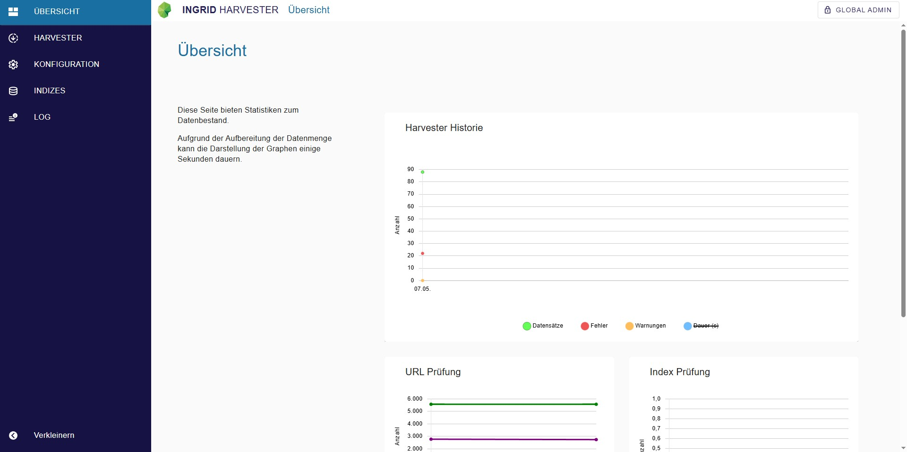
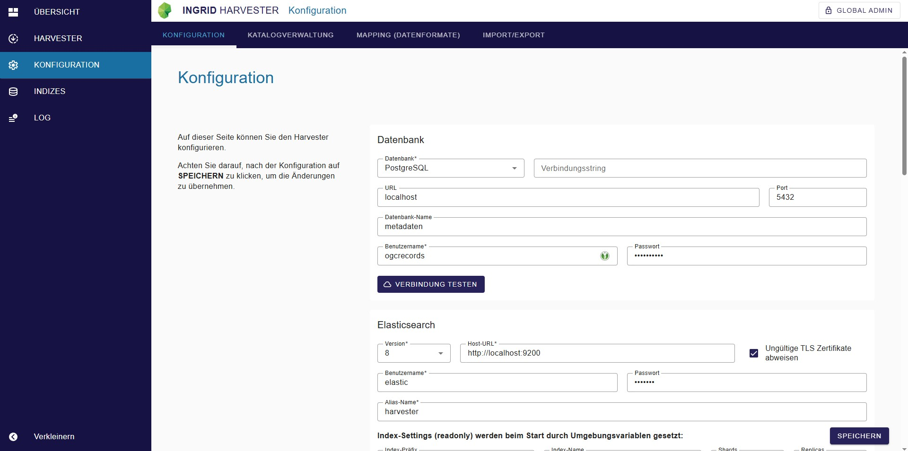
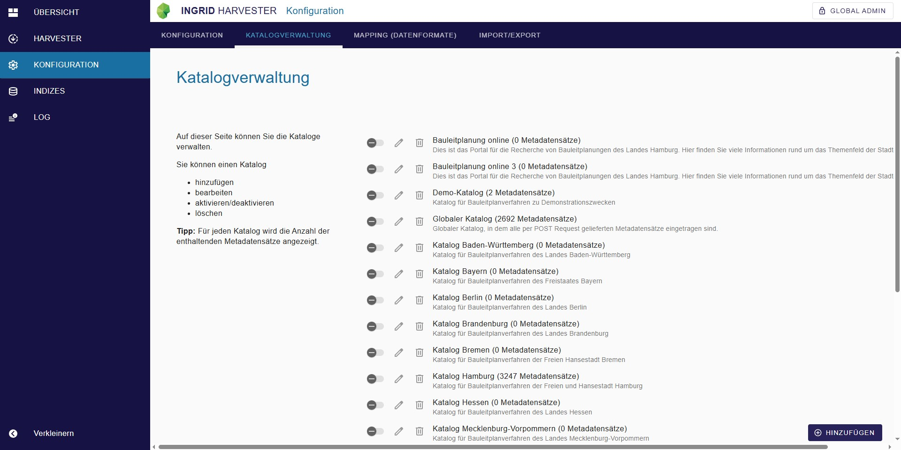
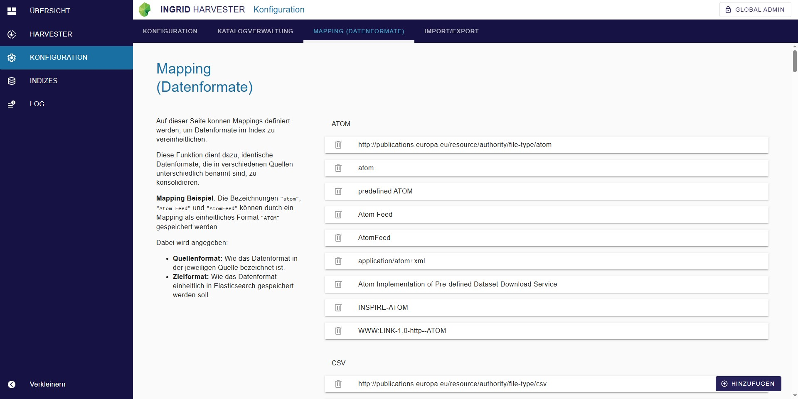
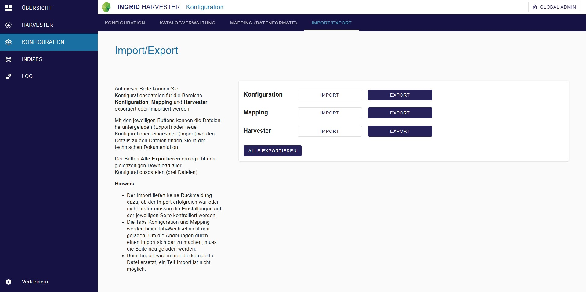
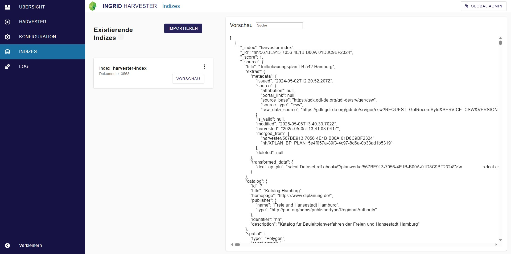
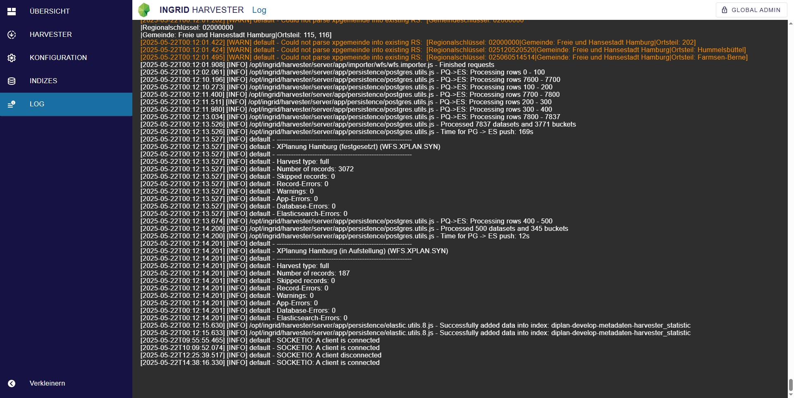

# Harvester Benutzeroberfläche

Diese Seite bietet einen Überblick über Bediehnung und Benutzeroberfläche vom Harvester. 

<div class="grid cards" markdown>

-   :material-book-open-variant-outline: __Installation & Konfiguration__

    ---

    { class="grid-pictogram" }
    
    Sie wollen den **Harvester installieren**? 
    
    Informationen zur Komponente können Sie der Dokumentation entnehmen.

    [Harvester Dokumentation]({{ fix_url('components/harvester.md') }}){ .md-button }

</div>

## Dashboard



!!! tip inline end "Hinweis"

    Unter [Indizes](#indizes) können die Inhalte und die Struktur des jeweiligen Statistik-Indexes eingesehen werden.

Auf der Seite **Übersicht** werden verschiedene statistische Daten zum Datenbestand als Graphen bereitgestellt. Anmerkung: Die Darstellung des Graphen kann einige Sekunden dauern, aufgrund der Aufbereitung der Datenmenge.

Die unterschiedlichen statistischen Daten werden jeweils in einem eigenen Index abgelegt.
Per Cron werden die statistischen Daten zeitgesteuert ermittelt.
Index und Cron werden nachfolgend in den einzelnen Statistik Kapiteln aufgeführt.


??? info "Harvester Historie"

    Der Graph **Harvester Historie** werden statistische Daten zu den einzelnen Harvestern bzw. deren Indizes dargestellt (enthaltene Datensätze, Gesamt Anzahl und Warnungen, Fehler).

    Die Statistiken aus dem Bereich Harvester werden tageweise zusammengefasst. Wenn für einen Harvester mehrere Harvesting-Vorgänge an einem Tag durchgeführt wurden, wird der jeweils letzte Lauf verwendet. Die Werte der einzelnen Harvester werden aufsummiert.

    - **Index**: harvester_statistic (s. Indizes)
    - **Cron**: Die Statistik der Harvester wird mit jedem Harvesting Prozess aktualisiert, jeder Harvester besitzt seinen eigenen Cron.

??? info "Url Prüfung"

    Die **Url Prüfung** ermittelt den Status, der in den Metadaten enthaltenen URLs (Download Links).

    Für alle Distribution-URLs wird eine HEAD-Abfrage gemacht. Bei einer korrekten Antwort wird der HTTP-Statuscode der Antwort gespeichert, falls ein Fehler auftritt die entsprechende Fehlermeldung.

    Im Diagramm werden die Ergebnisse gruppiert nach Statuscode-Bereich (2xx, 4xx oder 5xx) bzw. nach fehlerhafte Anfrage.
    Bei Klick auf einen Datensatz im Diagramm öffnet sich ein Pop-Up in der die Ergebnisse für diesen Durchlauf nach genauem Statuscode oder Fehler aufgeschlüsselt werden und jeweils die betroffenen URLs aufgelistet werden. Die URL-Einträge sind mit einer Suche nach mCLOUD Datensätzen mit dieser Distribution-URL verknüpft.

    Hinweise zu Ergebnissen
    Status 405 - Method Not Allowed: Hier handelt es sich üblicherweise um Systeme die keine HEAD-Abfrage unterstützen. Ein normaler regulärer Aufruf der URL ist oftmals trotzdem möglich.

    - **Index**: url_check_history (s. Indizes)
    - **Cron**: Unter `Konfiguration` > `Checks` > `Url Check` kann ein Cron Expression hinterlegt werden.

??? info "Index Prüfung"

    Die **Index Prüfung** ermittelt über alle Indizes hinweg statistische Daten.

    Aktuell werden die Anzahl der validen und nicht validen Datensätze, sowie die Anzahl der Datensätze mit Raum- bzw. Zeitbezug im Graphen angezeigt.
    Nicht valide Datensätze sind im Index markiert, dies sind z.B. Datensätze, die über keinen Download-Link verfügen.

    **Anmerkung für mCLOUD-Portal**: Darüber hinaus erfasst die **Index Prüfung** den Status der Facetten aus dem mCLOUD-Portal. Diese Information wird allerdings aktuell nicht angezeigt.
    Im Tab Indizes kann aber mit Klick auf den entsprechenden Statistik Index diese Information angezeigt werden.

    - **Index**: index_check_history (s. Tab Indizes)
    - **Cron**: Unter `Konfiguration` > `Checks` > `Index Check` kann ein Cron Expression hinterlegt werden.

## Harvester Prozesse aufsetzen


Zentraler Bereich der Admin-GUI ist die Seite **Harvester**, in der sämtliche Harvesting-Prozesse unterteilt nach Typ aufgelistet sind.
Hier können die Harvester hinzugefügt, bearbeitet und gesteuert werden.

Jeder Harvester kann durch einen Schalter aktiviert/deaktiviert werden.

Durch einen Klick auf den Titel des Harvesters wird dieser aufgeklappt und Sie erhalten einen Überblick über die letzten Aktivitäten sowie weitere Optionen:

- Import manuell starten
- Error-Log einsehen
- Historie abrufen
- Zeitliche Ausführung planen (Cronjob einrichten)
- Harvester bearbeiten
- Harvester entfernen
- ??? info "Harvester Hinzufügen"

        Um eine neue Harvester anzulegen, klicken Sie auf `HINZUFÜGEN` in der unteren rechten Ecke. Nun öffnet sich eine Dialog, der Sie dabei unterstützt einen Harvester anzulegen. 

        1. Wählen Sie zunächst den Typ der Datenquelle aus. 
        - Die verfügbaren Typen sind vom Profil abhängig.
        1. Füllen Sie die entsprechenden Felder aus. 
        - Ausfüllhilfen finden sie im Abschnitt [Harvester Ausfüllhilfe]({{ fix_url('guides/harvester-csw.md/#ausfullhilfe') }}). 
        1. Klicken Sie auf `ANLEGEN`, um den Prozess abzuschließen. 

        Nach dem Sie einen Harvester angelegt haben, ist dieser in der Liste zu finden. Über den Schieberegler auf der rechten Seite kann ein Harvester aktiviert oder deaktiviert werden.

- ??? info "Harvester Ausführung"

        Die Ausführung der Harvester kann manuell gestartet werden oder zeitlich gesteuert automatisch erfolgen.
        Wählen Sie zunächst einen bestehenden Harvester aus in dem Sie auf den Titel des Harvesters klicken.

        - Die Schaltfläche `IMPORT STARTEN` führt den Harvester direkt aus.
        - Über die Schaltfläche `PLANEN` öffnet sich ein Dialog in dem die regelmäßige automatische Ausführung des Harvesters aktiviert und geplant werden kann.
        
        Die Intervallsteuerung erfolgt dabei entsprechend der Cron-Notation: https://de.wikipedia.org/wiki/Cron#Beispiele
        
        ```
        */5 * * * * => Alle 5 Minuten
        45 8 * * * => Täglich um 8:45 Uhr
            ```

        - Am Anfang der Liste, in der linken oberen Ecke, finden Sie die Schaltfläche `ALLE IMPORTIEREN`, mit der alle aktiven Harvester manuell gestartet werden.

- ??? info "Harvester Historie"

        Über die Schaltfläche `HISTORIE` kann zu jedem Harvester ein Diagramm mit Daten zu den letzten Imports angezeigt werden. Das Diagram enthält Kurven zur Anzahl der gespeicherten Datensätze, Fehler und Warnungen, sowie die Dauer des Imports.

        Per Mouseover werden zusätzlich Anzahl der Abgerufenen Datensätze und Übersprungene Datensätze sowie jeweils die Top-5 der Fehlermeldungen und Warnungen angezeigt.


## Konfiguration

### Konfiguration



Unter **Konfiguration** werden die Basis-Konfigurationen gesetzt. Detailierte Informationen zur Konfiguration finden Sie in der Dokumentation unter [Harvester]({{ fix_url('guides/harvester-setup.md') }}).

### Katalogverwaltung



Auf der Seite **Katalogverwaltung** können Sie die Kataloge:

- hinzufügen
- bearbeiten
- aktivieren/deaktivieren
- löschen

!!! tip "Tipp"

    Für jeden Katalog wird die Anzahl der enthaltenden Metadatensätze angezeigt.


### Mapping (Datenformate)



Unter **Konfiguration** im Reiter **Mapping (Datenformat)** können Mappings definiert werden, um Datenformate im Index zu vereinheitlichen. Diese Funktion dient dazu, identische Datenformate, die in verschiedenen Quellen unterschiedlich benannt sind, zu konsolidieren.

??? info "Mapping erstellen"

    **Beispiel**: Die Bezeichnungen `"atom"`, `"Atom Feed"` und `"AtomFeed"` können durch ein Mapping als einheitliches Format `"ATOM"` gespeichert werden.

    Dabei wird angegeben:
    
    * **Quellenformat**: Wie das Datenformat in der jeweiligen Quelle bezeichnet ist.
    * **Zielformat**: Wie das Datenformat einheitlich in Elasticsearch gespeichert werden soll.


### Import/Export



Unter **Konfiguration** im Reiter **Import/Export** können Konfigurationsdateien für die Bereiche **Konfiguration**, **Mapping** und **Harvester** exportiert oder importiert werden. 


??? info "Konfigurationen importieren/exportieren"

    Mit den jeweiligen Buttons können die Dateien heruntergeladen (Export) oder neue Konfigurationen eingespielt (Import) werden. Details zu den Dateien finden Sie in der "Technischen Dokumentation".

    Der Button `Alle Exportieren` ermöglicht den gleichzeitigen Download aller Konfigurationsdateien (drei Dateien).

    **Hinweis**

    - Der Import liefert keine Rückmeldung dazu, ob der Import erfolgreich war oder nicht, dafür müssen die Einstellungen auf der jeweiligen Seite kontrolliert werden.
    - Die Tabs Konfiguration und Mapping werden beim Tab-Wechsel nicht neu geladen. Um die Änderungen durch einen Import sichtbar zu machen, muss die Seite neu geladen werden.
    - Beim Import wird immer die komplette Datei ersetzt, ein Teil-Import ist nicht möglich.

## Indizes



!!! tip inline end "Statistik Indizes enden mit"

    - *index_check_history*
    - *harvester_statistic*
    - *url_check_history*

Die Seite **Indizes** zeigt die aktuellen Indizes in Elasticsearch an. 

Es können jeweils die ersten 10 Einträge pro Index für eine schnelle Kontrolle in der `VORSCHAU` angezeigt werden.

Im 3-Punkte-Menü eines Index stehen die Funktionen `Exportieren` und `Löschen` zur Verfügung.


??? info "Index importieren"

    Über die Schaltfläche `IMPORTIEREN` kann ein exportierter Index importiert werden (Seite Indizes ganz oben).

    > **Hinweis**: Ein Index kann nur importiert werden, wenn es unter dem Namen noch keinen Index gibt. Gegebenenfalls bestehende Indizes müssen zunächst gelöscht werden.

## Log



Auf der Seite Log wird das Log-File der letzten Harvester Läufe und Systemmeldungen angezeigt. Fehler sind rot hervorgehoben, um Probleme schneller erkennen zu können.

