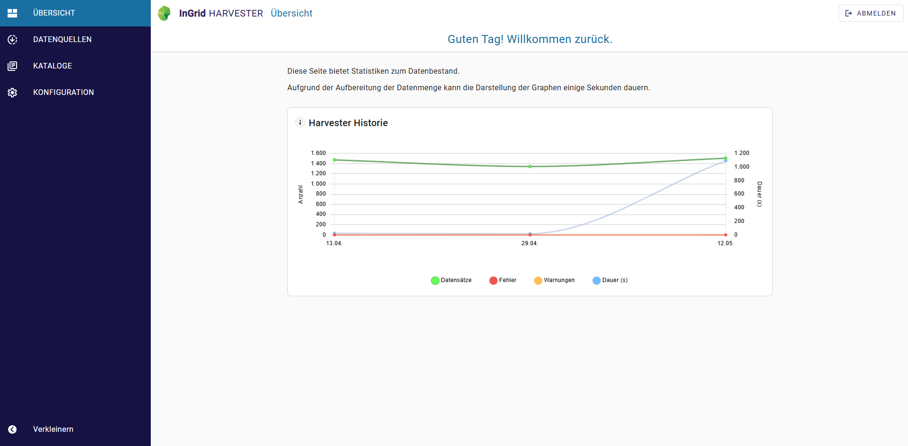
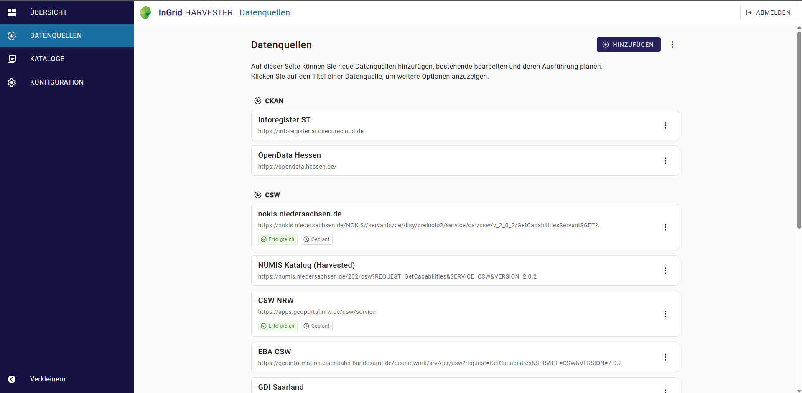
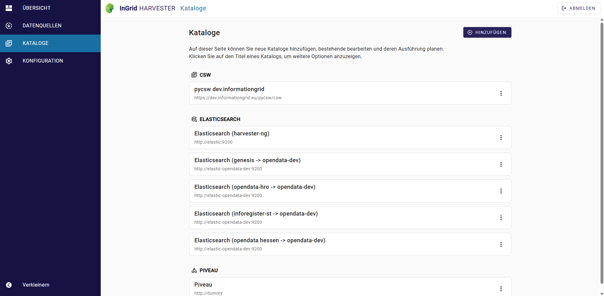
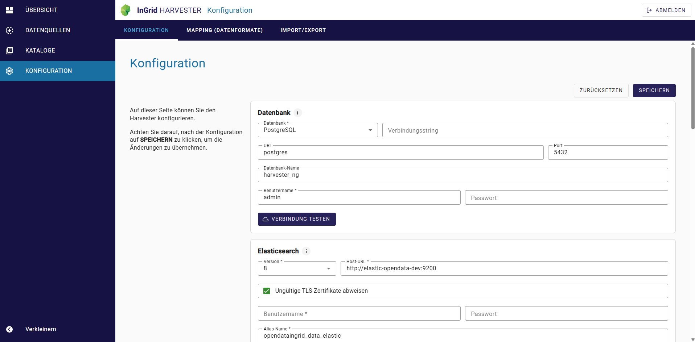
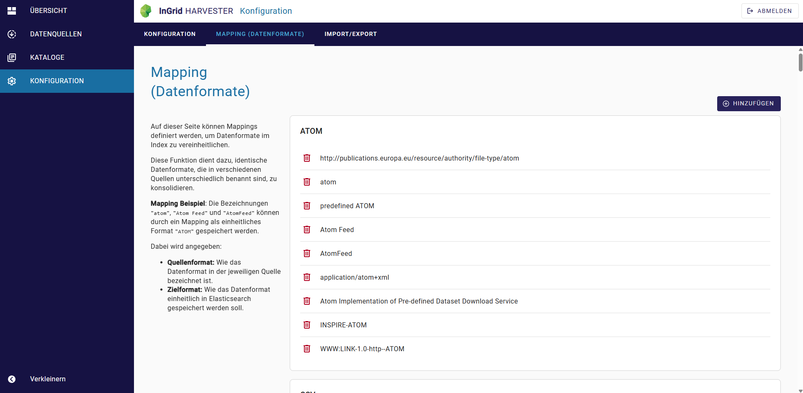
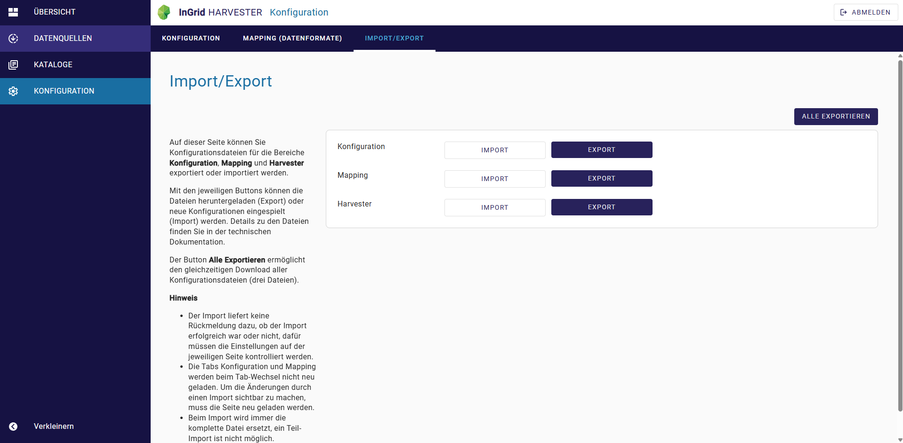

# Harvester Benutzeroberfläche

Diese Seite bietet einen Überblick über Bediehnung und Benutzeroberfläche vom Harvester. 

-   :material-book-open-variant-outline: __Installation & Konfiguration__

    ---

    { class="grid-pictogram" }
    
    Sie wollen den **Harvester installieren**? 
    
    Informationen zur Komponente können Sie der Dokumentation entnehmen.

    [Harvester Dokumentation]({{ fix_url('components/harvester.md') }}){ .md-button }

## Dashboard

Auf der Seite **Übersicht** werden statistische Daten zum Datenbestand bereitgestellt. 

Der Graph **Harvester Historie** zeigt statistische Daten zu den einzelnen Datenquellen (enthaltene Datensätze, Gesamt Anzahl und Warnungen, Fehler). Die Darstellung des Graphen kann einige Sekunden dauern, aufgrund der Aufbereitung der Datenmenge.

Die Statistik wird tageweise zusammengefasst. Wenn für eine Datenquelle mehrere Harvesting-Vorgänge an einem Tag durchgeführt wurden, wird der jeweils letzte Lauf verwendet. Die Werte der einzelnen Datenquellen werden aufsummiert.

## Datenquelle verbinden & importieren

Zentraler Bereich der Admin-GUI ist die Seite **Datenquellen**, in der sämtliche Harvesting-Prozesse unterteilt nach Typ aufgelistet sind.
Hier können Datenquellen hinzugefügt, bearbeitet und gesteuert werden.

Durch einen Klick auf den Titel einer bestehenden Datenquelle wird die Karte aufgeklappt und Sie erhalten einen Überblick über die letzten Aktivitäten sowie weiteren Informationen:

- Letzte Ausführung
- Dauer der Ausführung
- Nächste Ausführung
- Anzahl Dokumente
- Anzahl Fehler
- Anzahl Warnungen
- Angeschlossene Kataloge

??? info "Datenquelle hinzufügen"

    Um eine neue Datenquelle anzulegen, klicken Sie auf `HINZUFÜGEN` (oben rechts). Nun öffnet sich eine Dialog, der Sie dabei unterstützt einen Datenquelle zu konfigurien/verbinden. 

    1. Wählen Sie zunächst den Typ der Datenquelle aus. 
    - Die verfügbaren Typen sind vom Profil abhängig.
    1. Füllen Sie die entsprechenden Felder aus. 
    - Ausfüllhilfen finden Sie im Abschnitt [Datenquelle verbinden]({{ fix_url('guides/harvester-csw.md/#ausfullhilfe') }}). 
    1. Klicken Sie auf `ANLEGEN`, um den Prozess abzuschließen. 

    Nach dem Sie eine Datenquelle angelegt haben, ist diese in der Liste zu finden.

??? info "Datenquelle importieren & zeitlich planen"

    Die Datenquellen können manuell oder zeitlich automatisiert geharvestet werden.
    Wählen Sie zunächst eine bestehende Datenquelle aus und klicken auf das 3-Punkte-Menu. Hier finden Sie folgende Optionen:

    **Import starten**

    Import wird sofort ausgeführt.

    **Planen**

    Öffnet einen Konfigurationsdialog bzgl. regelmäßigen automatisches Ausführung. Hier kann ein Import aktiviert und zeitlich geplant werden.

    
    Die Intervallsteuerung erfolgt dabei entsprechend der Cron-Notation: https://de.wikipedia.org/wiki/Cron#Beispiele
    
        */5 * * * * => Alle 5 Minuten
        45 8 * * * => Täglich um 8:45 Uhr

    Am Anfang der Liste, in der linken oberen Ecke, finden Sie ein weiteres 3-Punkte-Menu mit der Option `ALLE IMPORTIEREN`. Damit werden alle aktiven Datenquellen manuell importiert.

??? info "Importverlauf pro Datenquelle"

    In dem 3-Punkte-Menu von jeder Datenquelle finden Sie die Option `Verlauf`. 

    Der Verlauf gibt Einblick in die letzten 10 Importverläufe von einer Datenquelle. Hier können Anzahl der gespeicherten Datensätze, Fehler, Log-Nachrichten, sowie die Dauer des Imports eingesehen werden.

## Kataloge verwalten

Neben den Datenquellen können Kataloge (Datenziele) definieren werden, an die importiere Datensätze aus den Datenquellen weitergegeben werden. 

Neben den Datenquellen können Kataloge als Datenziele definiert werden. An diese werden die importierten Datensätze aus den Datenquellen weitergegeben. Ein Katalog kann mit mehreren Datenquellen verbunden werden. 

!!! tip inline end "Hinweis zum Löschen"

    Wird ein Katalog aus der Liste gelöscht, dann werden alle importierten Datensätze aus dem Katalog entfernt.

Auf der Seite **Katalog** können Sie die Kataloge:

- Hinzufügen
- Bearbeiten
- Duplizieren
- Löschen

Ausfüllhilfen zur Konfiguration von einem Katalog finden Sie im Abschnitt [Katalog verbinden]({{ fix_url('guides/harvester-catalog.md') }}). 

<!-- ------------- Bis hier korrigiert ------------- -->

## Konfiguration

### Konfiguration

Unter **Konfiguration** werden die Basis-Konfigurationen gesetzt. Detailierte Informationen zur Konfiguration finden Sie in der Dokumentation unter [Harvester Einrichten]({{ fix_url('guides/harvester-setup.md') }}).

### Mapping (Datenformate)

Unter **Konfiguration** im Reiter **Mapping (Datenformat)** können Mappings definiert werden, um Datenformate im Index zu vereinheitlichen. Diese Funktion dient dazu, identische Datenformate, die in verschiedenen Quellen unterschiedlich benannt sind, zu konsolidieren.

??? info "Mapping erstellen"

    **Beispiel**: Die Bezeichnungen `"atom"`, `"Atom Feed"` und `"AtomFeed"` können durch ein Mapping als einheitliches Format `"ATOM"` gespeichert werden.

    Dabei wird angegeben:
    
    * **Quellenformat**: Wie das Datenformat in der jeweiligen Quelle bezeichnet ist.
    * **Zielformat**: Wie das Datenformat einheitlich in Elasticsearch gespeichert werden soll.

### Import/Export

Unter **Konfiguration** im Reiter **Import/Export** können Konfigurationsdateien für die Bereiche **Konfiguration**, **Mapping** und **Harvester** exportiert oder importiert werden. 

??? info "Konfigurationen importieren/exportieren"

    Mit den jeweiligen Buttons können die Dateien heruntergeladen (Export) oder neue Konfigurationen eingespielt (Import) werden. Details zu den Dateien finden Sie in der "Technischen Dokumentation".

    Der Button `Alle Exportieren` ermöglicht den gleichzeitigen Download aller Konfigurationsdateien (drei Dateien).

    **Hinweis**

    - Der Import liefert keine Rückmeldung dazu, ob der Import erfolgreich war oder nicht, dafür müssen die Einstellungen auf der jeweiligen Seite kontrolliert werden.
    - Die Tabs Konfiguration und Mapping werden beim Tab-Wechsel nicht neu geladen. Um die Änderungen durch einen Import sichtbar zu machen, muss die Seite neu geladen werden.
    - Beim Import wird immer die komplette Datei ersetzt, ein Teil-Import ist nicht möglich.
