# Crawler einrichten

Dieser Abschnitt begleitet Sie beim Einrichten des Crawlers. Eine abgeschlossene Installation des Crawlers wird vorausgesetzt.

### Basiskonfiguration

Der Zugang zu Admin GUI ist durch Login/Passwort geschützt. Das Login ist `admin`, das Default Passwort ist `admin` und muss in der Admin GUI geändert werden.

**Menü "Kommunikation bearbeiten"**

Hier werden die InGrid Kommunikationseinstellungen bearbeitet. Es muss mind. ein iBus definiert werden. Das iPlug kann aber auch an mehrere iBus Komponenten angeschlossen werden.

Die Proxy Service URL des iPlugs besteht aus einer Gruppe, zu welcher der iBus gehört, an den man sich anschließt und der ID des iPlugs. Der Name sollte noch nicht vergeben sein. Um dies zu erreichen, sollte man spezifische Begriffe des Anbieters einarbeiten. Die Adresse hat folgendes Format: `/<InGrid Gruppe>:<InGrid iPlug ID>`, z.B. `/ingrid:iplug-se`.

!!! note
    Die Definition eines iBus ist nötig, um im weiteren Verlauf einen Anbieter auswählen zu können. Partner und Anbieter werden vom Management iPlug über den ersten angeschlossenen iBus zur Verfügung gestellt.

**Menü "Arbeitsverzeichnis"**

Dieses Verzeichnis benutzt das iPlug, um Dateien für seinen Betrieb abzulegen.

**Menü "Angaben zu Betreiber und Datenquelle"**

Der Anbieter des iPlugs wird durch die Auswahl von Partner und Anbieter definiert. Diese Listen werden vom [Codelist Repository](codelist_repository.md) zentral bereitgestellt.

Der Ansprechpartner für das iPlug kann frei definiert werden, ebenso der Name und die Beschreibung der Datenquelle.

Ein wichtiger Parameter ist die Art der Datenquelle . Hier sind die entsprechenden, zur Datenquelle passenden Typen zu wählen. Die hier getroffene Auswahl entscheidet darüber, ob das iPlug bei einer bestimmten Suchanfrage vom iBus angesprochen wird. Wird z.B. Metadatenbank (datatype : metadata) ausgewählt, wird die Datenquelle bei der Einschränkung der Suche auf Metadaten angesprochen, nicht aber bei einer Suche nach Webseiten.

Die Angabe entscheidet auch über die Darstellung im Portal, Metadaten-Treffer werden z.B. anders dargestellt als Webseiten-Treffer.

| Art der Datenquelle | `datatype` | Erläuterung |
| :--- | :--- | :--- |
| Andere Datenbank | `dsc_other` | Das iPlug liefert Ergebnisse aus einer Datenbank, diese ist aber keine IGC Datenbank. Die Darstellung der Detaildaten im Portal erfolgt in generischer Detaildarstellung. |
| allgemeine Umweltinformationen | `default` | Das iPlug liefert Allgemeinen Umweltinformationen. |
| Umweltthemen | `topics` | Das iPlug liefert Daten zu spezifischen Themen (siehe Portal / Umweltthemen) |
| Adressen | `address` | iPlug liefert Adressen. Ergebnisse werden bei Suche unter Rubrik “Adressen” berücksichtigt. |
| Metadatenbank | `metadata` | iPlug liefert ISO Metadaten. Ergebnisse werden im Portal unter der Kategorie “Metadaten” angezeigt. |
| CSW | `csw` | Das iPlug liefert Ergebnisse aus CSW Datenquellen (Muss aus historischen Gründen zusammen mit DSC-CSW aktiviert werden.) |
| Webseiten | `www` | Das iPlug liefert Suchergebnisse für Webseiten. Ergebnisse werden im Portal unter der Kategorie “Webseiten” angezeigt. |

Die *URL des Administrationsinterfaces* ist anzugeben, wenn die Administration über einen Proxy erreichbar sein soll. Diese URL wird in der Portaladministration angezeigt. Die Angaben für den Port und ein Kennwort sind zu vervollständigen. Das Kennwort muss mit seiner Wiederholung übereinstimmen, um Tippfehler zu vermeiden. Ist das Kennwort-Feld leer, so wird dieses beim Speichern nicht verändert. Der Benutzer für diese Oberfläche heißt immer admin. Wenn sie zu einem späteren Zeitpunkt das Kennwort und den Port für die Administrationsoberfläche ändern, müssen Sie das iPlug neu starten. Bei allen anderen Optionen werden Änderungen auch ohne einen Neustart übernommen.

**Menü "Hinzufügen von weiteren Partnern"**

Hier können weitere Partner ausgewählt werden.

**Menü "Hinzufügen von weiteren Anbietern"**

Hier können weitere Anbieter ausgewählt werden.

**Menü "Scheduling"**

Für indexierende iPlugs, kann hier eingestellt werden, wann die Indexierung der Datenquelle vorgenommen werden soll.

### DB - Einstellungen

!!! warning inline end "Zur Überarbeitung"
    Dieser Textabschnitt muss noch einmal geprüft und überarbeitet werden.

Hier sind verschiedene Parameter hinterlegt:

| Parameter | Beschreibung |
| --- | --- |
| Datenbankpfad | Dies ist der Pfad, wo die dateibasierte, interne [H2 Datenbank](http://www.h2database.com) abgelegt werden soll, in der sich die gepflegten URLs befinden. |
| Instanzenpfad | Dieser Pfad gibt an, wo die Einstellungen und Indexe der gesammelten Webseiten abgelegt werden sollen. |
| ElasticSearch Port | Dieser Port wird für die Kommunikation mit dem Index verwendet. **Achtung: Das integrierte Elastic Search Plugin benötigt für Clusterfunctionalität auch den Port 9300.** |

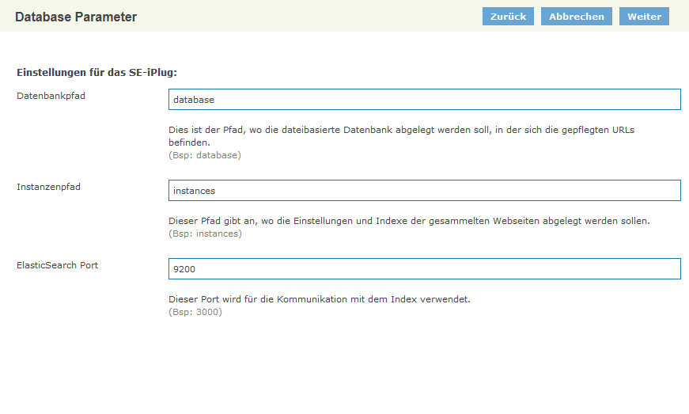

<figcaption class="figcaption">SE iPlug Einstellungen</figcaption>

### SE Instanzen

Es können mehrere Instanzen mit jeweils unterschiedlicher Konfiguration und unterschiedlichen URL Räumen, die durch Start- Limit und Exclude-URL Muster definiert werden, konfiguriert werden. Jede Instanz kann unabhängig gestartet und indexiert werden.

In der Übersicht können Instanzen erstellt, kopiert, gelöscht und aktiviert/deaktiviert werden.

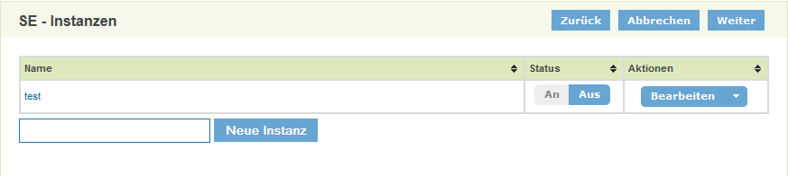

<figcaption class="figcaption">SE iPlug Instanzen - Übersicht</figcaption>

#### Instanzen - URL Pflege

Die URL Pflege erlaubt das Verwalten von URL Räumen, die indexiert werden sollen. URL Räume sind durch 3 Parameter spezifiziert:

| Parameter | Erläuterung |
| :--- | :--- |
| **Start-URL** | Einstiegs-URL in den URL Raum |
| **Limit URL Muster** | Ein oder mehrere URL Muster, die nicht verlassen werden dürfen |
| **Exclude URL Muster** | Ein oder mehrere URL Muster, die innerhalb des URL Raumes ausgeschlossen sind |

Ein URL Muster ist hier immer entweder

- ein rechts-trunkiertes Muster `http://www.domain.com/pfad`
  das alle URLs beginnend mit dem Muster inkludiert

- oder ein regulärer Ausdruck `/http://www.domain.com/[Reguärer Ausdruck]/`
  der alle URL inkludiert, die dem regulären Ausdruck entsprechen. Es ist hier darauf zu achten, dass der reguläre Ausdruck sich immer nur auf den Pfad bezieht. Alle URL Muster müssen zwingend mit einer Domain beginnen.

!!! note
    Änderungen am URL Raum werden im Index erst nach einem weiteren Indexierungsdurchgang sichtbar.

Auf der Übersichtsseite wird die Liste aller URL Räume angezeigt. Diese kann über einen URL Filter oder die Angabe von bestimmten Metadaten eingeschränkt werden.

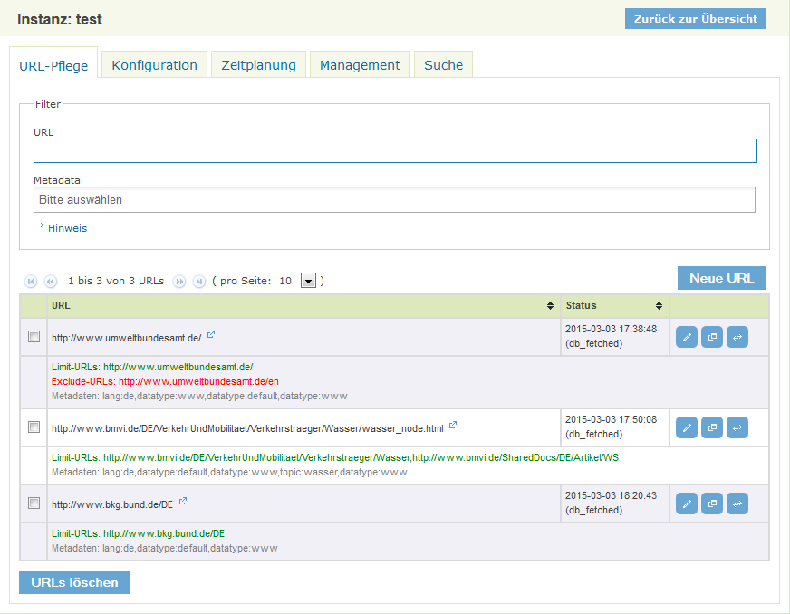

<figcaption class="figcaption">SE iPlug URL Pflege - Übersicht</figcaption>

Für jeden URL Raum wird ein Status angegeben, der sich auf die Start-URL bezieht. Hier kann eingesehen werden, wann die URL zuletzt überprüft wurde und welchen Status diese hat. Folgende Status existieren:

| Status | Erläuterung |
| --- | --- |
| db_fetched | URL wurde erfolgreich geladen. |
| db_redir_temp | Es wurde ein temporärer Redirect erkannt.|
| db_redir_perm | Es wurde ein permanenter Redirect erkannt. |
| db_unfetched | Die URL wurde zur Überprüfung vorgemerkt, aber noch nicht geladen. |
| db_gone | Beim Laden der URL wurde ein Fehler festgestellt. Die URL wurde als nicht mehr existierend klassifiziert. |
| db_notmodified | Die URL wurde geladen, es wurde aber keine Änderungen festgestellt. |

Für jeden URL Raum stehen folgende Aktionen zur Verfügung:

**URL Raum Editieren**

Die Parameter des URL Raumes können editiert werden. Die angezeigten Metadaten beziehen sich auf die Start-URL und zeigen die Default-Einstellungen und können pro Instanz festgelegt werden.

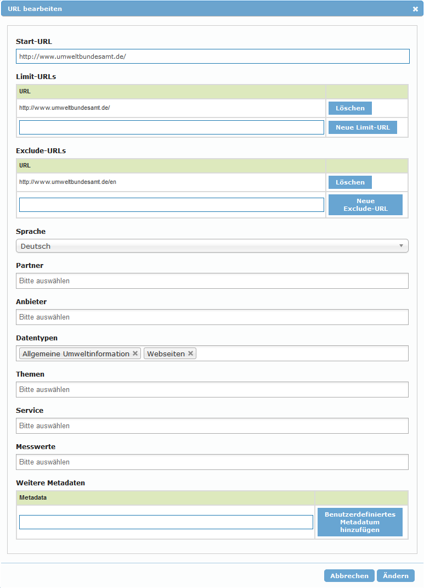

<figcaption class="figcaption">SE iPlug URL Pflege - URL Raum editeren</figcaption>

**Als Template verwenden**

Der URL Raum wird als Template für einen neuen Eintrag erhalten. Alle Metadaten bleiben erhalten.

**Url Testen**

Die Start-URL wird unter realen Bedingungen getestet. Dies bedeutet, dass der Crawl Prozess für die URL durchlaufen wird. Das Ergebnis wird angezeigt und hilft Probleme, wie z.B. Auswirkungen einer vorhandenen `robots.txt` zu analysieren.

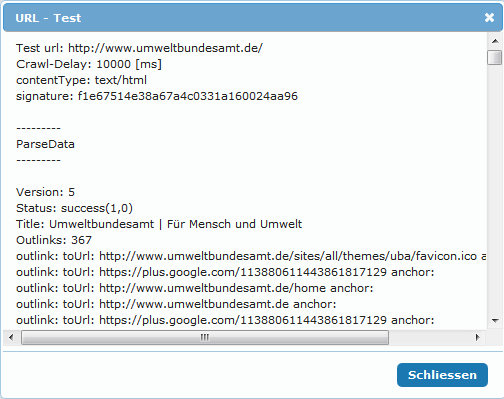

<figcaption class="figcaption">SE iPlug URL Pflege - URL Testen</figcaption>

#### Instanzen - Management

Im Management Bereich kann ein Indexierungsdurchlauf manuell gestartet werden. Die `Tiefe` gibt dabei an wie viele Segmente für den Durchlauf erzeugt werden. Die `Anzahl der URLs` gibt die Anzahl der URLs pro Segment an. In der voreingestellten Konfiguration wird für `Tiefe` immer 1 angegeben.

Im Statusbereich kann der Fortschritt des Crawls verfolgt werden. Hier wird auch der Status des letzten Durchlaufes angezeigt.

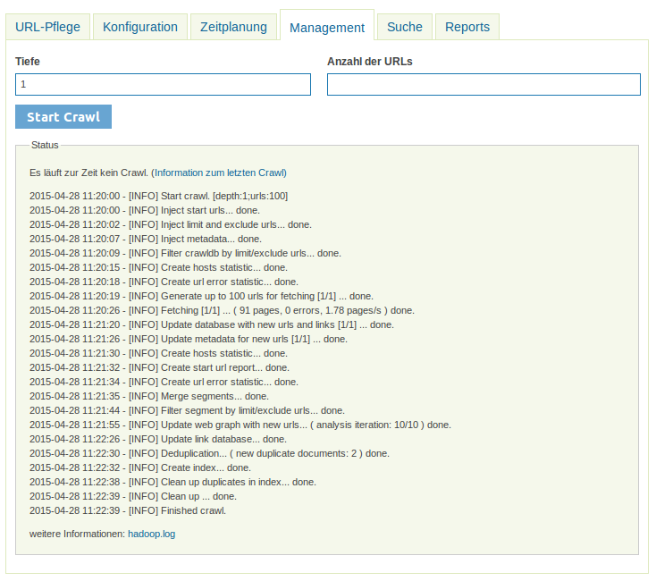

<figcaption class="figcaption">SE iPlug Instanzen - Management</figcaption>

#### Instanzen - Konfiguration Nutch

Nutch Konfigurationswerte können hier komfortable geändert werden. Die Änderungen werden sofort gespeichert und werden sofort beim nä. Schritt des Indexierungsablaufs angewendet!

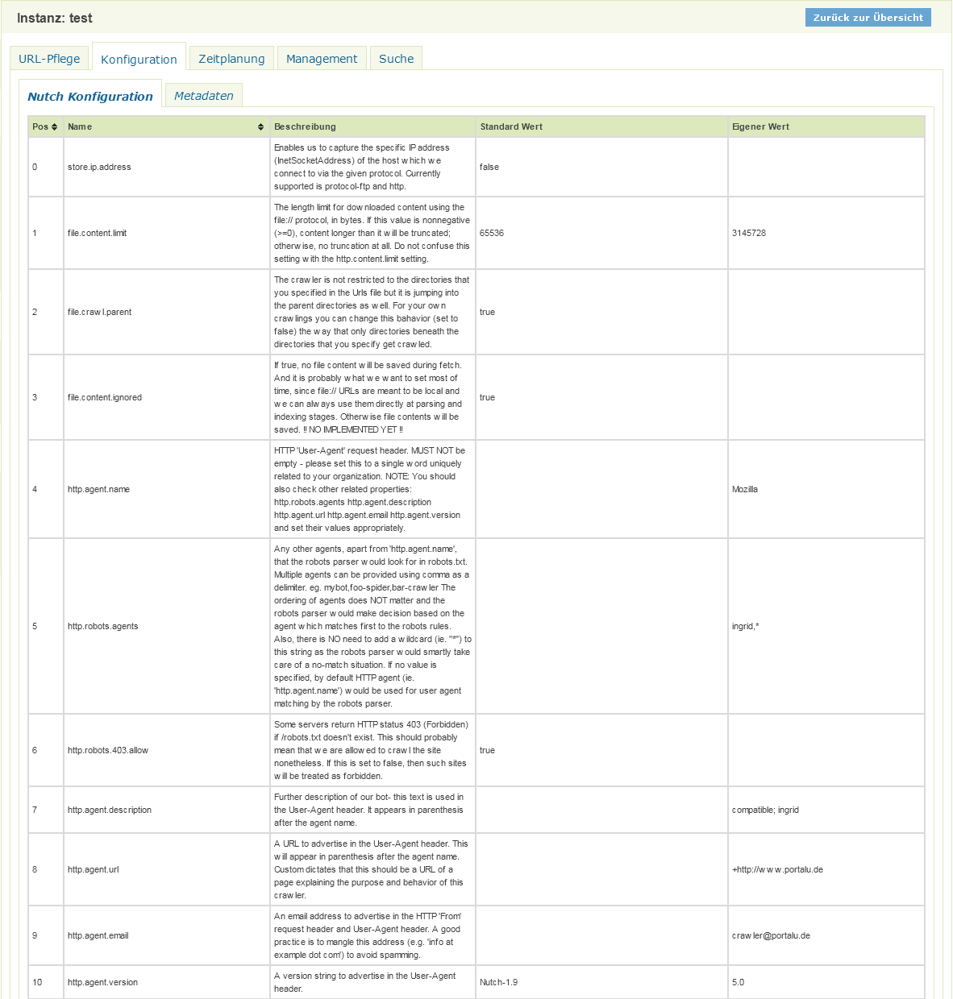

<figcaption class="figcaption">SE iPlug Instanzen - Nutch Konfiguration</figcaption>

Die Anzahl der einstellbaren Parameter ist sehr groß. Daher werden hier nur ausgewählte Parameter sowie sinnvolle Szenarien dokumentiert.

**Allgemeine Parameter**

Diese allgemeinen Parameter gelten für alle Szenarien und sollten bei der Einrichtung von der Webseiten Indexierung beachtet werden.

| Eigenschaft | Wert | Erläuterung |
| ----- | ----- | ----- |
| http.agent.url | +http://www.informationgrid.de | URL mit der sich der Crawler bei den Webseiten präsentiert. |
| http.agent.email | crawler@portalu.de | Email mit der sich der Crawler bei den Webseiten präsentiert. |
| http.proxy.host | | Der Proxy Server, falls der Zugriff auf die Webseiten über einen Proxy Server erfolgt. Wenn leer, wird kein Proxy verwendet. |
| fetcher.server.delay | 2.0 | Pause zwischen Requests auf den gleichen Server. Dieser Wert kann durch die robots.txt des Servers überschrieben werden. |
| fetcher.max.crawl.delay | -1 | Max. Pause zwischen Requests auf den gleichen Server. Wenn der Wert in der robots.txt ist größer als dieser Wert ist, wird der Server ignoriert. **Achtung:** Ein hoher Wert in der robots.txt kann bedeuten, dass das Laden der URLs von dem Server sehr lange dauert. Bitte über *URL Testen* in der Url Pflege testen. |

**Adaptiver Indexierungsablauf (Default)**

Für jede geänderte Seite wird der Zeitpunkt der erneuten Überprüfung adaptiv berechnet. Seiten, die sich oft ändern werden dadurch automatisch öfter überprüft, Seiten, die sich wenig ändern werden weniger oft überprüft.

| Eigenschaft | Wert | Erläuterung |
| ----- | ----- | ----- |
| db.fetch.schedule.class | org.apache.nutch.crawl.AdaptiveFetchSchedule | Berechnet das Fetch Intervall in Abhängigkeit von der Änderungsrate |
| db.fetch.interval.default | 86400 | Default Fetch Intervall in sec. Dies entspricht 24h und wird für alle neuen URLs verwendet. Dies gilt auch für URLS mit dem Status `db_gone`.|
| db.fetch.interval.max | 7776000 | Max. Fetch Intervall in sec. Dies entspricht 9 Tage, d.h. alle Seiten werden mind. alle 9 Tage zur Überprüfung ausgewählt. |
| db.fetch.schedule.adaptive.min_interval | 60 | Min. Fetch Intervall in sec. Seiten die sich sehr oft ändern werden alle 60 sec zur Überprüfung ausgewählt. Da der Indexierungsvorgang i.d.R länger dauert, werden sich oft ändernde URLs in jedem Durchlauf zur Überprüfung vorgesehen. |
| db.fetch.schedule.adaptive.max_interval | 31536000 | Max. Fetch Intervall für den adaptiven Prozess. Ist auf `db.fetch.interval.max` überschrieben. |

**Nicht-Adaptiver Indexierungsablauf**

Alle URLs bekommen das gleiche Fetch Intervall zugewiesen. Diese Konfiguration kann angewendet werden, wenn immer alle URLs, unabhängig von deren Änderungsrate, überprüft werden sollen.

| Eigenschaft | Wert | Erläuterung |
| --- | --- | --- |
| db.fetch.schedule.class | org.apache.nutch.crawl.DefaultFetchSchedule | Das Fetchintervall für URLs entspricht immer dem Wert `db.fetch.interval.default`. |
| db.fetch.interval.default | 86400 | Default Fetch Intervall in sec. Dies entspricht 24h und wird für alle URLs verwendet. |
| db.fetch.interval.max | 7776000 | Max. Fetch Intervall in sec. Dies entspricht 9 Tage. Dies gilt hier nur für URLS mit dem Status `db_gone`.|

**Indexierung einzelner URLs (z.B. Katalog Crawl)**

Es werden nur die Start-URls indexiert.

| Eigenschaft | Wert | Erläuterung |
| --- | --- | --- |
| db.fetch.schedule.class | org.apache.nutch.crawl.DefaultFetchSchedule | Das Fetchintervall für URLs entspricht immer dem Wert `db.fetch.interval.default`. |
| db.fetch.interval.default | 3600 | Default Fetch Intervall in sec. Dies entspricht 1h und wird für alle URLs verwendet. |
| db.fetch.interval.max | 7776000 | Max. Fetch Intervall in sec. Dies entspricht 9 Tage. Dies gilt hier nur für URLS mit dem Status `db_gone`. Alternativ kann hier auch 3600 eingegeben werden, wenn alle URLs immer überprüft werden sollen.  |
| db.max.outlinks.per.page | 0 | Es werden keine Outlinks aus den Webseiten extrahiert. Die Verlinkungen der Seiten werden dadurch nicht verfolgt. |

#### Instanzen - Konfiguration Metadaten

!!! warning inline end "Warnung"
    **Achtung, bitte vorsichtig sein!**

Dieser Bereich erlaubt die Konfiguration der Metadaten innerhalb einer Instanz. Die Definition der Metadaten erfolgt im JSON Format.

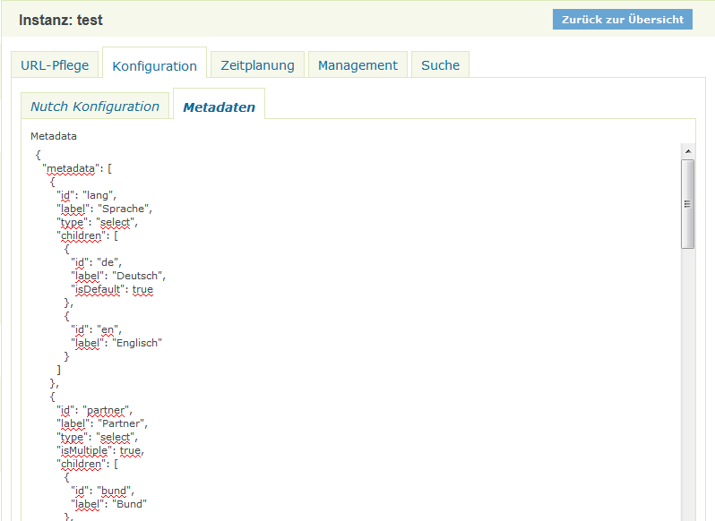

<figcaption class="figcaption">SE iPlug Instanzen - Metadaten Konfiguration</figcaption>

Jedes Metadatum ist durch folgende Eigenschafte definiert.

| Eigenschaft | Erläuterung |
| --- | --- |
| id | Die ID des Metadatums. Dieser Wert wird auch als Name des Indexfeldes bei der Indexierung verwendet. |
| label | Beschriftung des Metadatums in der Oberfläche. |
| type | Element-Typ des Metadatums in der Oberfläche   `select` - Selectbox (default) `grouped` - Selectbox mit Gruppierung  |
| isMultiple: true | Mehrfachauswahl in Select Boxen ist möglich. |
| children | Enthält den Wertebereich des Metadatums |

Jeder Wert kann über folgende Eigenschaften beschrieben werden:

| Eigenschaft | Erläuterung |
| --- | --- |
| id | Der Wert des Metadatum Wertes. Dieser Wert wird bei der Indexierung verwendet. Wird bei Gruppenüberschriften (`type=grouped`) nicht angegeben. |
| label | Beschriftung des Wertes in der Oberfläche. Bei `type=grouped` wird der Wert als Gruppenüberschrift verwendet. |
| children | Nur bei `type=grouped`. Enthält den Wertebereich einer Gruppe mit den Eigenschaften `id` und `label`. |

#### Instanzen - Zeitplanung

Hier kann die regelmäßige Ausführung des Indexierungslaufes eingestellt werden.

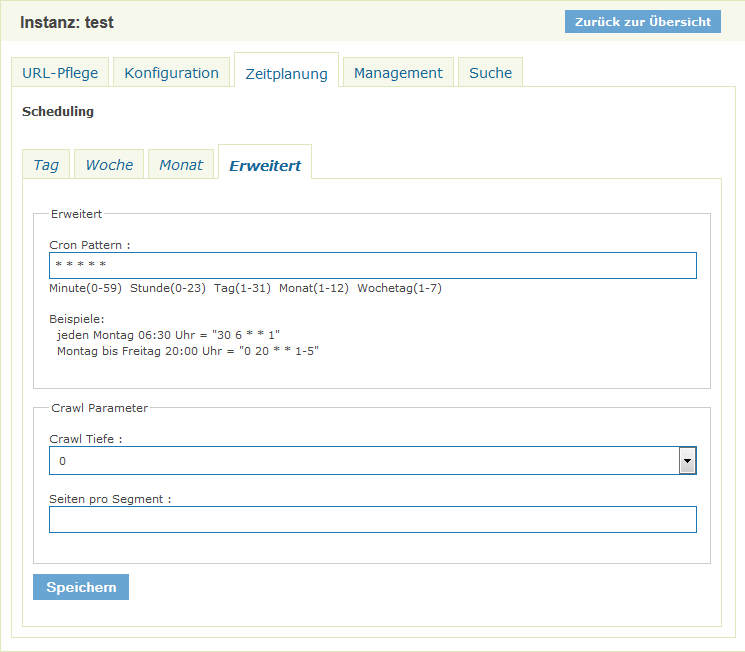

<figcaption class="figcaption">SE iPlug Instanzen - Zeitplanung</figcaption>

Die Zeitsteuerung kann über unterschiedliche Weise eingestellt werden. Die Verwendung von [CRON Mustern](https://de.wikipedia.org/wiki/Cron) ist möglich.
*Crawl Tiefe* steht dabei für die Anzahl der Segmente. Hier sollte in der Regel immer 1 ausgewählt werden.
*Seiten pro Segment* definiert wie viele Seiten maximal pro Segment selektiert werden sollen.

#### Instanzen - Suche

!!! warning inline end "Zur Überarbeitung"
    Dieser Textabschnitt muss noch einmal geprüft und überarbeitet werden.

Hier kann der Index der Instanz getestet werden. Diese Suche funktioniert, selbst wenn die Instanz noch nicht zur Suche freigegeben wurde.

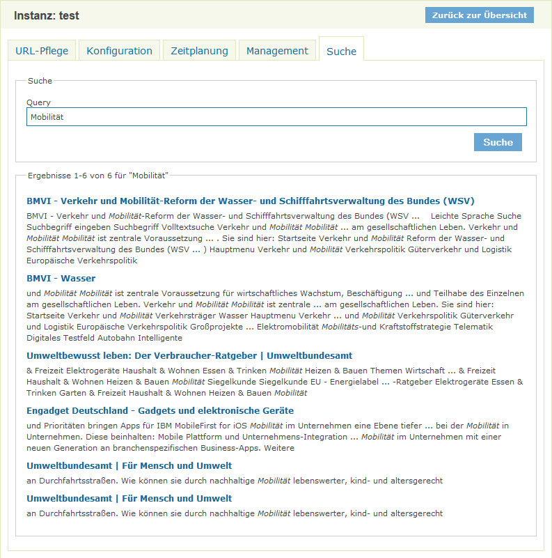

<figcaption class="figcaption">SE iPlug Instanzen - Suche</figcaption>

#### Instanzen - Reports

Folgende Reports stehen zur Verfügung:

**Host Report**

Der Host Report liefert Informationen über die Anzahl der

- bekannten (in der CrawlDB vermerkten)
- analysierten (in einem Durchlauf analysierten und ggf. indexierten)

URLs. Das `Ratio` liefert einen schnellen Überblick über das Verhältnis von analysierten zu bekannten URLs ein sehr niedriger Wert deutet auf Problem beim Indexieren einer Domain hin.

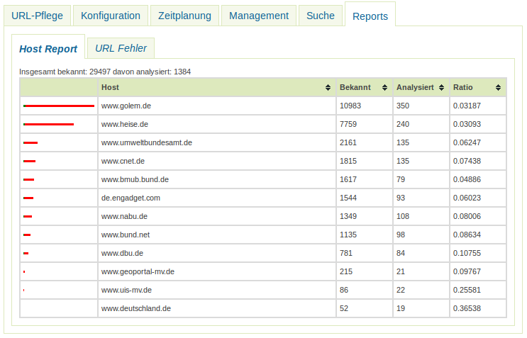

<figcaption class="figcaption">SE iPlug Instanzen - Report - Host Report</figcaption>

**Url Fehler Report**

Der URL Fehler Report liefert eine Übersicht über URls, die der Crawl Prozess nicht korrekt analysieren konnte. Darunter fallen sowohl URLs, die nicht geladen werden konnten, als auch z.B. URLs, die auf Grund der Einstellungen für Robots (robots.txt oder META Tags) für die Suchmaschine nicht zur Vefügung stehen.

Die URLs können sowohl über ein URL Teilstring oder über einen Fehlercode gefilter werden.

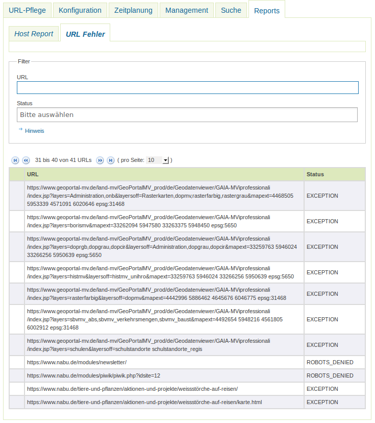

<figcaption class="figcaption">SE iPlug Instanzen - Report - URL Fehler</figcaption>

#### Instanzen - Administratoren

Hier können Instanzadministratoren erstellt und verwaltet werden. Die erstellten Benutzer können sich auf dem iPlug anmelden und erhalten Zugriff auf die zugewiesene Instanz. Auf andere Instanzen und die Konfiguration des iPlugs können diese Benutzer nicht zugreifen.

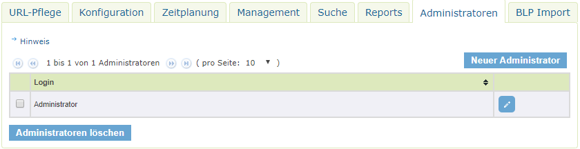
<figcaption class="figcaption">SE iPlug Instanzen - Administratoren</figcaption>