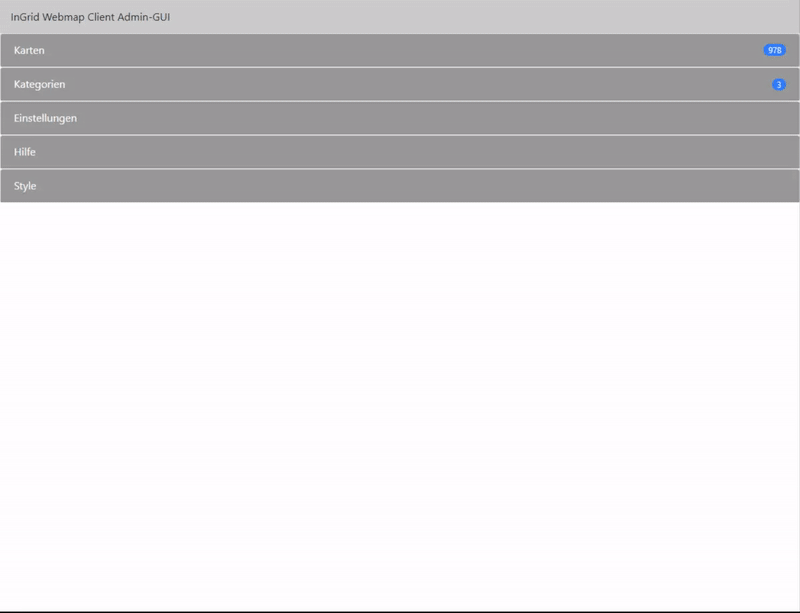
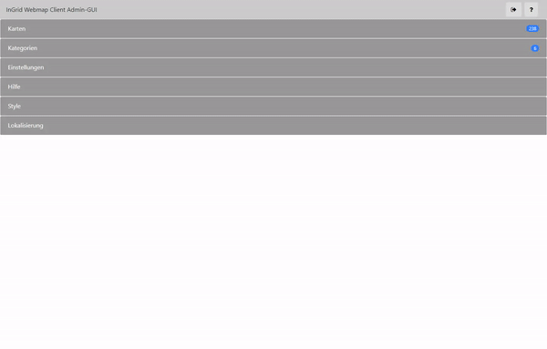
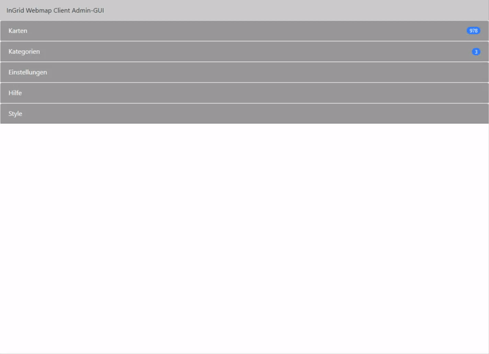

# Webmap Client Admin GUI

Die **Admin-GUI** verwaltet die Karten, Kategorien, Einstellungen, Hilfe und den Styles des **Webmap Clients**.

<div class="grid cards" markdown>

-   :material-book-open-variant-outline: __Installation & Konfiguration__

    ---

    { class="grid-pictogram" }
    
    Sie wollen den **Webmap Client installieren**? 
    
    Informationen zur Komponente können Sie der Dokumentation entnehmen.

    [Webmap Client Dokumentation]({{ fix_url('components/webmap-client.md') }}){ .md-button }

</div>

## URL vom Admin-GUI

Aufgerufen wird die Admin-GUI mit der URL:

``http://HOSTNAME/ingrid-webmap-client/admin/`

## Karten

Unter dem Akkordeon "Karten" werden alle eingepflegten und darzustellenden Karten (WMS, WMTS) aufgelistet.

Aus WMS- oder WMTS-Diensten können Karten dem Webmap Client hinzugefügt, zu Kategorien zugeordnet, aus verschiedenen Karten eines WMS-Dienstes eine kombinierte Karte erstellt und einzelne Karten zu Ihren Bedürfnisse angepasst werden.

Prüfen Sie auch die Liste der eingepflegten Karten nach fehlerhaften Karten (z.B. Dienst oder Karte nicht mehr erreichbar). So wird Ihnen in der Liste der Karten eine "i"-Symbol angezeigt, wenn ein Dienst oder eine Karte nicht mehr erreichbar ist.

### Karten hinzufügen

- Verwenden Sie um neue Karten hinzuzufügen den Button "Dienst laden".

- Nach Verwendung des Buttons erscheint ein Pop-Up und in diesem Pop-Up können Sie nun einen WMS- oder WMTS-Dienst anhand seiner GetCapabilities-URL laden. Bei erfolgreichem Laden werden nun die einzelnen Karten eines Dienstes in einer  Baumstruktur (WMS) oder als Liste (WMTS) dargestellt.

    > Hinweis: Bei WMS werden automatisch die URL-Parameter "SERVICE=WMS", "VERSION=1.3.0" und/oder "REQUEST=GetCapabilities" der Dienst-URL hinzugefügt, falls diese Parameter nicht vorhanden sind.

- Handelt es sich bei Ihrem geladenen Dienst um einen passwortgeschützten Dienst, so wählen Sie die Checkbox "Login verwenden" aus und tragen hier Benutzername und Passwort ein. (siehe [Passwortgeschützte Karten]({{ fix_url('components/webmap-client.md/#passwortgeschutzte-kartendienste') }}))

    - Mit der Checkbox "Login ersetzen" können Sie bereits eingetragene Login-Daten für einen Dienst ersetzen.

    > Hinweis: Benutzername und Passwort werden für jeden Dienst in einer seperaten JSON-Datei auf den Server abgespeichert. Dies ist notwendig, damit im Webmap Client eine GetCapabilities-, GetMap-, GetLegend,- oder GetFeatureInfo-Anfrage über den eigene Server mit einer Authentifizierung durchgeführt werden kann.

- Nun können Sie einzelne Karten über die Checkbox auswählen und hinzufügen (Button "Hinzufügen") oder als kombinierte Karte (Button "Kombinieren und Hinzufügen") dem Webmap Client zur Verfügung stellen. Nach Betätigung eines dieser Button werden die neuen Karten am Anfang der Kartenliste hinzugefügt, sind aber keine Kategorie zugeordnet.

    > Hinweis: Hat eine Karte keinen Extent, so ist die Karte nicht auswählbar und kann nicht hinzugefügt werden.

- Möchten Sie Ihre Karten schon vorhandenen Kategorien zuorden, so wählen Sie aus der Auswahliste "Kategorie auswählen" eine Kategorie aus.

    - Öffnen Sie die Kategorie mit dem "+"-Button.

    -  Es erscheint nun die Kategorie in einer Baumstruktur.

        > Hinweis: Da hier keine Unterkategorien angelegt werden können, müssen diese Unterkategorien schon vorher angelegt sein.

    - Sind Unterkategorien vorhanden, so wählen Sie diese Unterkategorie aus und bestätigen Ihre Auswahl mit dem Button "Hinzufügen". Es können weitere Unterkategorien ausgewählt werden.

    - Fügen Sie nun die Karten hinzu (Button "Hinzufügen" oder Button "Kombinieren und Hinzufügen") so werden die Karten auch automatisch den ausgewählten (Unter-)Kategorien zugeordnet.

        > Hinweis: Werden Karten hinzugefügt, erhalten die Karten eine eindeutige ID, d.h. möchte man die Karten mit der gleichen ID zu verschiedenen Kategorien hinzufügen, dann müssen die Kategorien alle in einen Schub ausgewählt werden und anschließend den Button "Hinzufügen" oder Button "Kombinieren und Hinzufügen" betätigen. Ansonsten besteht die Möglichkeit die Karten manuell über das Akkordeon "Kategorien" den jeweiligen (Unter-) Kategorien zuzuordnen.

  - Die Checkbox "Gruppenlayer als Ordner laden" (über Auswahl "Kategorie auswählen") ermöglich es Ihnen die Gruppenlayer zu ignorieren, Gruppenlayer werden weder als einzelne Layer noch bei kombinierten Layer verwendet, und bei einem Zuordnen zu einer Kategorie zu einem Ordner geändert und in der Kategorie hinterlegt.

  

### Karten löschen

  Für das Löschen von eingepflegten Karten gibt es drei Möglichkeiten:

  - **Karte einzeln löschen**

    Klicken Sie auf das Akkordeon einer Karte. Nach dem Öffnen des Akkordeons erscheint nun ein Button "Löschen". Mit diesem Button wird eine einzelne Karte entfernt. Mit Bestätigung des Löschvorgangs wird die Karte entfernt.

    > Hinweis: Werden Karten entfernt, so wird geprüft, ob die Karte einer Kategorie zugeordnet wurde und auch dort entfernt.

    

  - **Ausgewählte Karten löschen**

    Wählen Sie Karten aus den Listen über die Checkbox aus und betätigen Sie den Button "Auswahl löschen". Mit Bestätigung des Löschvorgangs werden die Karten entfernt.

    > Hinweis: Werden Karten entfernt, so wird geprüft, ob die Karte einer Kategorie zugeordnet wurde und auch dort entfernt.

    

  - **Alle Karten löschen**

    Mit Hilfe des Buttons "Alles löschen" werden alle Karten entfernt.

    > Hinweis: Werden Karten entfernt, so wird geprüft, ob die Karte einer Kategorie zugeordnet wurde und auch dort entfernt.

    

### Karten suchen

  Die Liste der Karten kann auf Dauer sehr lang und unübersichtlich werden.

  Eine Abhilfe kann hier das Suchfeld schaffen. Nach Eingabe eines Suchbegriffs wird die Liste nach Titel/Label einer Karte gefiltert.

  

- **Filtern nach ...**

  Weitere Filtermöglichkeiten der Liste finden Sie beim betätigen des Button rechts neben dem Suchfeld. Hierbei öffnet sich ein weiterer Bereich mit verschiedenen Auswahlmöglichkeiten, die die Liste der eingepflegten Karten begrenzt.

  * Filtern nach Kategorien

    Hier werden die Karten angezeigt die auch in der ausgewählten Kategorie eingebunden sind.

  * Filtern nach Karten-Typ

    Begrenzen können Sie auch die Liste nach dem Karten-Typ, also WMS oder WMTS.

  * Filtern nach fehlerhaften Karten

    Die Liste wird nach fehlerhaften Karten gefiltert, also Karten deren Dienst nicht mehr erreichbar ist oder in der GetCapabilities des Dienstes nicht mehr als Layer aufgelistet werden.

    Ist eine Karte fehlerhaft so wird dies in der Liste der eingepflegten Karte anhand eines "i"-Symbol angemerkt.

    (siehe [Fehlerhafte Karten]({{ fix_url('components/webmap-client.md/#fehlerhafte-karten') }}))

### Karten bearbeiten

Eingepflegte Karten können auch bearbeitet werden und dabei die Default-Werte aus der GetCapabilities des zugehörigen Dienstes manipulieren.

In der Bearbeitungsansicht der Karten existiert zu jeder Eigenschaft eine kurze Info über den "i"-Button.

Es gibt zwei Typen von Karten die bearbeitet werden können:

* WMS
* WMTS

??? example "Eigenschaften und ihre Werte"

    | Typ           | Eigenschaft                          | Info                                                                                                                                                                                                                                                                                                                                                                                         | Default                                                                                                                                                                                                                                                                                                                                                                                 |
        |---------------|--------------------------------------|----------------------------------------------------------------------------------------------------------------------------------------------------------------------------------------------------------------------------------------------------------------------------------------------------------------------------------------------------------------------------------------------|-----------------------------------------------------------------------------------------------------------------------------------------------------------------------------------------------------------------------------------------------------------------------------------------------------------------------------------------------------------------------------------------|
    | **Gemeinsam** |                                      |                                                                                                                                                                                                                                                                                                                                                                                              |                                                                                                                                                                                                                                                                                                                                                                                         |
    |               | Typ                                  | Hier wird Ihnen der Typ Ihrer Karte angezeigt. Dieser Wert ist nicht veränderbar.                                                                                                                                                                                                                                                                                                            | Wert aus der GetCapabilities des zugehörigen Dienstes.                                                                                                                                                                                                                                                                                                                                  |
    |               | ID                                   | Hier haben Sie die Möglichkeit die eindeutige ID der Karte individuell anzupassen. <br><br> Diese ID wird beim Aufruf der Karte im Webmap Client im Parameter "layers" referenziert und wird auch benötigt um eine Karte zu einer Kategorie (siehe [Kategorien]("#kategorien")) zuzuweisen.                                                                                                  | Die eindeutige ID zu einer Karte wird beim Importieren einer Karte aus seinem Dienst automatisch genieriert.                                                                                                                                                                                                                                                                            |
    |               | Version                              | Bestimmen Sie hier die Version Ihrer Karte. Eine Auswahl der Werte "1.1.1" und "1.3.0" steht zu Auswahl.                                                                                                                                                                                                                                                                                     | Wert aus der GetCapabilities des zugehörigen Dienstes.                                                                                                                                                                                                                                                                                                                                  |
    |               | Label                                | Bearbeiten Sie hier den Titel Ihrer Karte. <br><br> Hinweis: Der Titel wird z.B. in der Ergebnisliste bei Suche im Webmap Client angezeigt.                                                                                                                                                                                                                                                  | Wert aus der GetCapabilities des zugehörigen Dienstes.                                                                                                                                                                                                                                                                                                                                  |
    |               | Extent                               | Passen Sie hier das Extent Ihrer Karte an.  <br><br>  Hinweis: Die eingetragenen Koordinaten müssen in der Projektion "EPSG:4326/WGS-84" eingetragen werden.                                                                                                                                                                                                                                 | Wert aus der GetCapabilities des zugehörigen Dienstes.                                                                                                                                                                                                                                                                                                                                  |
    |               | Kachel-Größe                         | Geben Sie hier die gewünschte Kachel-Größe Ihrer Karten ein.                                                                                                                                                                                                                                                                                                                                 | 256                                                                                                                                                                                                                                                                                                                                                                                     |
    |               | Hintergrundkarte                     | Bestimmen Sie hier, ob Ihre Karte als Hintergrundkarte verwendet werden kann. <br><br> Hinweis: In den Kategorien werden die Hintergrundkarten zugewiesen. (siehe [Kategorien]("#kategorien"))                                                                                                                                                                                               | false                                                                                                                                                                                                                                                                                                                                                                                   |
    |               | Hintergrundkartenbild                | Wählen Sie ein Hintergrundbild für Ihre Hintergrundkarte aus, welches beim Hintergrundkarten-Umschalter im Frontend angezeigt werden soll und laden Sie dieses Bild hoch. Die optimale Größe des Bildes ist 90 x 58 Pixel. Nach dem Speichern werden automatisch die CSS-Styles für das Frontend angepasst. Beim Aktualisieren des Hintergrundbildes einer Karte wird das alte Bild ersetzt. |                                                                                                                                                                                                                                                                                                                                                                                         |
    |               | Format                               | Definieren Sie das Bild-Format der GetMap-Anfrage. (png, jpeg, etc.)                                                                                                                                                                                                                                                                                                                         | Wert aus der GetCapabilities des zugehörigen Dienstes.                                                                                                                                                                                                                                                                                                                                  |
    |               | Suchbarkeit                          | Lassen Sie die Karte über die Suche im Webmap Client auffinderbar machen.                                                                                                                                                                                                                                                                                                                    | true                                                                                                                                                                                                                                                                                                                                                                                    |
    |               | Cross Origin                         | Liefert Ihre Karte bei einer GetMap-Anfrage im Response-Header "Access-Control-Allow-Origin: *" oder "Access-Control-Allow-Origin: <IHRE-DOMÄIN>", so können Sie hier den Wert auf "true" setzten und im Webmap Client werden vorhandenen GetFeatureInfos beim überfahren der Maus auf Ihrer Karte als Handsymbol angezeigt und sind auf der Karte somit einfacher auffindbar.               | false                                                                                                                                                                                                                                                                                                                                                                                   |
    |               | Highlightable                        | Aktivieren Sie die Eigenschaft 'highlightable'.                                                                                                                                                                                                                                                                                                                                              | false                                                                                                                                                                                                                                                                                                                                                                                   |
    |               | Zeitabhängige Darstellung aktivieren | Aktivieren Sie die zeitabhängige Darstellung der Karte. Umd diese Funktion verwenden zu können, muss in der GetCapabilities des Dienstes die Karte einen Eintrag 'dimension name="time"' enthalten. <br><br>Hinweis: Im Webmap Client wird ihnen dann rechts in der Karte eine neues Control für die Darstellung von Zeitständen angezeigt.                                                  |                                                                                                                                                                                                                                                                                                                                                                                         |
    |               | Zeitstempeln definieren              | Tragen Sie die Zeitstempeln der Karte ein. Zurzeit können nur jährliche Zeitreihenfolgen angegeben werden. <br><br> Hinweis: Achten Sie auf das Format des Zeitstempels.                                                                                                                                                                                                                     |                                                                                                                                                                                                                                                                                                                                                                                         |
    |               | Default Zeitstempel                  | Legen Sie den Zeitstempel fest, welcher per Default angezeigt wird. Neben den Zeitstempel kann auch "last" für die Darstellung des ersten Eintrages der Zeitstempelliste und "all" für alle Einträge der Zeitstempelliste.                                                                                                                                                                   | last                                                                                                                                                                                                                                                                                                                                                                                    |
    |               | Legende aktivieren                   | Aktivieren Sie die Einstellung, wenn die Karte eine Legende hat oder eine Legende per GetLegend-Anfrage aufgerufen werden soll.                                                                                                                                                                                                                                                              | true                                                                                                                                                                                                                                                                                                                                                                                    |
    |               | Legenden-URL                         | Definieren Sie die URL der Karten-Legende, ansonsten wird ein GetLegenden-Request ausgeführt.                                                                                                                                                                                                                                                                                                | Wert aus der GetCapabilities des zugehörigen Dienstes.                                                                                                                                                                                                                                                                                                                                  |
    |               | Attribution                          | Tragen Sie den Titel für die URL unter 'attributionUrl'ein. Wird diese Karte im Webmap Client aktiviert, so wird in der Karte unten rechts ein Link dargstellt.<br><br>Hinweis: Wird im Webmap Client unten rechts angezeigt, wenn die Karte aktiv ist.                                                                                                                                      | Wert aus der GetCapabilities des zugehörigen Dienstes. <br>WMS:<br>...<br>```<Service>```<br>...<br>``` <ContactInformation>```<br>```<ContactOrganization>Attribution</ContactOrganization>```<br>....<br><hr/>WMTS:<br>...<br>```<ServiceProvider>```<br>...<br>```<ProviderName>Attribution</ProviderName>```<br>...<br>Hinweis: Dieser Wert wird bei jedem Update-Job aktualisiert. |
    |               | Attribution-URL                      | Tragen Sie hier die URL für weitere Infos zur aktivierten Karte ein. <br><br>Hinweis: Wird im Webmap Client unten rechts angezeigt, wenn die Karte aktiv ist.                                                                                                                                                                                                                                | Wert aus der GetCapabilities des zugehörigen Dienstes. <br>WMS:<br>...<br>```<Service>```<br>```<OnlineResource xlink:href="Attribution-URL"/>```<br>...<br><hr/>WMTS:<br>...<br>```<ServiceProvider>```<br>```<ProviderSite xlink:href="Attribution-URL"/>```<br>...<br>Hinweis: Dieser Wert wird bei jedem Update-Job aktualisiert.                                                   |
    |               | Tooltip                              | Aktivieren Sie die GetFeature-Info-Abfrage, falls es die Karte erlaubt.                                                                                                                                                                                                                                                                                                                      | Wert aus der GetCapabilities des zugehörigen Dienstes.                                                                                                                                                                                                                                                                                                                                  |
    |               | Transparenz                          | Definieren Sie die per default dargestellte Transparenz der Karte.                                                                                                                                                                                                                                                                                                                           | 1                                                                                                                                                                                                                                                                                                                                                                                       |
    |               | Login                                | Haben Sie die Karte über einen passwortgeschützten Dienst geladen, so wird unter Login der Benutzername des Dienstes angezeigt. <br><br> Anhand dem Login und der Dienst-URL wird das gespeicherte Passwort ermittelt und die Karte wird über den eigenen Server mit Authentifizierung geladen.                                                                                              |                                                                                                                                                                                                                                                                                                                                                                                         |
    |               | Query-Layers                         | Layers die bei einer GetFeatureInfo-Anfrage abgefragt werden sollen. Nur bei aktiver Checkbox "Tooltip" sichtbar. Mehrere Layer werden kommagetrennt aufgelistet.                                                                                                                                                                                                                            | Layers für die GetMap-Anfrage.                                                                                                                                                                                                                                                                                                                                                          |
    |               | Feature-Count                        | Anzahl an Features die bei einer GetFeatureInfo-Anfrage für die Karte(n) abgefragt werden sollen. Nur bei aktiver Checkbox "Tooltip" sichtbar. Wert sollte größer als 0 sein.                                                                                                                                                                                                                | 10                                                                                                                                                                                                                                                                                                                                                                                      |
    | **WMS**       |                                      |                                                                                                                                                                                                                                                                                                                                                                                              |                                                                                                                                                                                                                                                                                                                                                                                         |
    |               | WMS-URL                              | Tragen Sie hier die Dienst-URL Ihrer Karte ein. Anhand dieser URL werden diverse Anfrage, wie z.B. GetCapabilities, GetMap, GetFeatureInfo, etc. durchgeführt.                                                                                                                                                                                                                               | Wert aus der GetCapabilities des zugehörigen Dienstes.                                                                                                                                                                                                                                                                                                                                  |
    |               | WMS-Layers                           | Tragen Sie hier den 'NAME' der dazustellenden Karte ein. Mehrere Karten werden kommagetrennte aufgelistet. <br><br>Hinweis: Zusammengesetzte Karten per kommagetrennt können im Webmap Client nur zusammen dargestellt werden.                                                                                                                                                               | Wert aus der GetCapabilities des zugehörigen Dienstes.                                                                                                                                                                                                                                                                                                                                  |
    |               | Gutter                               | Definieren Sie den ignorierten Rand (in Pixel) um die Karten-Tiles.                                                                                                                                                                                                                                                                                                                          | 0                                                                                                                                                                                                                                                                                                                                                                                       |
    |               | Single Tile                          | (De-)aktivieren Sie hier den Aufruf Ihrer Karte in Kacheln.                                                                                                                                                                                                                                                                                                                                  | false                                                                                                                                                                                                                                                                                                                                                                                   |
    |               | Min-Scale                            | Definieren Sie einen Min-Scale der Karte.                                                                                                                                                                                                                                                                                                                                                    | Wert aus der GetCapabilities des zugehörigen Dienstes.                                                                                                                                                                                                                                                                                                                                  |
    |               | Max-Scale                            | Definieren Sie einen Max-Scale der Karte.                                                                                                                                                                                                                                                                                                                                                    | Wert aus der GetCapabilities des zugehörigen Dienstes.                                                                                                                                                                                                                                                                                                                                  |
    |               | Style                                | Legen Sie ein 'styles'-Parameter für die GetMap-Abfrage fest, falls notwendig.                                                                                                                                                                                                                                                                                                               |                                                                                                                                                                                                                                                                                                                                                                                         |
    | **WMTS**      |                                      |                                                                                                                                                                                                                                                                                                                                                                                              |                                                                                                                                                                                                                                                                                                                                                                                         |
    |               | Service-URL                          | Tragen Sie hier die WMTS-ServiceMetadataURL ein.                                                                                                                                                                                                                                                                                                                                             | Wert aus der GetCapabilities des zugehörigen Dienstes.                                                                                                                                                                                                                                                                                                                                  |
    |               | Template                             | Tragen Sie hier die WMTS-ResourceURL ein.                                                                                                                                                                                                                                                                                                                                                    | Wert aus der GetCapabilities des zugehörigen Dienstes.                                                                                                                                                                                                                                                                                                                                  |
    |               | MatrixSet                            | Definieren Sie den TileMatrixSet Identifier der Karte.                                                                                                                                                                                                                                                                                                                                       | Wert aus der GetCapabilities des zugehörigen Dienstes.                                                                                                                                                                                                                                                                                                                                  |
    |               | Layername                            | Tragen Sie hier den Layer-Name für Ihre Karte ein.                                                                                                                                                                                                                                                                                                                                           | Wert aus der GetCapabilities des zugehörigen Dienstes.                                                                                                                                                                                                                                                                                                                                  |
    |               | RequestEncoding                      | Tragen Sie den Request-Encoding der Karte für GetTile fest, z.B. 'REST' oder 'KVP'.                                                                                                                                                                                                                                                                                                          | Wert aus der GetCapabilities des zugehörigen Dienstes.                                                                                                                                                                                                                                                                                                                                  |
    |               | Style                                | Legen Sie ein 'style'-Parameter für die GetMap-Abfrage fest, falls notwendig.                                                                                                                                                                                                                                                                                                                | Wert aus der GetCapabilities des zugehörigen Dienstes.                                                                                                                                                                                                                                                                                                                                  |
    |               | Origin                               | Tragen Sie aus dem TileMatrixSet den TopLeftCorner der Karte ein.                                                                                                                                                                                                                                                                                                                            | Wert aus der GetCapabilities des zugehörigen Dienstes.                                                                                                                                                                                                                                                                                                                                  |
    |               | Scales                               | Tragen Sie aus dem TileMatrixSet den TileMatrix-ScaleDenominator der Karte ein.                                                                                                                                                                                                                                                                                                              | Wert aus der GetCapabilities des zugehörigen Dienstes.                                                                                                                                                                                                                                                                                                                                  |
    |               | FeatureInfoTpl                       | Tragen Sie hier das Template für die GetFeatureInfo ein.                                                                                                                                                                                                                                                                                                                                     | Wert aus der GetCapabilities des zugehörigen Dienstes.                                                                                                                                                                                                                                                                                                                                  |


> Falls Sie das Konfigurationsverzeichnis des Webmap Clients außerhalb des Portal-Verzeichnisses, also nicht als ein Unterordner des Portal-Verzeichnisses, festgelegt haben, so bleiben die eingepflegten Karten auch für zukünftige Portal-Updates erhalten.

## Kategorien

### Kategorien hinzufügen

  - Verwenden Sie um eine neue Kategorie hinzufügen den Button "Neue Kategorie".

  - Nach Verwendung des Buttons erscheint ein Pop-Up und in diesem Pop-Up können Sie nun eine neue Kategorie anlegen.

    - ID: Eindeutige ID der Kategorie

    - Label: Titel der Kategorie

    - Tooltip: Tooltip der Kategorie im Webmap Client

    - Kategorienbild:  Wählen Sie ein Kategorienbild für Ihre Kategorie aus, welches beim Kategorien-Umschalter im Frontend angezeigt werden soll.
      > Hinweis: Die optimale Größe des Bildes ist 140 x 60 Pixel. Nach dem Speichern werden automatisch die CSS-Styles für das Frontend angepasstf. Beim Aktualisieren des Kategorien-Bildes einer Kategorie wird das alte Bild ersetzt.

  - Mit dem "Speichern"-Button wird die Kategorie hinzugefügt.

### Kategorien löschen

  Analog zu den "Karten" können die Kategorien gelöscht werden:

  - Einzeln löschen bei Öffnen einer Kategorie.

  - Ausgewählte Kategorien über die Checkbox löschen

  - Alle Kategorien löschen

### Kategorien suchen

  Mit dem Suchfeld in der Navigationsleiste des Akkordeon "Kategorien" können Sie nach Kategorien per ID suchen.

<a name="kategorie"></a>
**Kategorie**

### Kategorien bearbeiten

Haben Sie eine Kategorie in der Liste ausgewählt, so können Sie über den Button-"Bearbeiten" diese Kategorie bearbeiten:

- Die "ID" kann nicht angepasst.

    > Hinweis:
    > Im Akkordion [Style](#style) müssen ggf. weitere Anpassungen durchgeführt
    > - wenn man der Kategorie im Webmap Client in der Auswahl "Thema wechseln" ein anderes Bild vergeben möchte. [siehe auch]({{ fix_url('components/webmap-client.md/#kann-man-die-themen-bilder-unter-thema-wechseln-anpassen') }})

- Ändern Sie Ihren Titel über den Eintrag "Label".

- Ändern Sie Ihren Tooltip über den Eintrag "Tooltip".

    > Hinweis:
    > Dieser Tooltip wird im Webmap Client in der Auswahl "Thema wechseln" benötigt und dargestellt. (Mouse-Over über eine Kategorie)

- Ändern Sie das Kategorienbild für Ihre Kategorie

    > Hinweis: Die optimale Größe des Bildes ist 140 x 60 Pixel. Nach dem Speichern werden automatisch die CSS-Styles für das Frontend angepasstf. Beim Aktualisieren des Kategorien-Bildes einer Kategorie wird das alte Bild ersetzt.

- Passen Sie die Auswahl an Hintergrundkarten an, indem Sie über die Liste Karten hinzufügen, entfernen oder sortieren. Die Reihenfolge in der Liste entspricht im Webmap Client die Reihenfolge der Auswahlmöglichkeiten von Rechts nach Links.

    > Hinweise:
    > - In der Liste der Karte, werden nur Karten mit der Eigenschaft "Hintergrundkarte" aufgelistet.
    > - "osmLayer" ist ein OpenLayers-Layer und funktioniert nur in der Projektion "EPSG:3857" einwandfrei.
    > - "kein Hintergrund" wird immer im Webmap Client als Hintergrund-Auswahl hinzugefügt
    > - Im Akkordion [Style](#style) müssen ggf. weitere Anpassungen durchgeführt werden, wenn man der Hintergrundkarte eine [Reihenfolge]({{ fix_url('components/webmap-client.md/#kann-man-die-reihenfolge-der-hintergrundkarten-auswahl-anpassen') }}) oder ein anderes [Bild]({{ fix_url('components/webmap-client.md/#kann-man-die-bilder-fur-die-hintergrundkarten-auswahl-anpassen') }}) vergeben möchte.

- Setzen Sie hier aus der Liste "Hintergrundkarte" Ihre Default-Hintergrundkarte fest.

- Unter "Selektierte Karten" können Sie Karten hinzufügen die im Webmap Client per Default im Akkordeon "Dargestellte Karten" hinzugefügt sind.

- Unter "Aktivierte Karten" können Sie Karten hinzufügen die im Webmap Client per Default im Akkordeon "Dargestellte Karten" hinzugefügt, ausgewählt und in der Karte dargestellt werden.

Zudem können Sie nun der Kategorien Unterkategorien hinzufügen:

-  Über den "+"-Button werden erscheint ein Pop-Up.

- Hier können Sie nun einen Titel für die Unterkategorie festlegen.

- Optional: Können Sie der Unterkategorie eine Karte zuweisen.

- Bei Auswahl der neu erstellten Unterkategorie bearbeitet, gelöscht oder weitere Unterkategorien/-Karten hinzugefügt werden.

(Unter-)kategorien verschieben:

Verwenden Sie die Drag & Drop-Funktion um (Unter-)kategorien zu verschieben. Hierzu wählen Sie eine (Unter-)kategorien aus, halten gedrückt die linke Maustaste, Verschieben die Maus zur gewünschten (Unter-)kategorien und lassen die Maustaste wieder los.

### Kategorien kopieren

Über den "Kopieren"-Button können Sie die aktuelle geöffnete Kategorie duplizieren. Bei Verwendung des Buttons erscheint ein Popup-Fenster mit den Einstellungen der zu kopierenden Kategorie.

Tragen Sie nun eine eindeutige und noch nicht existierenden ID ein. Sie werden darauf hingewiesen, falls Sie eine existierende Kategorien-ID eingetragen haben.

Passen Sie auch den Label/Titel der neuen Kategorie an. Dieser Label sollte ebenfalls auch eindeutig und noch nicht existieren. (Kann zu Probleme im Frontend führen.)

Ansonsten stehen Ihnen weitere Einstellungen, wie z.B. Hintergrundkarten, per Default selektierte Karten, etc., zur Verfügung die Sie individuell anpassen können.

### Kategorien aktualisieren

Mit dem "Aktualisieren"-Button können Sie den aktuell sichtbaren Kategorien-Baum.

> Falls Sie das Konfigurationsverzeichnis des Webmap Clients außerhalb des Portal-Verzeichnisses, also nicht als ein Unterordner des Portal-Verzeichnisses, festgelegt haben, so bleiben die eingepflegten Kategorien auch für zukünftige Portal-Updates erhalten.

### Kategorie-Baum

- **Hinzufügen**

    Fügen Sie der Kategorie einen Ordner hinzu. Geben Sie dem Ordner einen Titel und wählen Sie ggfs. dem Ordner eine Karte aus. Diese Einstellungen können Sie auch später wieder bearbeiten.

- **Karten-Zuordnung entfernen**

    Haben Sie über die Checkboxen vor den Karten bzw. Ordnern eine Auswahl getroffen, so können Sie mit diesem Button die zugeordnete Karte zu jeder Auswahl entfernen.

- **Auswahl löschen**

    Haben Sie über die Checkboxen vor den Karten bzw. Ordnern eine Auswahl getroffen, so können Sie mit diesem Button Ihre Auswahl aus der Kategorie löschen.

## Einstellungen

!!! info inline end "Hinweis"
    Falls Sie das Konfigurationsverzeichnis des Webmap Clients außerhalb des Portal-Verzeichnisses, also nicht als ein Unterordner des Portal-Verzeichnisses, festgelegt haben, so bleib die definierten Einstellungen auch für zukünftige Portal-Updates erhalten.

Unter Einstellungen können Sie Ihren Webmap Client individuell nach Ihren Anforderungen anpassen. Zu jeder einzelnen Einstellung existiert ein Button "i" um detailierte Informationen zu einer Hilfe vorzuweisen.

Habe Sie Änderungen an den Einstellungen vorgenommen, so schließen Sie Ihre Anpassungen mit dem Button "Speichern" ab.

Um Ihre Einstellungen auf Werkseinstellung wieder zurückzusetzen, verwenden Sie hierfür den Button "Zurücksetzen".


Folgende Einstellungen sind möglich:

### Karte

??? example "Einstellungen für Karten"

    | Einstellung                                                    | Info                                                                                                                                                                                                                                                                                                                                                                                                                                                                                                                    | Default                                                                                                        |
    |----------------------------------------------------------------|-------------------------------------------------------------------------------------------------------------------------------------------------------------------------------------------------------------------------------------------------------------------------------------------------------------------------------------------------------------------------------------------------------------------------------------------------------------------------------------------------------------------------|----------------------------------------------------------------------------------------------------------------|
    | **Default Kategorie**                                          | Wählen Sie eine Kategorie aus, welches per Default (sofern in der URL des Webmap Clients mit dem Parameter "topic" nichts anderes festgelegt wurde) im Menü des Webmap Clients ausgewählt und angezeigt wird.<br><br>Hinweis: Eine Auswahl an Kategorien ist nur dann möglich, wenn unter dem Akkordeon "Kategorien" auch Kategorien angelegt wurden.                                                                                                                                                                   | themen                                                                                                         |
    | **Kataloge Akkordeon verstecken**                              | Verstecken Sie im Menü des Webmap Clients das Kategorien-Akkordeon.                                                                                                                                                                                                                                                                                                                                                                                                                                                     | false                                                                                                          |
    | **Dienst importieren - Layer umgekehrt**                       | Die Layer eines Dienstes werden der Karte in umgekehrter Reihenfolge hinzugefügt.                                                                                                                                                                                                                                                                                                                                                                                                                                       | false                                                                                                          |
    | **Dienst importieren - Mehrere Layer mit gleichem Identifier** | Beim Import eines Dienstes mit einem Identifier werden auch mehrere Layer mit gleichem Identifier ohne Abfrage/Popup der Karte hinzugefügt.                                                                                                                                                                                                                                                                                                                                                                             | false                                                                                                          |
    | **Dienst importieren - Alle Layer**                            | Beim Import eines Dienstes ohne Identifier-Abfrage werden alle Layer ohne Abfrage/Popup der Karte hinzugefügt.                                                                                                                                                                                                                                                                                                                                                                                                          | false                                                                                                          |
    | **EPSG / Projektion**                                          | Legen Sie hier die Projektion der Kartendarstellung im Webmap Client fest. <br><br> Nicht alle Projektion werden unterstützt, da der Webmap Client nicht alle Projektionen supported und ggf. erweitert werden muss. Unterstützte Projektionen sind: <br><br> - EPSG:3857<br> - EPSG:4326<br> - EPSG:31466<br> - EPSG:31467<br> - EPSG:31468<br> - EPSG:31469<br> - EPSG:25832<br> - EPSG:25833<br><br> Hinweis: Achten Sie darauf, das Ihre verwendeten WMS- und WMTS-Dienste die Projektion unterstützten.            | EPSG:3857                                                                                                      |
    | **Initiale Ausdehnung (WGS84)**                                | Legen Sie den Kartenausschnitt fest, welchen Bereich der Karte per Default (sofern in der URL des Webmap Clients mit dem Parameter "E", "N" und "zoom" nichts anderes festgelegt wurde) im Webmap Client dargestellen werden soll. <br><br>Die Koordinaten des Bereiches müssen in der Projektion EPSG:4326/WGS-84 festgelegt werden. <br><br>Hinweis: Die Koordinaten des definierten Bereiches werden im Webmap Client auch bei dem Button "Auf initiale Kartenausdehnung" (rechts unter den Zoom-Buttons) verwendet. | [0.42587260523, 46.9672880527, 15.7908768234, 55.1764096793]                                                   |
    | **Maximale Ausdehnung (WGS84)**                                | Der Webmap Client unterstützt nicht alle Projektionen und zu manchen Projektion kennt der Webmap Client auch nicht das Extent einer Projektion, z.B. bei "EPSG:25832".<br><br>Kennt der Webmap Client nicht das Extent der Default-Projektion  (siehe oben), so kann man mit dieser Einstellung den Extent in EPSG:4326/WGS-84 festlegen bzw. redefinieren. So ist es auch möglich die Darstellung der Karte im Webmap Client auf einen bestimmten Bereich einzugrenzen.                                                | [0.42587260523, 46.9672880527, 15.7908768234, 55.1764096793]                                                   |
    | **Sprache**                                                    | Legen Sie hier die unterstützten Sprachen des Webmap Clients fest. Tragen Sie hierfür das Länderkürzel ein und fügen Sie es der Liste der Sprache hinzu oder entfernen Sie Sprachen.<br><br>Existierte eine Sprache die der Webmap Client noch nicht unterstützt, so wird die deutschsprachige Lokalisierung und Hilfe kopiert und verwendet.<br><br>Hinweis: Eine Anpassung der Lokalisierung in der Admin-GUI existiert noch nicht.                                                                                   | [“de”, “en”]                                                                                                   |
    | **Default Mauszeiger-Projektion**                              | Passen Sie die Liste der Projektionen an, die im Webmap Client zur Auswahl der Maus-Zeiger-Koordinaten und im Positions-Popup (Rechtsklick auf Karte) zur Verfügung stehen, indem Sie die Reihenfolge ändern, Einträge entfernen und/oder hinzufügen. <br><br> Hinweis: Wie auch unter Punkt "EPSG / Projektion" schon hingewiesen, werden nicht alle Projektionen unterstützt und es muss ggfs. im Webmap Client Anpassungen durchgeführt werden.                                                                      | ['EPSG:3857', 'EPSG:4326', 'EPSG:31466', 'EPSG:31467', 'EPSG:31468', 'EPSG:31469', 'EPSG:25832', 'EPSG:25833'] |

### Import

??? example "Einstellungen für Import"

    | Einstellung                         | Info                                                                                                                                                                                                                                                                                                                                                                               | Default |
    |-------------------------------------|------------------------------------------------------------------------------------------------------------------------------------------------------------------------------------------------------------------------------------------------------------------------------------------------------------------------------------------------------------------------------------|---------|
    | **WMS-TileLayer Gutter definieren** | Definieren Sie den ignorierten Rand (in Pixel) um die Karten-Tiles. <br> Gutter funktioniert nur bei der Klasse ol.source.TileWMS. Also wenn der Layer die Karte in Kacheln lädt. Bei Single-Tile wird die Klasse ol.source.ImageWMS verwendet und dort gibt es die Option gutter nicht. Da nun per default Single-Tile verwendet wird, bringt die Einstellung Gutter hier nichts. | 0       |

### Layerinfo

??? example "Einstellungen für Layerinfo"

    | Einstellung                           | Info                                                                                                                                                                                                                                                                                                                                                                                                       | Default |
    |---------------------------------------|------------------------------------------------------------------------------------------------------------------------------------------------------------------------------------------------------------------------------------------------------------------------------------------------------------------------------------------------------------------------------------------------------------|---------|
    | **Karten-Scale prüfen**               | Definieren Sie hier, ob die Karten im Menü nach Ihrer Sichtbarkeit/Scale geprüft werden soll. Hierbei werden die Karten in den Akkordeon ausgegraut dargestellt, sobald eine Karte nicht im Sichbarkeitsbereich des aktuellen Kartenausschnitts ist. <br><br> Hinweis: Die Scale-Prüfung erfolgt über die eingetragenen Werte der Karten/Layern in der GetCapabilities und können ggf. nicht korrekt sein. | true    |
    | **Darstellung vom Service-Baum**      | Stellen Sie in der Infobox einer Karte ('i'-Button) die Zugehörigkeit einer Karte zu seinem Dienst in einem weiterem Tab dar.                                                                                                                                                                                                                                                                              | true    |
    | **Darstellung von Layer-Bezeichnung** | Listen Sie in der Infobox einer Karte ('i'-Button), zusätzlich zu dem Titel und der Zusammenfassung, die Layer-Bezeichnung(en) auf.                                                                                                                                                                                                                                                                        | true    |

### Suche

??? example "Einstellungen für Suche"

    | Einstellung                             | Info                                                                                                                                                                                                                                                    | Default                                                                                  |
    |-----------------------------------------|---------------------------------------------------------------------------------------------------------------------------------------------------------------------------------------------------------------------------------------------------------|------------------------------------------------------------------------------------------|
    | **Dienstsuche (Opensearch)**            | Verwenden Sie die InGrid-Opensearch-Schnittstelle um nach WMS-Diensten zu suchen und im  Webmap Client zu visualisieren.<br><br>Hinweis: Entfernen Sie den Eintrag und für die Suche wird der Dienst ignoriert.                                         |                                                                                          |
    | **Darstellung ISO-XML-Link**            | Hier können Sie die Darstellung des CSW-Links in Infobox bei der Dienstsuche aktivieren.                                                                                                                                                                | true                                                                                     |
    | **Dienst-URL Nominatim**                | Tragen Sie hier die URL für die Ortsuche ein. <br><br>Ihr Dienst muss ein JSON zurückliefern. <br><br> Hinweis: Entfernen Sie den Eintrag und für die Suche wird der Dienst ignoriert.                                                                  | https://nominatim.openstreetmap.org/search?format=json%26countrycodes=de                 |
    | **Zoomstufe für Locationsuche**         | Legen Sie Ihre die Zoomstufe für die Ortsuche fest. Wird nach der Suche eine Ort ausgewählt, dann springt der Webmap Client zu diesem Ort mit der definierten Zoomstufe.<br><br> Hinweis: Für die Ortsuche wird Nominatim (nächster Eintrag) verwendet. | 10                                                                                       |
    | **Koordinatensuche-Zoomstufe**          | Legen Sie, analog zur Ortsuche, die Zoomstufe für die Koordinaten-Suche fest.                                                                                                                                                                           | 16                                                                                       |
    | **Koordinaten-Achsen XY**               | Definieren Sie den Koordinaten-Tausch bei der Suche für Ihre Default-Projektion.                                                                                                                                                                        | false                                                                                    |
    | **Dienst-URL BWaStr-Locator**           | Möchten Sie den BWaStr-Locator in der Suche, um nach Bundeswasserstraßen zu suchen, verwenden, so tragen Sie hier die zugehörige Dienst-URL ein. <br><br> Hinweis: Entfernen Sie den Eintrag und für die Suche wird der Dienst ignoriert.               | https://via.bund.de/wsv/bwastr-locator/rest/bwastrinfo/query?limit=200%26searchfield=all |
    | **Dienst-URL BwaStr-Locator (Geo)**     | Zugehörig zu der Funktion "Dienst-URL BWaStr-Locator" können Sie hier die Dienst-URL für die Geokodierung von Bundeswasserstraßen eintragen.<br><br>Hinweis: Entfernen Sie den Eintrag und der Dienst ignoriert.                                        | https://via.bund.de/wsv/bwastr-locator/rest/geokodierung/query                           |
    | **Dienst-URL BwaStr-Locator (Station)** | Zugehörig zu der Funktion "Dienst-URL BWaStr-Locator" können Sie hier die Dienst-URL für die Stationierung von Bundeswasserstraßen eintragen.<br><br>Hinweis: Entfernen Sie den Eintrag und der Dienst ignoriert.                                       | https://via.bund.de/wsv/bwastr-locator/rest/stationierung/query                          |
    | **W3W-Dienst**                          | (De-)aktvieren Sie im Popup 'Positionen' die Darstellung von What3Words.                                                                                                                                                                                | true                                                                                     |
    | **W3W Dienst-URL**                      | Tragen Sie hier die Dienst-URL für W3W ein.                                                                                                                                                                                                             | https://api.what3words.com**                                                             |
    | **W3W Api-Schlüssel**                   | Tragen Sie hier den Api-Schlüssel für W3W ein.                                                                                                                                                                                                          | OM48J50Y                                                                                 |

### Verweise

??? example "Einstellungen für Verweise"

    | Einstellung                                   | Info                                                                                                                 | Default                             |
    |-----------------------------------------------|----------------------------------------------------------------------------------------------------------------------|-------------------------------------|
    | **URL zum Problem melden** (ab Version 5.5.1) | Tragen Sie hier die URL zu Ihrer "Problem melden"-Seite ein. Im Webmap Client wird der Link oben rechts dargestellt. | Integrierte Funktion wird verwendet |
    | **URL zur Hilfe** (ab Version 5.5.1)          | Tragen Sie hier die URL zu Ihrer Hilfe-Seite ein. Im Webmap Client wird der Link oben rechts dargestellt.            | /hilfe?hkey=maps-1                  |
    | **Copyright URL**                             | Tragen Sie hier die URL zu Ihrer Copyright-Seite ein. Im Webmap Client wird der Link unter rechts dargestellt.       | /impressum                          |
    | **Sitemap URL**                               | Tragen Sie hier die URL zu Ihrer Sitemap-Seite ein. Im Webmap Client wird der Link unter rechts dargestellt.         | /inhaltsverzeichnis                 |

### Druck/KML

??? example "Einstellungen für Druck/KML"

    | Einstellung                                  | Info                                                                                                                                                                                                                                                                                                     | Default                                                                                    |
    |----------------------------------------------|----------------------------------------------------------------------------------------------------------------------------------------------------------------------------------------------------------------------------------------------------------------------------------------------------------|--------------------------------------------------------------------------------------------|
    | **URL zum Print-Logo**                       | Tragen Sie hier die URL zu Ihrem Logo ein, welches beim Druck verwendet werden soll.                                                                                                                                                                                                                     | {location.protocol}//{location.host}/ingrid-webmap-client/frontend/prd/img/print_logo.png  |
    | **URL zum Nordzeiger-Logo**                  | Tragen Sie hier die URL zu Ihrem Nordzeiger-Logo ein, welches beim Druck verwendet werden soll.                                                                                                                                                                                                          | {location.protocol}//{location.host}/ingrid-webmap-client/frontend/prd/img/north_arrow.png |
    | **Koordinatennetz-Layer(s)**                 | Legen Sie hier die URL und deren Layer für das Koordinatennetz beim Druck fest. Hierbei ist ein JSON-Format mit 'url' (URL zum Dienst) und 'layers' (Liste von Layer-Name) notwendig. <br><br> Hinweis: Tragen Sie ein leeres JSON-Objekt ("{}") ein, um die Funktion "Koordinatennetz" zu deaktivieren. | { "url": "https://via.bund.de/wsv/netze/wms?", "layers": ["GN","GNB"] }                    |
    | **Dateiname des Drucks**                     | Tragen Sie hier den Dateiname für den Druck ein.                                                                                                                                                                                                                                                         | Print.InGrid                                                                               |
    | **Druck abhängig von Mauszeiger-Projektion** | Hier können Sie den Druck der Karte abhängig von der ausgewählten Mauszeiger-Projektion aktivieren. Die dargestellten Karten müssen aber die Projektion unterstützen.<br><br> Hinweis: Diese Funktion ist experimentell.                                                                                 | false                                                                                      |
    | **KML-Dateiname bei Export**                 | Definieren Sie den Prefix für die Datei beim KML-Download.                                                                                                                                                                                                                                               | INGRID                                                                                     |

### Teilen

??? example "Einstellungen für Teilen"

    | Einstellung                      | Info                                                                                                                                                                                                                                                                                                                                                                                                                                                                       | Default                              |
    |----------------------------------|----------------------------------------------------------------------------------------------------------------------------------------------------------------------------------------------------------------------------------------------------------------------------------------------------------------------------------------------------------------------------------------------------------------------------------------------------------------------------|--------------------------------------|
    | **Dienst für den URL-Shortener** | Legen Sie den Dienst um die URL Ihres Webmap Clients zu verkürzen. Die URL des Webmap Clients spiegelt den aktuellen Zustand Ihres Webmap Clients wieder. Dieser Dienst wird z.B. beim Druck oder unter dem Akkordeon "Teilen" im Webmap Client verwendet. <br><br>Ihr Dienst muss ein JSON zurückliefern.<br><br> Hinweis: Entfernen Sie den Eintrag, so wird keine URL verkürzt und in den verwendeten Funktionen wird die komplette URL Ihres Webmap Clients angezeigt. | https://is.gd/create.php?format=json |
    | **Teile per Facebook**           | (De-)aktivieren Sie das Teilen Ihres Webmap Client-Zustand per Facebook. Die Funktion steht Ihnen im Webmap Client-Menü unter dem Akkordeon "Teilen" zur Verfügung. Hierbei wird die URL des Webmap Client versendet. Falls ein URL-Shortener verwendet wird, dann die Short-URL.                                                                                                                                                                                          | true                                 |
    | **Teile per E-Mail**             | (De-)aktivieren Sie das Teilen Ihres Webmap Client-Zustand per E-Mail. Die Funktion steht Ihnen im Webmap Client-Menü unter dem Akkordeon "Teilen" zur Verfügung. Hierbei wird die URL des Webmap Client versendet. Falls ein URL-Shortener verwendet wird, dann die Short-URL.                                                                                                                                                                                            | true                                 |
    | **Teile per Google+**            | (De-)aktivieren Sie das Teilen Ihres Webmap Client-Zustand per Google+. Die Funktion steht Ihnen im Webmap Client-Menü unter dem Akkordeon "Teilen" zur Verfügung. Hierbei wird die URL des Webmap Client versendet. Falls ein URL-Shortener verwendet wird, dann die Short-URL.                                                                                                                                                                                           | true                                 |
    | **Teile per Twitter**            | (De-)aktivieren Sie das Teilen Ihres Webmap Client-Zustand per Twitter. Die Funktion steht Ihnen im Webmap Client-Menü unter dem Akkordeon "Teilen" zur Verfügung. Hierbei wird die URL des Webmap Client versendet. Falls ein URL-Shortener verwendet wird, dann die Short-URL.                                                                                                                                                                                           | true                                 |
    | **Teile per iFrame**             | (De-)aktivieren Sie das Teilen Ihres Webmap Client-Zustand per Twitter. Die Funktion steht Ihnen im Webmap Client-Menü unter dem Akkordeon "Teilen" zur Verfügung. Hierbei wird ein HTML-iFrame Schnipsel mit dem aktuellen Zustand des Webmap Client erzeugt, welches kopiert und in HTML-Seiten integriert werden kann.                                                                                                                                                  | true                                 |
    | **Teile per Link**               | (De-)aktivieren Sie das Teilen Ihres Webmap Client-Zustand per Link. Die Funktion steht Ihnen im Webmap Client-Menü unter dem Akkordeon "Teilen" zur Verfügung. Hierbei wird die URL des Webmap Client versendet. Falls ein URL-Shortener verwendet wird, dann die Short-URL.                                                                                                                                                                                              | true                                 |
    | **Teile per QR**-Code            | (De-)aktivieren Sie das Teilen Ihres Webmap Client-Zustand per QR-Code. Die Funktion steht Ihnen im Webmap Client-Menü unter dem Akkordeon "Teilen" zur Verfügung. Hierbei wird die URL des Webmap Client versendet. Falls ein URL-Shortener verwendet wird, dann die Short-URL.                                                                                                                                                                                           | true                                 |
    | **Teile per Whatsapp**           | (De-)aktivieren Sie das Teilen Ihres Webmap Client-Zustand per Whatsapp. Die Funktion steht Ihnen im Webmap Client-Menü unter dem Akkordeon "Teilen" nur für die Betriebssysteme Android oder iOS zur Verfügung. Hierbei wird die URL des Webmap Client versendet. Falls ein URL-Shortener verwendet wird, dann die Short-URL.                                                                                                                                             | true                                 |

### Sonstige

??? example "Einstellungen für Sonstige"

    | Einstellung                                | Info                                                                                                                                                                                                                         | Default                                                                                                                                                                                                                     |
    |--------------------------------------------|------------------------------------------------------------------------------------------------------------------------------------------------------------------------------------------------------------------------------|-----------------------------------------------------------------------------------------------------------------------------------------------------------------------------------------------------------------------------|
    | **Default Dienstauswahlliste beim Import** | Passen Sie die Liste der Dienste an, die im Webmap Client zur Vorauswahl beim Importieren von Kartendienste (WMS, WMTS, KML) zur Verfügung stehen, indem Sie die Reihenfolge ändern, Einträge entfernen und/oder hinzufügen. | ["https://via.bund.de/wsv/bwastr/wms?VERSION=1.1.1", “https://via.bund.de/wsv/ienc/wms?”, “https://via.bund.de/wsv/bwastr/wmts/1.0.0/WMTSCapabilities.xml”, “https://via.bund.de/wsv/ienc/wmts/1.0.0/WMTSCapabilities.xml”] |
    | **Verwendung von Geodesic**                | (De-)aktivieren Sie hier die Verwendung von Geodesic zum Messen in Ihrem Webmap Client ein.                                                                                                                                  | true                                                                                                                                                                                                                        |
    | **3D-Funktion**                            | Hier können Sie die 3D-Funktion für die Karte aktivieren. <br><br>Hinweis: Diese Funktion ist experimentell.                                                                                                                 | false                                                                                                                                                                                                                       |
    | **Terrain-URL (3D)**                       | Definieren Sie einen Terrain (URL) für die 3D Funktion. <br><br> Hinweis: Diese Funktion ist experimentell.                                                                                                                  | //assets.agi.com/stk-terrain/world                                                                                                                                                                                          |

## Hilfe

Passen Sie Ihre Hilfe in den unterstützten Sprachen (kann unter Konfiguration festgelegt werden) des MapClient-Frontends an.

* Für jede Sprache existiert ein Tab in dem die einzelnen Hilfen in Akkordions aufgelistet und nach der Hilfe-ID sortiert werden. Um einen besseren Überblick zu haben, werden neben der ID auch der Titel einer bestimmten Hilfe angezeigt.

* Öffnen Sie nun eine Hilfe, so wird zu einer Hilfe-ID ein Formular sichtbar. Hier besteht die Möglichkeit zu einer ID den Hilfe-Titel, den Hilfe-Text und/oder die Bild-URL zu der zugehörigen Hilfe anzupassen.

* Mit dem "Speichern"-Button werden Ihre Änderungen übernommen. Um eine Hilfe-ID wieder auf Ihren Default zu setzen, verwenden Sie den Button "Zurücksetzen".



* Möchten Sie Ihre Hilfe für weitere Sprachen erweitern, so fügen Sie zunächst unter dem Akkordeon "Einstellungen" weitere Sprachen hinzu. Nach dem erfolgreichem Speichern der neuen Sprache wird Ihnen im Akkordeon "Hilfe" die neue Sprache in einem neuem Tab in deutscher Sprache angezeigt. Dieses Hilfe können Sie dann editieren/übersetzen und wird Ihnen beim Aufruf des Webmap Clients mit der neuen Sprache angezeigt.

> Falls Sie das Konfigurationsverzeichnis des Webmap Clients außerhalb des Portal-Verzeichnisses, also nicht als ein Unterordner des Portal-Verzeichnisses, festgelegt haben, so bleiben die geänderten Hilfe-Texte auch für zukünftige Portal-Updates erhalten.

## Style

Ändern Sie den Frontend-Look Ihres Webmap Clients indem Sie CSS-Klassen hinzufügen, bearbeiten oder entfernen.

Achten Sie darauf, das der Inhalt des Textfeldes der CSS-Syntax entsprechen muss, denn der komplette Textfeldinhalt wird in eine CSS-Datei gespeichert.


> Falls Sie das Konfigurationsverzeichnis des Webmap Clients außerhalb des Portal-Verzeichnisses, also nicht als ein Unterordner des Portal-Verzeichnisses, festgelegt haben, so bleibt die angepassten CSS-Anpassungen auch für zukünftige Portal-Updates erhalten.

## Lokalisierung

Unter diesem Akkordeon werden Ihnen für die verwendeten Sprachen eine Liste aller lokalisierten Texte mit ihrem Schlüssel aufgelistet.

Änderen Sie einfach den Inhalt in dem Textfeld und Ihre Anpassung wird automatisch gespeichert.

